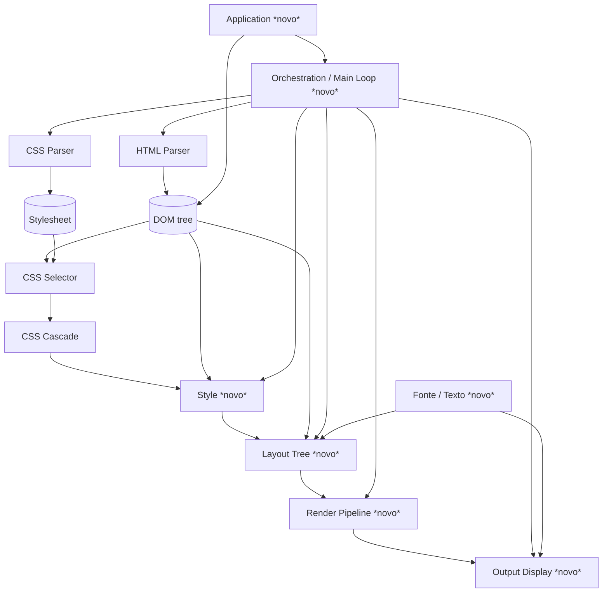

# tbox — Arquitetura

Este documento descreve as camadas da tbox, da entrada (HTML/CSS) até a tela,
e o design mínimo (v0) de cada camada ainda não implementada. É um documento
vivo: cada camada nova deve ser revisada/ajustada aqui *antes* de ganhar
código, e atualizada quando a implementação revelar que o design mudou.

Convenções que todo o projeto já segue e que as camadas novas devem manter:
- C puro (`extern "C"`), prefixo `tbox_`, sem exceções, sem alocação além de
  arena/malloc explícitos.
- Ownership por arena: uma estrutura "document"/"tree"/"context" é dona de
  uma `tbox_arena` e tudo que pendura nela; não há free individual.
- `tbox_string_view` para toda string não-dona de memória.
- Structs de resultado (`_set`, `_style`, etc.) com `items`/`count` +
  `void *reserved_` privado, destruídos por uma função `_destroy` dedicada
  — usado quando a struct é dona da própria alocação internamente (ex.:
  `tbox_css_computed_style`, `tbox_css_selector_node_set`).
- Um segundo padrão, para estruturas transientes reconstruídas a cada
  frame (Style/Layout/Render em v0): recebem a `tbox_arena` do chamador
  como parâmetro, sem `_destroy` próprio — a limpeza é o chamador resetar
  aquela arena (mesmo espírito de `tbox_vector_init`). Não confundir os
  dois: uma struct não deveria ter arena-do-chamador *e* `_destroy` ao
  mesmo tempo.
- Tolerância a entrada malformada nas camadas de parsing (nunca falha por
  markup/CSS inválido); falha explícita (`NULL`/`false` + offset de erro) só
  onde já é essa a política atual (`tbox_css_selector_compile`,
  `tbox_xpath_compile`).

## Visão geral das camadas



Camadas já implementadas (resumo, ver headers para o contrato completo):

| Camada | Header | Responsabilidade | Tipo central |
|---|---|---|---|
| Base | `src/base/*` | arena, vector, list, string, debug | `tbox_arena`, `tbox_vector` |
| HTML Parser | `html_parser.h` | tokeniza + constrói árvore de nós HTML5-tolerante | `tbox_html_node` |
| CSS Parser | `css_parser.h` | tokeniza + parseia stylesheet em regras/declarações | `tbox_css_stylesheet` |
| CSS Selector | `css_selector.h` | compila e casa seletores CSS2.1 contra a árvore | `tbox_css_selector_query` |
| CSS Cascade | `css_cascade.h` | resolve, por propriedade, qual declaração vence | `tbox_css_computed_style` |

Ponto de atenção: `tbox_css_computed_style` hoje é **texto puro** (pares
`property`/`value` como `tbox_string_view`, sem parsing de unidades, cores já
resolvidas à parte só existem como utilitário em `css_cascade.h`). Layout não
pode consumir isso diretamente — precisa de valores tipados. Por isso a
camada **Style** abaixo é nova em relação à lista original, mas é obrigatória
como ponte entre Cascade e Layout Tree.

Outra camada nova, também fora da lista original: **Fonte / Texto**, abaixo.
Vira obrigatória a partir do momento em que headings e paragraphs (com
conteúdo de texto real) entram no escopo mínimo.

Pequena adição pendente a uma camada já implementada: `tbox_html_node_text_content`
(concatena o conteúdo de todo nó TEXT descendente em ordem de documento,
equivalente a `textContent` do DOM) precisa ser adicionada ao HTML Parser
— não é específica de v0 nem de heading/parágrafo, é um utilitário
genérico sobre `tbox_html_node` que o Layout Tree passa a consumir (ver
lá). Outra pequena adição a `Base`: `tbox_string_collapse_whitespace`
(colapsa espaço em branco estilo `white-space: normal`), ao lado de
`tbox_string_builder` já existente — ver Layout Tree.

---

## Fonte / Texto (novo) — camada transversal

Diferente das outras camadas novas, esta não é mais um estágio do pipeline
(parse → style → layout → render → display): é um **serviço transversal**,
igual a `Base`, do qual tanto Layout Tree (para medir texto) quanto Output
Display (para rasterizar glifo) dependem diretamente. Nem Style nem Render
Pipeline precisam saber que ela existe — Render Pipeline só carrega
adiante, no `TEXT_RUN`, a referência de fonte que o Layout já resolveu.

Ela se divide em três responsabilidades bem separadas, porque cada uma tem
um eixo de variação diferente (plataforma / algoritmo / v0-vs-futuro):

**1. Font source (descoberta) — `tbox_font_source`.** De onde vêm os bytes
de uma fonte utilizável, dado um pedido abstrato (família genérica,
negrito, itálico). É aqui que a portabilidade entre SOs mora — o resto da
camada (face/métricas/rasterização, via FreeType) já é multiplataforma por
natureza. Uma interface pequena com um backend por plataforma:

```c
typedef struct tbox_font_query {
    tbox_string_view family; /* v0: só genéricos, ex. "sans-serif" */
    bool bold;
    bool italic;
} tbox_font_query;

typedef struct tbox_font_source tbox_font_source; /* opaco */

/* Resolve `query` para os bytes de um arquivo de fonte utilizável --
 * sempre um blob em memória, nunca um path: cada backend resolve sua
 * própria forma de descoberta (path de arquivo, handle de SO, etc.) para
 * bytes internamente antes de devolver, para que tbox_font_face_load
 * tenha uma única forma de entrada. Retorna false se nada casar (chamador
 * cai para algum fallback ele mesmo, ex. embedded). */
bool tbox_font_source_resolve(tbox_font_source *source, tbox_font_query query, const void **out_data, size_t *out_size);

void tbox_font_source_destroy(tbox_font_source *source);
```

Backends, um construtor por plataforma:
- `tbox_font_source_fontconfig_create()` — **v0, Linux.** Fontconfig é
  exatamente a ferramenta certa aqui (é o que qualquer app Linux usa para
  ir de "sans-serif, negrito" a um `.ttf` de verdade); tbox chama
  `FcFontMatch`/`FcPatternGetString` para achar o path, lê o arquivo pra
  memória, e devolve os bytes (mesma forma que o backend embedded).
- `tbox_font_source_win32_create()` / `tbox_font_source_coretext_create()`
  / `tbox_font_source_android_create()` — **futuro**, quando esses backends
  de Output Display existirem. Cada um sabe consultar o catálogo de fontes
  do próprio SO (DirectWrite/GDI, CoreText, `/system/fonts` + fontconfig
  reduzido no Android) e devolver bytes/path do mesmo jeito.
- `tbox_font_source_embedded_create(data, size)` — **v0 também**, não só
  ideia futura: embute a fonte **Liberation Sans Regular** (SIL Open Font
  License, vendorizada em `external/liberation-sans/`, mesmo padrão de
  `external/utf8.h/`) e devolve sempre ela, ignorando `query`. Existe
  principalmente para os **testes automatizados** de medição de
  texto/layout do v0 (ver "Escopo mínimo" abaixo) — sem ela, esses testes
  dependeriam de qual fonte o fontconfig resolve em cada máquina, o que
  não é portável entre dev machine e um container de CI que pode nem ter
  fonte instalada. Fallback caso `fontconfig` não encontre nada em runtime
  é um benefício secundário, não a motivação principal.

**2. Font face / métricas — `tbox_font_face`.** Fino wrapper sobre um
`FT_Face` carregado a um tamanho (`FT_Set_Pixel_Sizes`), agnóstico de onde
os bytes vieram — não conhece `tbox_font_source`, só recebe os bytes já
resolvidos. Expõe o que o Layout precisa: altura de linha e largura de um
texto.

```c
typedef struct tbox_font_face tbox_font_face; /* opaco: FT_Face + size ativo */

tbox_font_face *tbox_font_face_load(const void *font_data, size_t size, double size_px);
void tbox_font_face_destroy(tbox_font_face *face);

double tbox_font_face_line_height(const tbox_font_face *face);

/* v0: soma dos advances de cada glifo, sem kerning nem shaping (sem
 * ligaduras, sem reordenação bidi/complexa) -- suficiente para texto
 * latino simples em uma linha. Shaping de verdade (HarfBuzz) é um upgrade
 * de implementação por trás desta MESMA assinatura, não uma camada nova --
 * fica para quando texto multilíngue/complexo importar. */
double tbox_font_measure_text(const tbox_font_face *face, tbox_string_view text);
```

**3. Rasterização de glifo — usada só pelo Output Display.** Dado um
`tbox_font_face` e um codepoint, devolve um bitmap de cobertura alpha 8-bit
(`FT_Render_Glyph`) que o rasterizador (`tbox_raster_*`) compõe no buffer
de pixels na posição que o `TEXT_RUN` do Render Pipeline indicar. Fica
junto de `tbox_font_face` porque compartilha o mesmo `FT_Face` carregado —
não é uma sub-camada própria, só a segunda operação que se faz com uma
face já carregada.

```c
typedef struct tbox_font_glyph_bitmap {
    int width, height, bearing_x, bearing_y;
    double advance;
    const unsigned char *alpha; /* cobertura 8-bit, width*height bytes */
} tbox_font_glyph_bitmap;

tbox_font_glyph_bitmap tbox_font_rasterize_glyph(tbox_font_face *face, uint32_t codepoint);
```

**Escopo mínimo (v0):** um único `tbox_font_face`, **16px** (default de
corpo de texto de qualquer browser; também o valor inicial CSS que
`font-size` vai herdar no dia em que essa propriedade existir — escolher
esse número agora não cria atrito depois), usado para **todo** texto do
documento — coerente com "headings e paragraphs sem tratamento de estilo
próprio": não há fonte diferente por tag, só uma default para o documento
inteiro. `tbox_font_measure_text` e `tbox_font_rasterize_glyph` cobrem uma
única linha, sem quebra.

Resolução em v0 usa `tbox_font_source_fontconfig` (Linux, via
`FcFontMatch` para "sans-serif" genérico) para rodar a janela de verdade,
e `tbox_font_source_embedded` para os testes automatizados de medição de
texto/layout — necessário porque esses testes comparam largura
medida/pixel renderizado, e depender do que o fontconfig resolve em cada
máquina tornaria o resultado não-portável (diverge entre dev machine e
container de CI, que pode nem ter fonte instalada). A fonte embutida é
**Liberation Sans Regular** (SIL Open Font License — licença permissiva
para embutir/redistribuir, métrica compatível com Arial, ~250KB, e
coincide com o default real do fontconfig em boa parte das distros Linux,
então o visual entre os dois backends já bate em dev normal). Vendorizada
em `external/liberation-sans/` (arquivo + `LICENSE` + `README.md`,
mesmo padrão já usado em `external/utf8.h/`) — **só o peso Regular**, não
a família inteira (ver "Fora de escopo" abaixo).

**Fora de escopo por agora:** shaping real (HarfBuzz), cache de glifo
rasterizado (rasterizar de novo a cada frame é aceitável em v0, sem
incremental), fontes por `font-family`/`font-weight` do CSS (isso volta
para a Style layer decidir quando `font-*` entrar no escopo) — e junto
disso, vendorizar Bold/Italic/BoldItalic da família e ensinar
`tbox_font_source_embedded` a selecionar entre eles pela `query`; fazer
isso agora seria vendoring órfão, sem nenhum código/teste do v0
exercitando os arquivos extras. Backends de font source além de
fontconfig/embedded (win32/coretext/android) também ficam para depois.

---

## Style (novo) — resolução de valores tipados

**Responsabilidade:** transformar o `tbox_css_computed_style` (texto) de cada
nó em um `tbox_style` tipado e completo — toda propriedade suportada tem um
valor, vindo da cascade, de herança (propriedades herdáveis puxam do
`tbox_style` do pai) ou do valor inicial CSS2.1 (propriedades não-herdáveis).

**Entrada:** `tbox_html_node` (para caminhar pai→filho) + `tbox_css_computed_style`
de cada nó (já calculado pela cascade).
**Saída:** um `tbox_style` por nó.

**Tipos-chave (proposta):**
```c
typedef enum tbox_style_length_kind {
    TBOX_STYLE_LENGTH_AUTO,
    TBOX_STYLE_LENGTH_PX,        /* já absolutizado: em/rem/pt etc. convertidos aqui */
    TBOX_STYLE_LENGTH_PERCENT,   /* resolvido contra containing block só no Layout */
} tbox_style_length_kind;

typedef struct tbox_style_length {
    tbox_style_length_kind kind;
    double value; /* px ou percent, conforme kind */
} tbox_style_length;

typedef enum tbox_style_display { TBOX_STYLE_DISPLAY_BLOCK, TBOX_STYLE_DISPLAY_INLINE, TBOX_STYLE_DISPLAY_NONE } tbox_style_display;

typedef struct tbox_style {
    tbox_style_display display;
    tbox_style_length width, height;
    tbox_style_length margin[4];  /* top right bottom left */
    tbox_style_length padding[4];
    tbox_css_rgba color;             /* herdável */
    tbox_css_rgba background_color;  /* não herdável, inicial = transparent */
    /* cresce por propriedade suportada; ver "Escopo mínimo" */
} tbox_style;

tbox_style tbox_style_resolve(const tbox_html_node *node, const tbox_style *parent_style, const tbox_css_computed_style *computed);
```

**Contrato com o Layout Tree:** `tbox_style_resolve` acima é por nó (mesma
granularidade de `tbox_css_cascade_resolve`). Quem percorre a árvore
inteira, aplicando a cascade + `tbox_style_resolve` em cada nó (pai antes
do filho, para a herança funcionar) e devolvendo o resultado inteiro para o
Layout consumir, é uma função de nível de árvore:

```c
typedef struct tbox_style_entry {
    const tbox_html_node *node;
    tbox_style style;
} tbox_style_entry;

typedef struct tbox_style_table {
    tbox_style_entry *items;
    size_t count;
} tbox_style_table;

/* `arena` é do chamador (mesmo padrão de tbox_layout_build logo abaixo) --
 * tbox_style_table não tem _destroy próprio, sua vida é a da arena que a
 * contém (ver "Convenções" no topo do documento). */
tbox_style_table tbox_style_resolve_tree(tbox_arena *arena, const tbox_html_node *root, const tbox_css_stylesheet *stylesheet);

/* Busca linear, mesmo padrão de tbox_css_computed_style_find -- aceitável
 * para árvores de UI (dezenas a poucos milhares de nós); se O(n) por busca
 * virar gargalo medido, revisitar junto do débito de dirty-tracking (a
 * assinatura pública não muda, só a implementação por trás ganharia um
 * índice auxiliar). */
const tbox_style *tbox_style_table_find(const tbox_style_table *table, const tbox_html_node *node);
```
Decidido entre três opções (callback pull-based, esta tabela plana, ou um
mapa/hash por ponteiro de nó): tabela plana com busca linear, porque
reusa o mesmo padrão já presente em `tbox_css_computed_style_find` e
`tbox_css_selector_match` (par `node` + resultado num array), não exige
infraestrutura nova na `Base` (não há hash table hoje), e não tem
acoplamento de ordem de travessia entre Style e Layout Tree (diferente de
um array indexado por posição, que quebraria silenciosamente se as duas
camadas um dia percorrerem a árvore em ordens diferentes).

**Escopo mínimo (v0):** `display` (`block`/`inline`/`none`), `width`,
`height`, `margin`, `padding`, `color`, `background-color`. Sem `em`/`rem`
ainda (só `px` e palavras-chave/percent) — unidades relativas a fonte
entram junto com a camada de texto/fonte.

**Valor inicial de `display` — decisão explícita:** o CSS2.1 real define o
inicial de `display` como `inline`, mas isso pressupõe uma UA stylesheet
que declara `div`/`p`/`h1`-`h6`/etc. como `block` — e v0 não tem UA
stylesheet nenhuma (ver Orchestration). Se `tbox_style_resolve` seguisse o
inicial padrão à risca, todo elemento sem `display` explícito no CSS do
autor viraria `inline`, e o Layout Tree (que só implementa fluxo de bloco
em v0) não teria o que fazer com ele. Por isso, **o inicial de `display`
em v0 é `TBOX_STYLE_DISPLAY_BLOCK`**, não `inline` — simplificação
deliberada, coerente com "todo elemento vira block-level box igual a
qualquer outro" já decidido para a Fatia vertical v0. `display: none`
continua funcionando normalmente quando declarado explicitamente no CSS
do autor. Fica marcado aqui porque diverge da spec real; quando uma UA
stylesheet existir (próxima fatia), o inicial correto (`inline`) passa a
fazer sentido de novo, já que os elementos block ganham `display: block`
por herança de uma folha de estilo, não por default do motor.

**Shorthand:** decidido — expande aqui, na Style layer, no momento de tipar
cada propriedade (`margin: 1px 2px` vira `margin[4]` já resolvido). O CSS
Parser continua agnóstico de propriedade (não sabe o que é shorthand); a
Cascade continua resolvendo por texto puro. Só a Style sabe que `margin` é
shorthand de `margin-top/right/bottom/left`.

**Fora de escopo por agora:** `position`, `float`, `flex`/`grid`, `z-index`,
`border` (nem `border-width` nem `border-color` — meio-caminho não ajuda
ninguém; ver justificativa no Render Pipeline), `white-space` (v0 sempre
se comporta como `white-space: normal` fixo — ver collapse de espaço no
Layout Tree).

Sem pergunta em aberto de curto prazo nesta camada — `em`/`%` de
`font-size` é débito de design conhecido, não pendência de v0 (ver seção
"Débito de design conhecido" no fim do documento).

---

## Layout Tree (novo)

**Responsabilidade:** a partir do DOM + `tbox_style` por nó, construir uma
árvore de caixas (box tree) e resolver a geometria de cada uma (posição e
tamanho, em px, relativa ao viewport) segundo o modelo de caixas CSS2.1
(content/padding/border/margin box) e o algoritmo de fluxo normal (block e
inline).

**Entrada:** raiz do DOM + `tbox_style_table` (já calculada pela camada
Style, ver contrato lá) + `tbox_font_face` (já carregado pela camada
Fonte/Texto) + dimensões do viewport.
**Saída:** árvore de `tbox_layout_box`.

**Tipos-chave (proposta):**
```c
typedef struct tbox_rect { double x, y, width, height; } tbox_rect;

typedef struct tbox_layout_box {
    const tbox_html_node *node; /* NULL para caixas anônimas (texto solto, wrapper inline-in-block) */
    const tbox_style *style;

    tbox_rect margin_box, border_box, padding_box, content_box;

    /* v0: só preenchido para heading/parágrafo (ver "Regra explícita"
     * abaixo) -- `text` é o resultado já passado por
     * tbox_html_node_text_content + tbox_string_collapse_whitespace,
     * pronto pra medir/desenhar; `font` é a face usada pra medi-lo. Vazio
     * (text.size == 0, font == NULL) pra qualquer outra caixa. O Render
     * Pipeline (próxima camada) lê os dois pra montar o TEXT_RUN -- não
     * mede nem resolve nada de novo. */
    tbox_string_view text;
    const tbox_font_face *font;

    struct tbox_layout_box *parent, *first_child, *last_child, *next_sibling;
} tbox_layout_box;

tbox_layout_box *tbox_layout_build(tbox_arena *arena, const tbox_html_node *root, const tbox_style_table *styles, const tbox_font_face *font, double viewport_width, double viewport_height);
```
(dona da árvore é uma arena passada pelo chamador — mesmo padrão de
`tbox_vector_init` em `Base` (arena do chamador, sem `_destroy` próprio),
**não** o de `tbox_html_document`, que é dono da própria arena
internamente — os dois padrões coexistem no projeto, ver "Convenções" no
topo. Aqui o dono típico é a Orchestration: `tbox_style_resolve_tree`,
`tbox_layout_build` e `tbox_render_build_display_list` compartilham a
mesma arena por-frame (`tbox_context.frame_arena`, ver Orchestration),
resetada uma vez a cada frame em vez de cada camada destruir/recriar a
própria.)

**`root` e documentos com múltiplas tags soltas no nível raiz.** Se `root`
for um `TBOX_HTML_NODE_DOCUMENT`, `tbox_layout_build` constrói a caixa só
para o **primeiro** filho ELEMENT do documento (tipicamente `<html>`, se o
HTML de entrada tiver um) — filhos ELEMENT adicionais no mesmo nível são
ignorados. O HTML Parser não insere `<html>`/`<body>` implicitamente
(diferente da árvore de construção HTML5 completa), então um documento com
múltiplas tags soltas no nível raiz (`<div>...</div><h1>...</h1>`, sem
contêiner nenhum) perde tudo depois da primeira. Não é bug do Layout Tree:
é a mesma expectativa de qualquer HTML real (que sempre tem exatamente um
`<html>` de topo) — só precisa estar explícita aqui, já que este parser
não a impõe sozinho. Todo HTML de teste/exemplo em v0 deve envolver seu
conteúdo num único elemento de topo (`<body>`, `<div>`, tanto faz,
contanto que seja um só).

**Escopo mínimo (v0):** só fluxo normal — block-level boxes empilhadas
verticalmente (largura = do pai, salvo `width` explícito). `<h1>`…`<h6>` e
`<p>` viram block-level boxes iguais a qualquer outro elemento (mesmo
`tbox_style_display = BLOCK`, sem tratamento de estilo por tag).
**Regra explícita:** `tbox_layout_build` reconhece esses elementos por uma
lista fixa de tag names verificada dentro dele mesmo (`h1`, `h2`, `h3`,
`h4`, `h5`, `h6`, `p`) — só eles ganham caixa de texto em v0; qualquer
outro elemento (incluindo um `<div>` com texto dentro) vira uma caixa
vazia, mesmo que tenha nós TEXT descendentes. Texto arbitrário em
qualquer tag fica para quando o inline formatting context real existir.
Para os elementos da lista, o texto é obtido via `tbox_html_node_text_content` (nova função no
HTML Parser — pequena adição a uma camada já implementada, não é exclusiva
de v0: concatena o conteúdo de todo nó TEXT descendente, em ordem de
documento, ignorando a estrutura de elementos aninhados, equivalente ao
`textContent` do DOM — `<p>oi <b>mundo</b></p>` vira `"oi mundo"`,
descartando só a informação de *qual* trecho vinha de qual elemento, não o
texto em si). Decidido contra a alternativa de reconstruir a marcação
literal (`"oi <b>mundo</b>"`): essa exigiria escrever um re-serializador
sem nenhum valor futuro (seria descartado no dia em que o inline
formatting context real existir), enquanto `tbox_html_node_text_content`
**evolui** para lá — a mesma travessia de nós de texto descendentes em
ordem de documento é a base do inline formatting context real, só que
preservando por nó em vez de concatenar tudo numa string. O resultado
passa então por `tbox_string_collapse_whitespace` (nova função em `Base`,
ao lado de `tbox_string_builder` já existente: colapsa sequências de
espaço/tab/quebra-de-linha em um único ' ' e apara as bordas —
comportamento fixo `white-space: normal`, já que essa propriedade não
existe ainda na Style layer) e só então é medido com
`tbox_font_measure_text`/`tbox_font_face_line_height`
(camada Fonte/Texto acima) numa única linha, sem quebra. Altura da caixa
segue a regra normal de `height: auto` (acompanha o conteúdo) = altura de
linha da fonte default. **Largura da caixa continua seguindo a regra
geral acima (largura do pai)** — o texto medido nunca redimensiona a
caixa; se o advance for maior que a largura disponível, o texto
simplesmente ultrapassa visualmente a borda da caixa (overflow visível,
sem clipping em v0 — `overflow: hidden` não existe ainda). Wrap real fica
para depois. `tbox_layout_build` recebe o `tbox_font_face` já
carregado (injetado por quem chama, tipicamente a Orchestration) em vez de
carregar fonte ele mesmo — Layout Tree não sabe de `tbox_font_source`, só
usa a face já pronta. Isso é suficiente para o "vertical slice" de um
`<div>` com `width`/`height`/`background-color` mais headings/parágrafos
mostrando seu texto.

**Fora de escopo por agora:** inline formatting context real (quebra de
linha entre múltiplas palavras/elementos inline), floats,
`position: absolute/fixed`, flexbox, tabelas, scroll.

Sem pergunta em aberto de curto prazo nesta camada — re-layout incremental
(só recalcular a subárvore suja) é débito de design conhecido, coberto
pelo "Modelo de invalidação" no fim do documento.

---

## Render Pipeline (novo)

**Responsabilidade:** percorrer a Layout Tree e produzir uma **display
list** — uma sequência ordenada de comandos de desenho abstratos,
independente de backend (não sabe o que é Wayland nem pixel format).

**Entrada:** raiz de `tbox_layout_box`.
**Saída:** `tbox_display_list` (vetor de comandos).

**Tipos-chave (proposta):**
```c
typedef enum tbox_paint_op_kind { TBOX_PAINT_FILL_RECT, TBOX_PAINT_TEXT_RUN } tbox_paint_op_kind;

typedef struct tbox_paint_op {
    tbox_paint_op_kind kind;
    tbox_rect rect;      /* FILL_RECT: retângulo. TEXT_RUN: origem (x,y) da content box; width/height não usados */
    tbox_css_rgba color; /* FILL_RECT: cor de fundo. TEXT_RUN: cor do texto */
    /* TEXT_RUN apenas: */
    tbox_string_view text;      /* v0: uma linha só, sem quebra */
    const tbox_font_face *face; /* injetada por quem monta a display list, não carregada aqui */
} tbox_paint_op;

typedef struct tbox_display_list {
    tbox_paint_op *items;
    size_t count;
} tbox_display_list;

/* `arena` é do chamador -- mesma arena por-frame de tbox_style_resolve_tree
 * e tbox_layout_build (ver Orchestration); sem _destroy próprio. */
tbox_display_list tbox_render_build_display_list(tbox_arena *arena, const tbox_layout_box *root);
```

**Escopo mínimo (v0):** um `FILL_RECT` por `background-color` não-transparente
de cada caixa, em ordem de árvore (pré-ordem = paint order correto para v0,
já que não há `position`/`z-index` ainda). Um `TEXT_RUN` por caixa de
texto de heading/parágrafo (texto já medido pelo Layout numa única linha,
posição = origem da content box), carregando a `tbox_font_face` recebida
por injeção — Render Pipeline não chama nenhuma função de
`tbox/font.h`, só copia a referência para o paint op; quem de fato
rasteriza o glifo é o Output Display.

**Fora de escopo por agora:** stacking contexts, quebra de linha dentro de
`TEXT_RUN` (uma run = uma linha só, em v0), clipping, transparência
composta (alpha blending pode ficar para o Output Display resolver, já que
é ele que rasteriza), border (a Style layer não resolve `border-width`
nem `border-color` em v0 — ver Style).

**Por que separar Render Pipeline de Output Display:**
- A display list é o ponto de reuso entre backends — o mesmo
  `tbox_display_list` deve poder ser consumido por um backend
  Wayland/software hoje e, por exemplo, um backend que só exporta PNG para
  testes, sem essa camada saber de nenhum dos dois.
- Wayland não é o backend final único: em algum momento vamos precisar de
  Android, Windows e/ou macOS. Cada um desses tem seu próprio jeito de
  obter uma superfície/buffer de pixels e seu próprio event loop de
  plataforma — mas nenhum deles deveria mudar uma linha sequer do Layout
  Tree ou do Render Pipeline. Só o Output Display (e a parte de
  janela/input da Orchestration) muda por plataforma.
- Ganho concreto de curto prazo: um backend "headless" que só rasteriza a
  display list para um buffer/PNG, sem abrir janela nenhuma, permite testar
  e depurar Layout Tree e Render Pipeline (e comparar pixel a pixel contra
  um PNG de referência) rodando em CI, sem compositor Wayland disponível.
  Vale considerar esse backend PNG-only cedo, não só como ideia futura, já
  que ele é o jeito mais barato de ter teste de regressão visual antes de
  termos múltiplos backends "de verdade".

---

## Output Display (novo)

**Responsabilidade:** duas coisas que hoje estão fundidas no exemplo
`tbox_wayland.c` e que este design separa: (1) rasterizar uma
`tbox_display_list` num buffer de pixels, (2) gerenciar a janela/superfície
da plataforma (hoje só Wayland) e apresentar esse buffer.

**Proposta de sub-divisão:**
- `tbox_raster_*` (novo módulo, plataforma-agnóstico): desenha
  `tbox_display_list` num `uint32_t*` XRGB8888 já alocado pelo chamador —
  puro software rasterizer, sem dependência de Wayland. Isso é testável sem
  janela nenhuma (comparar buffer de saída byte a byte em teste).
- `tbox_backend_wayland_*` (evolução do exemplo atual — migra de
  `example/` para `src/` já em v0, já que `tbox_app_open` é API pública
  real e não mais exclusiva do exemplo; ver "Build system (v0)"): possui
  o `wl_shm` buffer, chama `tbox_raster_*` a cada frame, e traduz eventos
  Wayland (teclado, configure/resize) para o formato que a Orchestration
  entende.

**Escopo mínimo (v0):** `tbox_raster_fill_rect` e `tbox_raster_text_run`
cobrindo o que o Render Pipeline v0 emite — `tbox_raster_text_run` chama
`tbox_font_rasterize_glyph` (camada Fonte/Texto) por codepoint e compõe o
bitmap de cobertura alpha no buffer XRGB8888 pela `color` do paint op;
reaproveitar o `wl_shm` + event loop já existentes no exemplo,
generalizando para receber uma `tbox_display_list` em vez de desenhar o
checkerboard hardcoded. FreeType já está linkado (smoke-test no exemplo) —
v0 é o primeiro uso real dele, todo através da camada Fonte/Texto, nunca
direto.

**Fora de escopo por agora:** qualquer backend além de Wayland (X11,
framebuffer direto, backend "headless" para testes/CI) — mas a separação
acima em `tbox_raster_*` puro já deixa isso barato de adicionar depois, e
vale considerar um backend "headless"/buffer-only cedo só para poder testar
Output Display em CI sem compositor (ver "Por que separar Render Pipeline
de Output Display", acima).

---

## Orchestration / Main Loop (novo)

**Responsabilidade:** dona do pipeline de *cômputo* (parse → style →
layout → render, produzindo uma `tbox_display_list`) e da decisão de
*quando* re-executar cada etapa. **Não é dona do event loop da
plataforma nem do backend de apresentação** — essa correção veio depois
da primeira versão desta seção, escrita antes do Output Display (Tarefa
8) existir de verdade: `tbox_backend_wayland_*` já nasceu como uma API
autossuficiente (`open`/`poll`/`should_close`/`size`/`present`), e é a
Application (Tarefa 10) quem possui tanto um `tbox_context` quanto um
`tbox_backend_wayland`, rodando o loop de verdade e ligando os dois —
chama `tbox_context_run_frame` a cada resize/evento relevante, depois
`tbox_backend_wayland_present` com o resultado. `tbox_context` em si não
sabe que Wayland existe.

**v0 — política mais simples possível:** sem invalidação incremental
nenhuma. Qualquer coisa que mude (resize da janela é o único gatilho que
existe hoje) refaz o pipeline inteiro: style de novo, layout de novo,
display list de novo, raster de novo. `tbox_context_run_frame` começa
sempre com `tbox_arena_reset(&ctx->frame_arena)`, invalidando de uma vez
só tudo que Style/Layout/Render produziram no frame anterior — não há
`_destroy` por camada para chamar (ver "Convenções"). Isso é
intencionalmente ingênuo — serve para não bloquear o vertical slice numa
decisão de dirty-tracking que ainda não temos informação suficiente para
tomar bem.

**Tipos-chave (proposta, mínima):**
```c
typedef struct tbox_context {
    tbox_html_document *document;    /* dono: parseado em tbox_context_open, destruído em tbox_context_close */
    tbox_css_stylesheet *stylesheet; /* dono, mesmo ciclo de vida; author-only (ver abaixo) */
    tbox_font_face *font;   /* emprestado -- carregado e destruído por quem chama (Application/Tarefa 10), NÃO por frame nem pelo tbox_context */
    tbox_layout_box *root;  /* último layout calculado (vive em frame_arena); usado por tbox_context_hit_test entre frames */
    tbox_arena frame_arena; /* backing de tbox_style_table + tbox_layout_box + tbox_display_list; resetada no início de cada tbox_context_run_frame */
} tbox_context;

/* Parseia `html`/`css` e guarda o resultado -- `font` é emprestado (ver
 * acima). Retorna NULL só em falha de alocação. */
tbox_context *tbox_context_open(const char *html, size_t html_length, const char *css, size_t css_length, tbox_font_face *font);

/* Destrói document/stylesheet e a frame_arena. NÃO destrói `font` (não é
 * dono dele). */
void tbox_context_close(tbox_context *ctx);

void tbox_context_run_frame(tbox_context *ctx, double viewport_width, double viewport_height, tbox_display_list *out_list);

/* Busca linear em `ctx->root` (o último layout computado) pela caixa mais
 * profunda cujo `border_box` contém (x, y). NULL se não houver layout
 * ainda ou nada sob o ponto. */
const tbox_layout_box *tbox_context_hit_test(const tbox_context *ctx, double x, double y);
```

**Confirmado: v0 não usa nenhuma folha de estilo user-agent.** O array de
`tbox_css_cascade_source` passado para `tbox_css_cascade_resolve` tem uma
única entrada — `{ stylesheet: <CSS do app>, origin: TBOX_CSS_ORIGIN_AUTHOR }`
— consistente com headings/parágrafos não terem nenhum tratamento de
estilo próprio em v0 (é justamente a ausência de UA stylesheet que os
deixa visualmente iguais a um `<div>`). `example/user-agent.css` e
`example/user.css` já existentes no repo são fixtures só do exemplo
`css_cascade_origins` (demonstra prioridade de origem/`!important`), sem
relação com este pipeline. Uma UA stylesheet de verdade fica para quando o
"default rendering" por tag (tamanho de heading, margin de parágrafo etc.)
entrar em escopo — próxima fatia depois do v0, não débito de longo prazo.

**Responsabilidade adicional (v0, mínima):** hit-testing — dado um evento de
clique/toque em coordenadas de tela, achar a `tbox_layout_box` (e portanto o
`tbox_html_node`) sob o ponteiro, para a Application poder disparar
callbacks. Busca linear na árvore de layout é suficiente em v0.

**Fora de escopo por agora:** dirty-tracking real, agendamento de frame por
vsync/timer (v0 redesenha só em resposta a evento), animações, foco de
teclado navegável.

Se `tbox_context` como "um documento por janela" continua sendo a unidade
certa de orquestração é débito de design conhecido, ligado à árvore
pública de mutação da Application — ver "Débito de design conhecido" no
fim do documento.

---

## Application (novo)

**Responsabilidade:** a API pública voltada a quem constrói uma GUI com
tbox — a camada que alguém importando `<tbox/tbox.h>` para fazer um app
realmente usa. Retained mode: o desenvolvedor monta/modifica uma árvore
(igual a montar um DOM programaticamente, ou carregando de um arquivo
HTML+CSS) e a biblioteca mantém tela e árvore sincronizadas.

**Não é uma decisão de v0.** O v0 não expõe árvore nenhuma para mutação
(ver escopo abaixo) — `tbox_html_node` vs. `tbox_widget` como árvore
pública só precisa ser decidido quando o design da API de mutação
começar. As três opções em consideração estão detalhadas em "Débito de
design conhecido" no fim do documento.

**Escopo mínimo (v0):** abrir uma janela a partir de HTML+CSS em string/arquivo
(`tbox_app_open(html, css, width, height)`), rodar o loop até fechar. Sem
API de mutação em v0 — isso testa o pipeline inteiro ponta-a-ponta sem
comprometer o design de "widget API" ainda.

**Fora de escopo por agora:** qualquer API de mutação incremental
(`set_text`, `add_class`, event handlers), múltiplas janelas, o próprio
`tbox_widget` (se vier a existir).

---

## Fatia vertical v0 — critério de "pronto"

Definição do primeiro slice ponta-a-ponta que valida as interfaces acima:
uma janela Wayland, aberta a partir de um HTML+CSS **estático** (sem API de
mutação — ver seção Application), exibindo:

- um `<div>` cujo `width`, `height` e `background-color` vêm do CSS de
  entrada, passando por Style → Layout Tree → Render Pipeline → Output
  Display de verdade (não hardcoded como o checkerboard atual);
- `<h1>`…`<h6>` e `<p>` reconhecidos e empilhados no fluxo normal como
  block-level boxes, **sem nenhum tratamento de estilo próprio nem outros
  parâmetros** — mesma `tbox_style_display = BLOCK` que qualquer outro
  elemento, sem folha de estilo de user-agent (sem negrito/tamanho de fonte
  diferente por nível de heading, sem margin default de parágrafo). O que
  os distingue de um `<div>` é que seu texto é de fato mostrado: uma única
  fonte default (Fonte/Texto layer, via fontconfig no Linux) para o
  documento inteiro, uma linha só por caixa de texto, sem quebra. O
  objetivo aqui é validar que HTML Parser → Style → Layout Tree tratam
  qualquer tag desconhecida-para-a-lib da mesma forma genérica, e que o
  caminho Layout → Render Pipeline → Fonte/Texto → Output Display consegue
  colocar glifo real na tela; diferenciar o *default rendering* de cada tag
  (UA stylesheet: tamanhos por nível de heading, margin de parágrafo etc.)
  fica para depois do v0.

Isso força a decidir, na prática, os pontos em aberto mais baratos primeiro
(assinatura de `tbox_style_resolve`, formato de `tbox_layout_box`,
`tbox_display_list`) antes de pagar o custo de inline layout, fontes, ou
incremental — que ficam para a próxima fatia.

## Build system (v0)

Decisões sobre como as camadas novas entram no CMake, além do design das
camadas em si (ver `CMakeLists.txt` atual para o padrão de referência —
detecção opcional de dependências de sistema já existe hoje para o
exemplo `tbox_wayland`):

1. **FreeType vira dependência obrigatória do `libtbox` core** (hoje só o
   exemplo `tbox_wayland` a busca via `FetchContent`). Sai de
   `example/CMakeLists.txt` e vai para o `CMakeLists.txt` raiz (antes de
   `add_subdirectory(src)`), reaproveitado por `src` e `example` sem
   duplicar `FetchContent_Declare`. Como é buildada a partir do source
   (não depende de pacote de sistema), pode virar obrigatória sem risco de
   quebrar builds por falta de pacote instalado.
2. **Fontconfig é opcional**, mesmo padrão de graceful-skip já usado para
   Wayland (`pkg_check_modules(... QUIET fontconfig)`); se ausente,
   `tbox_font_source_fontconfig.c` é excluído do build com warning, sem
   falhar o configure — importante para os testes (que usam só o backend
   `embedded`) continuarem buildando num container CI sem Fontconfig.
3. **O backend Wayland + `tbox_app_open` migram de `example/` para
   `src/`**, já que `tbox_app_open` é API pública de v0, não mais
   exclusiva do exemplo. A detecção condicional de
   `wayland-client`/`wayland-protocols`/`xkbcommon`/`wayland-scanner` que
   hoje vive em `example/CMakeLists.txt` precisa ser replicada em
   `src/CMakeLists.txt`, gating a compilação do backend dentro do
   `libtbox`. Sem esses pacotes, `libtbox` ainda builda (parsing/cascade/
   style/layout/render continuam utilizáveis sem depender de um
   compositor) — só `tbox_app_open` fica indisponível.
4. **Fonte embutida é lida por caminho de arquivo em runtime**, não
   compilada como byte-array: `tbox_font_source_embedded_create(data, size)`
   recebe bytes já carregados, então basta reaproveitar o `read_file()`
   que já existe em `example/css_cascade_origins.c` mais uma
   compile-definition apontando para
   `external/liberation-sans/LiberationSans-Regular.ttf` (mesmo padrão de
   `TBOX_EXAMPLE_HTML_PATH`). Sem ferramenta de codegen nova. (Packaging de
   terceiros instalando `libtbox` como lib de sistema precisaria instalar
   o `.ttf` junto — fora de escopo de v0, não é débito formal agora.)

## Decisões já tomadas

- **Style é camada própria**, separada da Cascade (Cascade resolve texto;
  Style tipa, herda, aplica shorthand e valores iniciais).
- **Shorthand CSS** (`margin`, `border`, `background`, ...) expande na
  Style layer, não no CSS Parser nem na Cascade.
- **Application v0** abre uma janela a partir de HTML+CSS estático, sem API
  de mutação incremental.
- **Fonte / Texto é camada própria, transversal** (não um estágio do
  pipeline) — Layout Tree depende dela para medir texto, Output Display
  depende dela para rasterizar glifo; Render Pipeline só carrega a
  referência adiante, sem chamar nenhuma função dela.
- **Descoberta de fonte usa Fontconfig no Linux** (`tbox_font_source_fontconfig`),
  atrás de uma interface (`tbox_font_source`) que outros SOs implementam
  depois (`win32`/`coretext`/`android`, todos futuros). Um segundo backend,
  `tbox_font_source_embedded` (Liberation Sans Regular, vendorizada em
  `external/liberation-sans/`), entra **já no v0** — não é só fallback, é
  o que dá saída determinística aos testes automatizados de medição de
  texto/layout do próprio v0 (não depende de um backend headless/PNG
  futuro, que continua fora de escopo).
- Texto em v0 é **medido e rasterizado sem shaping** (soma simples de
  advances via FreeType, uma única linha, sem quebra) — HarfBuzz fica como
  upgrade futuro por trás da mesma assinatura de `tbox_font_measure_text`.

## Débito de design conhecido (pós-v0)

Trabalho futuro real, conscientemente adiado — não bloqueia o v0, mas tem
complexidade própria e precisa chegar até quem for implementar aquela
fatia futura com o contexto intacto. Diferente de "Perguntas em aberto"
abaixo (decisões pequenas e de curto prazo): aqui o "quando" é um gatilho
explícito, não "em breve".

### Unidades relativas a fonte (`em`, `%` de `font-size`) na Style layer
**O que é:** resolver `font-size` e valores em `em`/`%` de fonte exige uma
cadeia de "font-size computado do pai" — herança que depende do *valor já
resolvido* de outra propriedade, diferente do mecanismo de herança simples
(copiar o valor do pai) que a Style layer usa hoje para `color` etc.
**Por que importa:** se isso não entrar no design de `tbox_style_resolve`
desde cedo, adicionar `em`/`rem`/`%` de fonte depois pode forçar mudar a
assinatura ou o algoritmo de resolução da Style layer inteira, não só
acrescentar uma propriedade.
**Gatilho para revisitar:** quando `font-size` entrar como propriedade
suportada pela Style layer — e, por extensão, quando a Layout Tree deixar
de usar uma única fonte/tamanho fixo para o documento inteiro (ver Fonte /
Texto, "Fora de escopo").
**Toca:** Style layer (`tbox_style_resolve`), Fonte / Texto (tamanho por nó
em vez de global).

### Modelo de invalidação (dirty-tracking) do pipeline
**O que é:** como a Orchestration evita recomputar Style → Layout → Render →
Raster inteiros a cada frame quando só parte da árvore mudou (ex.: um nó
teve `background-color` alterado via uma futura API de mutação). Inclui o
cache de glifo rasterizado (hoje v0 rasteriza de novo a cada frame, sem
nenhum cache) — mesma categoria de problema (recomputar só o que mudou),
mesmo gatilho.
**Por que importa:** decisão transversal a Style, Layout Tree e Render
Pipeline ao mesmo tempo — dirty flags por nó, memoização por subtree, ou
recompute total são os trade-offs clássicos aqui, e escolher tarde demais
pode forçar re-arquitetar as três camadas juntas.
**Gatilho para revisitar:** junto com "Critérios de atualização" logo
abaixo — quando a Application ganhar mutação/interatividade. Hoje o v0
reabre só com HTML+CSS estático, sem mutação nenhuma, e resize (único
gatilho do v0) legitimamente invalida a árvore inteira de qualquer forma —
não é um bom caso de teste para validar um modelo incremental.
**Toca:** Orchestration (`tbox_context_run_frame`), Style, Layout Tree,
Render Pipeline, Fonte/Texto (cache de glifo).

### Critérios de atualização (update triggers) do modelo Retained Mode
**O que é:** para além do resize de janela (único gatilho do v0), decidir
quais eventos disparam um novo frame num toolkit Retained Mode — onde a
app só descreve o estado desejado e é a Orchestration que decide *quando*
esse estado precisa ser re-observado na tela. Candidatos: mouse/teclado
quando afetarem estado visual (ex.: `:hover`/foco — hoje o CSS Selector
nem implementa pseudo-classes dinâmicas), mutações futuras via API da
Application, timers/animações, carregamento assíncrono de recursos (fonte,
imagem).
**Por que importa:** disparar frames de menos deixa a UI "travada"
(mudança de estado não aparece na tela); disparar de mais desperdiça
CPU/energia redesenhando sem necessidade. A lista de gatilhos cresce junto
com cada nova capacidade da Application, então decidir isso cedo demais,
sem essas capacidades existirem ainda, arrisca chutar errado.
**Gatilho para revisitar:** o mesmo do item acima (mutação/interatividade
na Application) — tratar os dois juntos, porque a resposta de um
influencia o outro (dirty-tracking por nó só funciona se o gatilho já
apontar *qual* nó mudou).
**Toca:** Orchestration (main loop / event dispatch), Application (fonte
dos eventos de mutação), Style/Layout Tree (se pseudo-classes dinâmicas
tipo `:hover` entrarem em cena).

### Árvore pública de mutação da Application (`tbox_html_node` vs. `tbox_widget`)
**O que é:** quando a Application ganhar API de mutação, decidir qual é a
árvore que o desenvolvedor manipula. Três caminhos em aberto:
- **A — `tbox_html_node` é a própria árvore pública**, com um "modo vivo"
  onde mutação dispara recompute. Zero API nova (reaproveita
  `tbox_html_node_create`/`append_child`/`remove`,
  `tbox_css_selector_select` como query de graça), coerente com "GUI a
  partir de HTML/CSS" ser o objetivo do projeto. Contras reais:
  `tbox_html_node` vive numa arena por documento sem free individual
  (`tbox_html_node_remove` só desconecta, não libera) — mutação
  incremental de vida longa (ex.: milhares de add/remove ao longo da
  sessão) só faz a arena crescer; e não há hoje onde pendurar handlers de
  evento/estado de interação sem sujar o tipo DOM puro.
- **B — `tbox_widget` próprio**, traduzido para HTML/CSS por baixo. API
  pode ser mais ergonômica (tipos de widget, callback como campo) e ter
  lifetime pensado para UI de vida longa, independente da arena do
  html_parser. Contras: exige um algoritmo de sincronização real entre as
  duas árvores (tipo virtual-DOM diff ou espelhamento imperativo) — é
  escrever uma segunda árvore mais uma ponte; risco dos dois modelos de
  atributo/estilo (widget vs. CSS cascade) divergirem.
- **C — meio-termo:** manter A, mas resolver os dois contras
  cirurgicamente em vez de construir uma segunda árvore — o problema de
  memória só é endereçado se/quando medido como real (não resolvido
  preventivamente), e handlers/estado de interação ficam numa tabela
  externa dona da Application (`tbox_html_node* → callback/estado`), sem
  mexer no tipo `tbox_html_node`.

Ligado a isso, uma segunda pergunta que compartilha o mesmo gatilho: o
`tbox_context` de hoje assume **um documento por janela** (um `tbox_html_document`,
uma stylesheet, uma árvore de layout). Isso não é sobre múltiplas janelas
(já fora de escopo, ver Application) nem sobre algo tipo frameset/`<frame>`
(documentos independentes navegáveis — tbox não tem conceito de
navegação/URL) — é sobre se, **dentro de uma única janela**, a Orchestration
vai eventualmente precisar orquestrar mais de uma árvore de layout/render
ao mesmo tempo, compositadas juntas: um tooltip, menu de contexto, dropdown
de um futuro `<select>`, ou diálogo modal. Mesmo em browsers reais esses
elementos tecnicamente pertencem à mesma árvore DOM, mas muitos toolkits
(inclusive browsers, internamente, para o dropdown nativo de `<select>`)
tratam isso como uma passagem de layout/render separada — às vezes até
como uma subsurface própria no sistema de janelas (no Wayland,
`wl_subsurface`) — para não forçar relayout/repaint do app inteiro ao
mover um popup, e para escapar de `overflow: hidden`/clipping do
container onde foi disparado. Se isso vier a ser necessário, `tbox_context`
como "um documento" deixa de ser a unidade certa de orquestração.

**Por que importa:** define a superfície pública que qualquer aplicação
construída sobre tbox vai usar pelo resto da vida do projeto — trocar
depois significa quebrar API de quem já consome a lib. A pergunta de
"uma árvore por janela vs. várias compositadas" também afeta a assinatura
de `tbox_context`/`tbox_context_run_frame` desde a raiz.
**Gatilho para revisitar:** quando começar o design da API de mutação da
Application — mesmo momento dos dois débitos anteriores (dirty-tracking e
critérios de atualização), já que todas essas decisões se influenciam: a
forma da árvore pública afeta o que pode ser marcado como "sujo" e quando,
e se popups precisam de árvore própria.
**Toca:** Application (API pública), HTML Parser (se a Opção A exigir
mudanças no modelo de arena/lifetime de `tbox_html_node`), Orchestration
(`tbox_context` como unidade de "um documento", dirty-tracking precisa de
uma estrutura para se ancorar).

## Perguntas em aberto (consolidado)

Nenhuma pendência de curto prazo restante. Toda lacuna identificada foi
fechada para v0 (registrada nas seções de cada camada) ou consolidada como
débito de design conhecido acima, com gatilho explícito de quando
revisitar.
