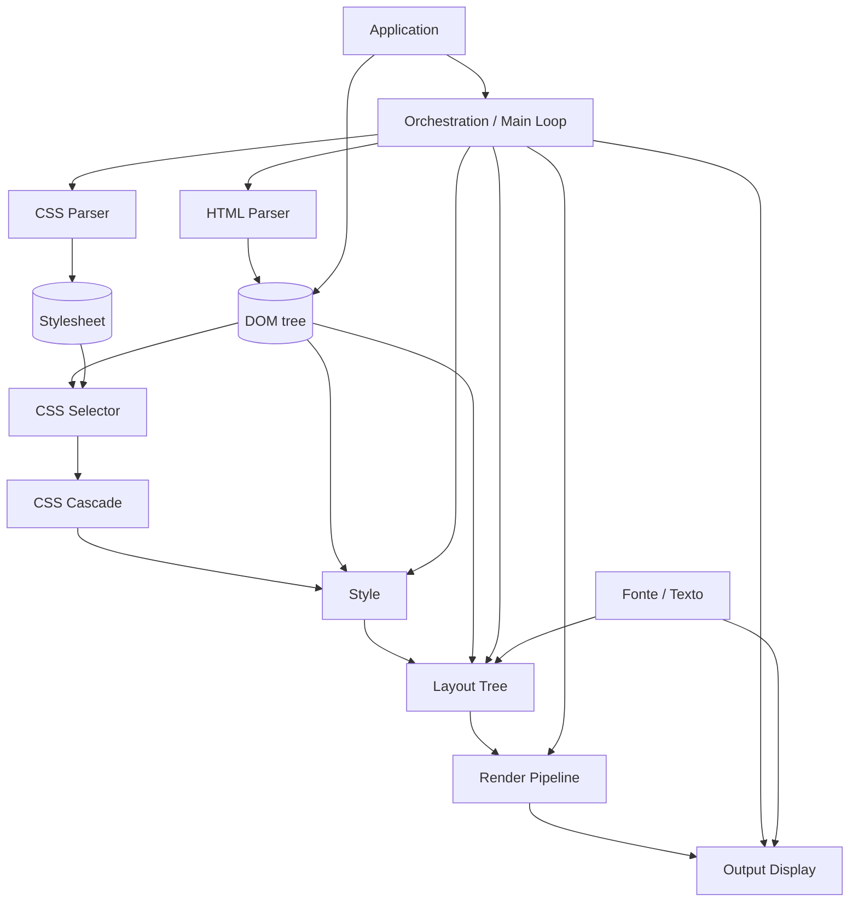

# tbox — Arquitetura

Este documento descreve as camadas da tbox, da entrada (HTML/CSS) até a tela.
O v0 (HTML+CSS estático numa janela), a v1 (Interatividade) e a v2
(Fidelidade Visual) estão completos — as seções abaixo descrevem essas
camadas como implementadas. A v3 (Interatividade Avançada — ver seção
própria) está em design. É um documento vivo: cada camada nova/revisão
deve ser revisada/ajustada aqui *antes* de ganhar código, e atualizada
quando a implementação revelar que o design mudou.

Convenções que todo o projeto já segue e que as camadas novas devem manter:
- C puro (`extern "C"`), prefixo `tbox_`, sem exceções, sem alocação além de
  arena/malloc explícitos.
- Ownership por arena: uma estrutura "document"/"tree"/"context" é dona de
  uma `tbox_arena` e tudo que pendura nela; não há free individual.
- `tbox_string_view` para toda string não-dona de memória.
- Structs de resultado (`_set`, `_style`, etc.) com `items`/`count` +
  `void *reserved_` privado, destruídos por uma função `_destroy` dedicada
  — usado quando a struct é dona da própria alocação internamente (ex.:
  `tbox_css_computed_style`, `tbox_css_selector_node_set`).
- Um segundo padrão, para estruturas transientes reconstruídas a cada
  frame (Style/Layout/Render em v0): recebem a `tbox_arena` do chamador
  como parâmetro, sem `_destroy` próprio — a limpeza é o chamador resetar
  aquela arena (mesmo espírito de `tbox_vector_init`). Não confundir os
  dois: uma struct não deveria ter arena-do-chamador *e* `_destroy` ao
  mesmo tempo.
- Tolerância a entrada malformada nas camadas de parsing (nunca falha por
  markup/CSS inválido); falha explícita (`NULL`/`false` + offset de erro) só
  onde já é essa a política atual (`tbox_css_selector_compile`,
  `tbox_xpath_compile`).

## Visão geral das camadas



Camadas já implementadas — v0, completo (resumo, ver headers para o contrato
completo; cada seção abaixo mantém o design detalhado, incluindo as decisões
tomadas durante a implementação):

| Camada | Header | Responsabilidade | Tipo central |
|---|---|---|---|
| Base | `src/base/*` | arena, vector, list, string, debug | `tbox_arena`, `tbox_vector` |
| HTML Parser | `html_parser.h` | tokeniza + constrói árvore de nós HTML5-tolerante | `tbox_html_node` |
| CSS Parser | `css_parser.h` | tokeniza + parseia stylesheet em regras/declarações | `tbox_css_stylesheet` |
| CSS Selector | `css_selector.h` | compila e casa seletores CSS2.1 contra a árvore | `tbox_css_selector_query` |
| CSS Cascade | `css_cascade.h` | resolve, por propriedade, qual declaração vence | `tbox_css_computed_style` |
| Style | `style.h` | tipa/herda/expande shorthand da cascade | `tbox_style`, `tbox_style_table` |
| Fonte / Texto | `font.h` | descoberta, métricas e rasterização de fonte | `tbox_font_source`, `tbox_font_face` |
| Layout Tree | `layout.h` | box tree + geometria CSS2.1 (fluxo normal) | `tbox_layout_box` |
| Render Pipeline | `render.h` | box tree → display list (comandos de desenho) | `tbox_display_list` |
| Output Display | `output.h` | rasteriza a display list + janela Wayland | `tbox_raster_*`, `tbox_backend_wayland` |
| Orchestration | `context.h` | pipeline de cômputo ponta-a-ponta + hit-test | `tbox_context` |
| Application | `app.h` | API pública: abrir uma janela a partir de HTML+CSS | `tbox_app_open` |

Ponto de atenção: `tbox_css_computed_style` hoje é **texto puro** (pares
`property`/`value` como `tbox_string_view`, sem parsing de unidades, cores já
resolvidas à parte só existem como utilitário em `css_cascade.h`). Layout não
pode consumir isso diretamente — precisa de valores tipados. Por isso a
camada **Style** abaixo é nova em relação à lista original, mas é obrigatória
como ponte entre Cascade e Layout Tree.

Outra camada nova, também fora da lista original: **Fonte / Texto**, abaixo.
Vira obrigatória a partir do momento em que headings e paragraphs (com
conteúdo de texto real) entram no escopo mínimo.

Pequena adição pendente a uma camada já implementada: `tbox_html_node_text_content`
(concatena o conteúdo de todo nó TEXT descendente em ordem de documento,
equivalente a `textContent` do DOM) precisa ser adicionada ao HTML Parser
— não é específica de v0 nem de heading/parágrafo, é um utilitário
genérico sobre `tbox_html_node` que o Layout Tree passa a consumir (ver
lá). Outra pequena adição a `Base`: `tbox_string_collapse_whitespace`
(colapsa espaço em branco estilo `white-space: normal`), ao lado de
`tbox_string_builder` já existente — ver Layout Tree.

---

## Fonte / Texto — camada transversal

Diferente das outras camadas novas, esta não é mais um estágio do pipeline
(parse → style → layout → render → display): é um **serviço transversal**,
igual a `Base`, do qual tanto Layout Tree (para medir texto) quanto Output
Display (para rasterizar glifo) dependem diretamente. Nem Style nem Render
Pipeline precisam saber que ela existe — Render Pipeline só carrega
adiante, no `TEXT_RUN`, a referência de fonte que o Layout já resolveu.

Ela se divide em três responsabilidades bem separadas, porque cada uma tem
um eixo de variação diferente (plataforma / algoritmo / v0-vs-futuro):

**1. Font source (descoberta) — `tbox_font_source`.** De onde vêm os bytes
de uma fonte utilizável, dado um pedido abstrato (família genérica,
negrito, itálico). É aqui que a portabilidade entre SOs mora — o resto da
camada (face/métricas/rasterização, via FreeType) já é multiplataforma por
natureza. Uma interface pequena com um backend por plataforma:

```c
typedef struct tbox_font_query {
    tbox_string_view family; /* v0: só genéricos, ex. "sans-serif" */
    bool bold;
    bool italic;
} tbox_font_query;

typedef struct tbox_font_source tbox_font_source; /* opaco */

/* Resolve `query` para os bytes de um arquivo de fonte utilizável --
 * sempre um blob em memória, nunca um path: cada backend resolve sua
 * própria forma de descoberta (path de arquivo, handle de SO, etc.) para
 * bytes internamente antes de devolver, para que tbox_font_face_load
 * tenha uma única forma de entrada. Retorna false se nada casar (chamador
 * cai para algum fallback ele mesmo, ex. embedded). */
bool tbox_font_source_resolve(tbox_font_source *source, tbox_font_query query, const void **out_data, size_t *out_size);

void tbox_font_source_destroy(tbox_font_source *source);
```

Backends, um construtor por plataforma:
- `tbox_font_source_fontconfig_create()` — **v0, Linux.** Fontconfig é
  exatamente a ferramenta certa aqui (é o que qualquer app Linux usa para
  ir de "sans-serif, negrito" a um `.ttf` de verdade); tbox chama
  `FcFontMatch`/`FcPatternGetString` para achar o path, lê o arquivo pra
  memória, e devolve os bytes (mesma forma que o backend embedded).
- `tbox_font_source_win32_create()` / `tbox_font_source_coretext_create()`
  / `tbox_font_source_android_create()` — **futuro**, quando esses backends
  de Output Display existirem. Cada um sabe consultar o catálogo de fontes
  do próprio SO (DirectWrite/GDI, CoreText, `/system/fonts` + fontconfig
  reduzido no Android) e devolver bytes/path do mesmo jeito.
- `tbox_font_source_embedded_create(data, size)` — **v0 também**, não só
  ideia futura: embute a fonte **Liberation Sans Regular** (SIL Open Font
  License, vendorizada em `external/liberation-sans/`, mesmo padrão de
  `external/utf8.h/`) e devolve sempre ela, ignorando `query`. Existe
  principalmente para os **testes automatizados** de medição de
  texto/layout do v0 (ver "Escopo mínimo" abaixo) — sem ela, esses testes
  dependeriam de qual fonte o fontconfig resolve em cada máquina, o que
  não é portável entre dev machine e um container de CI que pode nem ter
  fonte instalada. Fallback caso `fontconfig` não encontre nada em runtime
  é um benefício secundário, não a motivação principal.

**2. Font face / métricas — `tbox_font_face`.** Fino wrapper sobre um
`FT_Face` carregado a um tamanho (`FT_Set_Pixel_Sizes`), agnóstico de onde
os bytes vieram — não conhece `tbox_font_source`, só recebe os bytes já
resolvidos. Expõe o que o Layout precisa: altura de linha e largura de um
texto.

```c
typedef struct tbox_font_face tbox_font_face; /* opaco: FT_Face + size ativo */

tbox_font_face *tbox_font_face_load(const void *font_data, size_t size, double size_px);
void tbox_font_face_destroy(tbox_font_face *face);

double tbox_font_face_line_height(const tbox_font_face *face);

/* v0: soma dos advances de cada glifo, sem kerning nem shaping (sem
 * ligaduras, sem reordenação bidi/complexa) -- suficiente para texto
 * latino simples em uma linha. Shaping de verdade (HarfBuzz) é um upgrade
 * de implementação por trás desta MESMA assinatura, não uma camada nova --
 * fica para quando texto multilíngue/complexo importar. */
double tbox_font_measure_text(const tbox_font_face *face, tbox_string_view text);
```

**3. Rasterização de glifo — usada só pelo Output Display.** Dado um
`tbox_font_face` e um codepoint, devolve um bitmap de cobertura alpha 8-bit
(`FT_Render_Glyph`) que o rasterizador (`tbox_raster_*`) compõe no buffer
de pixels na posição que o `TEXT_RUN` do Render Pipeline indicar. Fica
junto de `tbox_font_face` porque compartilha o mesmo `FT_Face` carregado —
não é uma sub-camada própria, só a segunda operação que se faz com uma
face já carregada.

```c
typedef struct tbox_font_glyph_bitmap {
    int width, height, bearing_x, bearing_y;
    double advance;
    const unsigned char *alpha; /* cobertura 8-bit, width*height bytes */
} tbox_font_glyph_bitmap;

tbox_font_glyph_bitmap tbox_font_rasterize_glyph(tbox_font_face *face, uint32_t codepoint);
```

**Escopo mínimo (v0):** um único `tbox_font_face`, **16px** (default de
corpo de texto de qualquer browser; também o valor inicial CSS que
`font-size` vai herdar no dia em que essa propriedade existir — escolher
esse número agora não cria atrito depois), usado para **todo** texto do
documento — coerente com "headings e paragraphs sem tratamento de estilo
próprio": não há fonte diferente por tag, só uma default para o documento
inteiro. `tbox_font_measure_text` e `tbox_font_rasterize_glyph` cobrem uma
única linha, sem quebra.

Resolução em v0 usa `tbox_font_source_fontconfig` (Linux, via
`FcFontMatch` para "sans-serif" genérico) para rodar a janela de verdade,
e `tbox_font_source_embedded` para os testes automatizados de medição de
texto/layout — necessário porque esses testes comparam largura
medida/pixel renderizado, e depender do que o fontconfig resolve em cada
máquina tornaria o resultado não-portável (diverge entre dev machine e
container de CI, que pode nem ter fonte instalada). A fonte embutida é
**Liberation Sans Regular** (SIL Open Font License — licença permissiva
para embutir/redistribuir, métrica compatível com Arial, ~250KB, e
coincide com o default real do fontconfig em boa parte das distros Linux,
então o visual entre os dois backends já bate em dev normal). Vendorizada
em `external/liberation-sans/` (arquivo + `LICENSE` + `README.md`,
mesmo padrão já usado em `external/utf8.h/`) — **só o peso Regular**, não
a família inteira (ver "Fora de escopo" abaixo).

**Fora de escopo por agora:** shaping real (HarfBuzz), cache de glifo
rasterizado (rasterizar de novo a cada frame é aceitável em v0, sem
incremental), fontes por `font-family`/`font-weight` do CSS (isso volta
para a Style layer decidir quando `font-*` entrar no escopo) — e junto
disso, vendorizar Bold/Italic/BoldItalic da família e ensinar
`tbox_font_source_embedded` a selecionar entre eles pela `query`; fazer
isso agora seria vendoring órfão, sem nenhum código/teste do v0
exercitando os arquivos extras. Backends de font source além de
fontconfig/embedded (win32/coretext/android) também ficam para depois.

---

## Style — resolução de valores tipados

**Responsabilidade:** transformar o `tbox_css_computed_style` (texto) de cada
nó em um `tbox_style` tipado e completo — toda propriedade suportada tem um
valor, vindo da cascade, de herança (propriedades herdáveis puxam do
`tbox_style` do pai) ou do valor inicial CSS2.1 (propriedades não-herdáveis).

**Entrada:** `tbox_html_node` (para caminhar pai→filho) + `tbox_css_computed_style`
de cada nó (já calculado pela cascade).
**Saída:** um `tbox_style` por nó.

**Tipos-chave (proposta):**
```c
typedef enum tbox_style_length_kind {
    TBOX_STYLE_LENGTH_AUTO,
    TBOX_STYLE_LENGTH_PX,        /* já absolutizado: em/rem/pt etc. convertidos aqui */
    TBOX_STYLE_LENGTH_PERCENT,   /* resolvido contra containing block só no Layout */
} tbox_style_length_kind;

typedef struct tbox_style_length {
    tbox_style_length_kind kind;
    double value; /* px ou percent, conforme kind */
} tbox_style_length;

typedef enum tbox_style_display { TBOX_STYLE_DISPLAY_BLOCK, TBOX_STYLE_DISPLAY_INLINE, TBOX_STYLE_DISPLAY_NONE } tbox_style_display;

typedef struct tbox_style {
    tbox_style_display display;
    tbox_style_length width, height;
    tbox_style_length margin[4];  /* top right bottom left */
    tbox_style_length padding[4];
    tbox_css_rgba color;             /* herdável */
    tbox_css_rgba background_color;  /* não herdável, inicial = transparent */
    /* cresce por propriedade suportada; ver "Escopo mínimo" */
} tbox_style;

tbox_style tbox_style_resolve(const tbox_html_node *node, const tbox_style *parent_style, const tbox_css_computed_style *computed);
```

**Contrato com o Layout Tree:** `tbox_style_resolve` acima é por nó (mesma
granularidade de `tbox_css_cascade_resolve`). Quem percorre a árvore
inteira, aplicando a cascade + `tbox_style_resolve` em cada nó (pai antes
do filho, para a herança funcionar) e devolvendo o resultado inteiro para o
Layout consumir, é uma função de nível de árvore:

```c
typedef struct tbox_style_entry {
    const tbox_html_node *node;
    tbox_style style;
} tbox_style_entry;

typedef struct tbox_style_table {
    tbox_style_entry *items;
    size_t count;
} tbox_style_table;

/* `arena` é do chamador (mesmo padrão de tbox_layout_build logo abaixo) --
 * tbox_style_table não tem _destroy próprio, sua vida é a da arena que a
 * contém (ver "Convenções" no topo do documento). */
tbox_style_table tbox_style_resolve_tree(tbox_arena *arena, const tbox_html_node *root, const tbox_css_stylesheet *stylesheet);

/* Busca linear, mesmo padrão de tbox_css_computed_style_find -- aceitável
 * para árvores de UI (dezenas a poucos milhares de nós); se O(n) por busca
 * virar gargalo medido, revisitar junto do débito de dirty-tracking (a
 * assinatura pública não muda, só a implementação por trás ganharia um
 * índice auxiliar). */
const tbox_style *tbox_style_table_find(const tbox_style_table *table, const tbox_html_node *node);
```
Decidido entre três opções (callback pull-based, esta tabela plana, ou um
mapa/hash por ponteiro de nó): tabela plana com busca linear, porque
reusa o mesmo padrão já presente em `tbox_css_computed_style_find` e
`tbox_css_selector_match` (par `node` + resultado num array), não exige
infraestrutura nova na `Base` (não há hash table hoje), e não tem
acoplamento de ordem de travessia entre Style e Layout Tree (diferente de
um array indexado por posição, que quebraria silenciosamente se as duas
camadas um dia percorrerem a árvore em ordens diferentes).

**Escopo mínimo (v0):** `display` (`block`/`inline`/`none`), `width`,
`height`, `margin`, `padding`, `color`, `background-color`. Sem `em`/`rem`
ainda (só `px` e palavras-chave/percent) — unidades relativas a fonte
entram junto com a camada de texto/fonte.

**Valor inicial de `display` — decisão explícita:** o CSS2.1 real define o
inicial de `display` como `inline`, mas isso pressupõe uma UA stylesheet
que declara `div`/`p`/`h1`-`h6`/etc. como `block` — e v0 não tem UA
stylesheet nenhuma (ver Orchestration). Se `tbox_style_resolve` seguisse o
inicial padrão à risca, todo elemento sem `display` explícito no CSS do
autor viraria `inline`, e o Layout Tree (que só implementa fluxo de bloco
em v0) não teria o que fazer com ele. Por isso, **o inicial de `display`
em v0 é `TBOX_STYLE_DISPLAY_BLOCK`**, não `inline` — simplificação
deliberada, coerente com "todo elemento vira block-level box igual a
qualquer outro" já decidido para a Fatia vertical v0. `display: none`
continua funcionando normalmente quando declarado explicitamente no CSS
do autor. Fica marcado aqui porque diverge da spec real; quando uma UA
stylesheet existir (próxima fatia), o inicial correto (`inline`) passa a
fazer sentido de novo, já que os elementos block ganham `display: block`
por herança de uma folha de estilo, não por default do motor.

**Shorthand:** decidido — expande aqui, na Style layer, no momento de tipar
cada propriedade (`margin: 1px 2px` vira `margin[4]` já resolvido). O CSS
Parser continua agnóstico de propriedade (não sabe o que é shorthand); a
Cascade continua resolvendo por texto puro. Só a Style sabe que `margin` é
shorthand de `margin-top/right/bottom/left`.

**Fora de escopo por agora:** `position`, `float`, `flex`/`grid`, `z-index`,
`border` (nem `border-width` nem `border-color` — meio-caminho não ajuda
ninguém; ver justificativa no Render Pipeline), `white-space` (v0 sempre
se comporta como `white-space: normal` fixo — ver collapse de espaço no
Layout Tree).

Sem pergunta em aberto de curto prazo nesta camada — `em`/`%` de
`font-size` é débito de design conhecido, não pendência de v0 (ver seção
"Débito de design conhecido" no fim do documento).

---

## Layout Tree

**Responsabilidade:** a partir do DOM + `tbox_style` por nó, construir uma
árvore de caixas (box tree) e resolver a geometria de cada uma (posição e
tamanho, em px, relativa ao viewport) segundo o modelo de caixas CSS2.1
(content/padding/border/margin box) e o algoritmo de fluxo normal (block e
inline).

**Entrada:** raiz do DOM + `tbox_style_table` (já calculada pela camada
Style, ver contrato lá) + `tbox_font_face` (já carregado pela camada
Fonte/Texto) + dimensões do viewport.
**Saída:** árvore de `tbox_layout_box`.

**Tipos-chave (proposta):**
```c
typedef struct tbox_rect { double x, y, width, height; } tbox_rect;

typedef struct tbox_layout_box {
    const tbox_html_node *node; /* NULL para caixas anônimas (texto solto, wrapper inline-in-block) */
    const tbox_style *style;

    tbox_rect margin_box, border_box, padding_box, content_box;

    /* v0: só preenchido para heading/parágrafo (ver "Regra explícita"
     * abaixo) -- `text` é o resultado já passado por
     * tbox_html_node_text_content + tbox_string_collapse_whitespace,
     * pronto pra medir/desenhar; `font` é a face usada pra medi-lo. Vazio
     * (text.size == 0, font == NULL) pra qualquer outra caixa. O Render
     * Pipeline (próxima camada) lê os dois pra montar o TEXT_RUN -- não
     * mede nem resolve nada de novo. */
    tbox_string_view text;
    const tbox_font_face *font;

    struct tbox_layout_box *parent, *first_child, *last_child, *next_sibling;
} tbox_layout_box;

tbox_layout_box *tbox_layout_build(tbox_arena *arena, const tbox_html_node *root, const tbox_style_table *styles, const tbox_font_face *font, double viewport_width, double viewport_height);
```
(dona da árvore é uma arena passada pelo chamador — mesmo padrão de
`tbox_vector_init` em `Base` (arena do chamador, sem `_destroy` próprio),
**não** o de `tbox_html_document`, que é dono da própria arena
internamente — os dois padrões coexistem no projeto, ver "Convenções" no
topo. Aqui o dono típico é a Orchestration: `tbox_style_resolve_tree`,
`tbox_layout_build` e `tbox_render_build_display_list` compartilham a
mesma arena por-frame (`tbox_context.frame_arena`, ver Orchestration),
resetada uma vez a cada frame em vez de cada camada destruir/recriar a
própria.)

**`root` e documentos com múltiplas tags soltas no nível raiz.** Se `root`
for um `TBOX_HTML_NODE_DOCUMENT`, `tbox_layout_build` constrói a caixa só
para o **primeiro** filho ELEMENT do documento (tipicamente `<html>`, se o
HTML de entrada tiver um) — filhos ELEMENT adicionais no mesmo nível são
ignorados. O HTML Parser não insere `<html>`/`<body>` implicitamente
(diferente da árvore de construção HTML5 completa), então um documento com
múltiplas tags soltas no nível raiz (`<div>...</div><h1>...</h1>`, sem
contêiner nenhum) perde tudo depois da primeira. Não é bug do Layout Tree:
é a mesma expectativa de qualquer HTML real (que sempre tem exatamente um
`<html>` de topo) — só precisa estar explícita aqui, já que este parser
não a impõe sozinho. Todo HTML de teste/exemplo em v0 deve envolver seu
conteúdo num único elemento de topo (`<body>`, `<div>`, tanto faz,
contanto que seja um só).

**Escopo mínimo (v0):** só fluxo normal — block-level boxes empilhadas
verticalmente (largura = do pai, salvo `width` explícito). `<h1>`…`<h6>` e
`<p>` viram block-level boxes iguais a qualquer outro elemento (mesmo
`tbox_style_display = BLOCK`, sem tratamento de estilo por tag).
**Regra explícita:** `tbox_layout_build` reconhece esses elementos por uma
lista fixa de tag names verificada dentro dele mesmo (`h1`, `h2`, `h3`,
`h4`, `h5`, `h6`, `p`) — só eles ganham caixa de texto em v0; qualquer
outro elemento (incluindo um `<div>` com texto dentro) vira uma caixa
vazia, mesmo que tenha nós TEXT descendentes. Texto arbitrário em
qualquer tag fica para quando o inline formatting context real existir.
Para os elementos da lista, o texto é obtido via `tbox_html_node_text_content` (nova função no
HTML Parser — pequena adição a uma camada já implementada, não é exclusiva
de v0: concatena o conteúdo de todo nó TEXT descendente, em ordem de
documento, ignorando a estrutura de elementos aninhados, equivalente ao
`textContent` do DOM — `<p>oi <b>mundo</b></p>` vira `"oi mundo"`,
descartando só a informação de *qual* trecho vinha de qual elemento, não o
texto em si). Decidido contra a alternativa de reconstruir a marcação
literal (`"oi <b>mundo</b>"`): essa exigiria escrever um re-serializador
sem nenhum valor futuro (seria descartado no dia em que o inline
formatting context real existir), enquanto `tbox_html_node_text_content`
**evolui** para lá — a mesma travessia de nós de texto descendentes em
ordem de documento é a base do inline formatting context real, só que
preservando por nó em vez de concatenar tudo numa string. O resultado
passa então por `tbox_string_collapse_whitespace` (nova função em `Base`,
ao lado de `tbox_string_builder` já existente: colapsa sequências de
espaço/tab/quebra-de-linha em um único ' ' e apara as bordas —
comportamento fixo `white-space: normal`, já que essa propriedade não
existe ainda na Style layer) e só então é medido com
`tbox_font_measure_text`/`tbox_font_face_line_height`
(camada Fonte/Texto acima) numa única linha, sem quebra. Altura da caixa
segue a regra normal de `height: auto` (acompanha o conteúdo) = altura de
linha da fonte default. **Largura da caixa continua seguindo a regra
geral acima (largura do pai)** — o texto medido nunca redimensiona a
caixa; se o advance for maior que a largura disponível, o texto
simplesmente ultrapassa visualmente a borda da caixa (overflow visível,
sem clipping em v0 — `overflow: hidden` não existe ainda). Wrap real fica
para depois. `tbox_layout_build` recebe o `tbox_font_face` já
carregado (injetado por quem chama, tipicamente a Orchestration) em vez de
carregar fonte ele mesmo — Layout Tree não sabe de `tbox_font_source`, só
usa a face já pronta. Isso é suficiente para o "vertical slice" de um
`<div>` com `width`/`height`/`background-color` mais headings/parágrafos
mostrando seu texto.

**Fora de escopo por agora:** inline formatting context real (quebra de
linha entre múltiplas palavras/elementos inline), floats,
`position: absolute/fixed`, flexbox, tabelas, scroll.

Sem pergunta em aberto de curto prazo nesta camada — re-layout incremental
(só recalcular a subárvore suja) é débito de design conhecido, coberto
pelo "Modelo de invalidação" no fim do documento.

---

## Render Pipeline

**Responsabilidade:** percorrer a Layout Tree e produzir uma **display
list** — uma sequência ordenada de comandos de desenho abstratos,
independente de backend (não sabe o que é Wayland nem pixel format).

**Entrada:** raiz de `tbox_layout_box`.
**Saída:** `tbox_display_list` (vetor de comandos).

**Tipos-chave (proposta):**
```c
typedef enum tbox_paint_op_kind { TBOX_PAINT_FILL_RECT, TBOX_PAINT_TEXT_RUN } tbox_paint_op_kind;

typedef struct tbox_paint_op {
    tbox_paint_op_kind kind;
    tbox_rect rect;      /* FILL_RECT: retângulo. TEXT_RUN: origem (x,y) da content box; width/height não usados */
    tbox_css_rgba color; /* FILL_RECT: cor de fundo. TEXT_RUN: cor do texto */
    /* TEXT_RUN apenas: */
    tbox_string_view text;      /* v0: uma linha só, sem quebra */
    const tbox_font_face *face; /* injetada por quem monta a display list, não carregada aqui */
} tbox_paint_op;

typedef struct tbox_display_list {
    tbox_paint_op *items;
    size_t count;
} tbox_display_list;

/* `arena` é do chamador -- mesma arena por-frame de tbox_style_resolve_tree
 * e tbox_layout_build (ver Orchestration); sem _destroy próprio. */
tbox_display_list tbox_render_build_display_list(tbox_arena *arena, const tbox_layout_box *root);
```

**Escopo mínimo (v0):** um `FILL_RECT` por `background-color` não-transparente
de cada caixa, em ordem de árvore (pré-ordem = paint order correto para v0,
já que não há `position`/`z-index` ainda). Um `TEXT_RUN` por caixa de
texto de heading/parágrafo (texto já medido pelo Layout numa única linha,
posição = origem da content box), carregando a `tbox_font_face` recebida
por injeção — Render Pipeline não chama nenhuma função de
`tbox/font.h`, só copia a referência para o paint op; quem de fato
rasteriza o glifo é o Output Display.

**Fora de escopo por agora:** stacking contexts, quebra de linha dentro de
`TEXT_RUN` (uma run = uma linha só, em v0), clipping, transparência
composta (alpha blending pode ficar para o Output Display resolver, já que
é ele que rasteriza), border (a Style layer não resolve `border-width`
nem `border-color` em v0 — ver Style).

**Por que separar Render Pipeline de Output Display:**
- A display list é o ponto de reuso entre backends — o mesmo
  `tbox_display_list` deve poder ser consumido por um backend
  Wayland/software hoje e, por exemplo, um backend que só exporta PNG para
  testes, sem essa camada saber de nenhum dos dois.
- Wayland não é o backend final único: em algum momento vamos precisar de
  Android, Windows e/ou macOS. Cada um desses tem seu próprio jeito de
  obter uma superfície/buffer de pixels e seu próprio event loop de
  plataforma — mas nenhum deles deveria mudar uma linha sequer do Layout
  Tree ou do Render Pipeline. Só o Output Display (e a parte de
  janela/input da Orchestration) muda por plataforma.
- Ganho concreto de curto prazo: um backend "headless" que só rasteriza a
  display list para um buffer/PNG, sem abrir janela nenhuma, permite testar
  e depurar Layout Tree e Render Pipeline (e comparar pixel a pixel contra
  um PNG de referência) rodando em CI, sem compositor Wayland disponível.
  Vale considerar esse backend PNG-only cedo, não só como ideia futura, já
  que ele é o jeito mais barato de ter teste de regressão visual antes de
  termos múltiplos backends "de verdade".

---

## Output Display

**Responsabilidade:** duas coisas que hoje estão fundidas no exemplo
`tbox_wayland.c` e que este design separa: (1) rasterizar uma
`tbox_display_list` num buffer de pixels, (2) gerenciar a janela/superfície
da plataforma (hoje só Wayland) e apresentar esse buffer.

**Proposta de sub-divisão:**
- `tbox_raster_*` (novo módulo, plataforma-agnóstico): desenha
  `tbox_display_list` num `uint32_t*` XRGB8888 já alocado pelo chamador —
  puro software rasterizer, sem dependência de Wayland. Isso é testável sem
  janela nenhuma (comparar buffer de saída byte a byte em teste).
- `tbox_backend_wayland_*` (evolução do exemplo atual — migra de
  `example/` para `src/` já em v0, já que `tbox_app_open` é API pública
  real e não mais exclusiva do exemplo; ver "Build system (v0)"): possui
  o `wl_shm` buffer, chama `tbox_raster_*` a cada frame, e traduz eventos
  Wayland (teclado, configure/resize) para o formato que a Orchestration
  entende.

**Escopo mínimo (v0):** `tbox_raster_fill_rect` e `tbox_raster_text_run`
cobrindo o que o Render Pipeline v0 emite — `tbox_raster_text_run` chama
`tbox_font_rasterize_glyph` (camada Fonte/Texto) por codepoint e compõe o
bitmap de cobertura alpha no buffer XRGB8888 pela `color` do paint op;
reaproveitar o `wl_shm` + event loop já existentes no exemplo,
generalizando para receber uma `tbox_display_list` em vez de desenhar o
checkerboard hardcoded. FreeType já está linkado (smoke-test no exemplo) —
v0 é o primeiro uso real dele, todo através da camada Fonte/Texto, nunca
direto.

**Fora de escopo por agora:** qualquer backend além de Wayland (X11,
framebuffer direto, backend "headless" para testes/CI) — mas a separação
acima em `tbox_raster_*` puro já deixa isso barato de adicionar depois, e
vale considerar um backend "headless"/buffer-only cedo só para poder testar
Output Display em CI sem compositor (ver "Por que separar Render Pipeline
de Output Display", acima).

---

## Orchestration / Main Loop

**Responsabilidade:** dona do pipeline de *cômputo* (parse → style →
layout → render, produzindo uma `tbox_display_list`) e da decisão de
*quando* re-executar cada etapa. **Não é dona do event loop da
plataforma nem do backend de apresentação** — essa correção veio depois
da primeira versão desta seção, escrita antes do Output Display (Tarefa
8) existir de verdade: `tbox_backend_wayland_*` já nasceu como uma API
autossuficiente (`open`/`poll`/`should_close`/`size`/`present`), e é a
Application (Tarefa 10) quem possui tanto um `tbox_context` quanto um
`tbox_backend_wayland`, rodando o loop de verdade e ligando os dois —
chama `tbox_context_run_frame` a cada resize/evento relevante, depois
`tbox_backend_wayland_present` com o resultado. `tbox_context` em si não
sabe que Wayland existe.

**v0 — política mais simples possível:** sem invalidação incremental
nenhuma. Qualquer coisa que mude (resize da janela é o único gatilho que
existe hoje) refaz o pipeline inteiro: style de novo, layout de novo,
display list de novo, raster de novo. `tbox_context_run_frame` começa
sempre com `tbox_arena_reset(&ctx->frame_arena)`, invalidando de uma vez
só tudo que Style/Layout/Render produziram no frame anterior — não há
`_destroy` por camada para chamar (ver "Convenções"). Isso é
intencionalmente ingênuo — serve para não bloquear o vertical slice numa
decisão de dirty-tracking que ainda não temos informação suficiente para
tomar bem.

**Tipos-chave (proposta, mínima):**
```c
typedef struct tbox_context {
    tbox_html_document *document;    /* dono: parseado em tbox_context_open, destruído em tbox_context_close */
    tbox_css_stylesheet *stylesheet; /* dono, mesmo ciclo de vida; author-only (ver abaixo) */
    tbox_font_face *font;   /* emprestado -- carregado e destruído por quem chama (Application/Tarefa 10), NÃO por frame nem pelo tbox_context */
    tbox_layout_box *root;  /* último layout calculado (vive em frame_arena); usado por tbox_context_hit_test entre frames */
    tbox_arena frame_arena; /* backing de tbox_style_table + tbox_layout_box + tbox_display_list; resetada no início de cada tbox_context_run_frame */
} tbox_context;

/* Parseia `html`/`css` e guarda o resultado -- `font` é emprestado (ver
 * acima). Retorna NULL só em falha de alocação. */
tbox_context *tbox_context_open(const char *html, size_t html_length, const char *css, size_t css_length, tbox_font_face *font);

/* Destrói document/stylesheet e a frame_arena. NÃO destrói `font` (não é
 * dono dele). */
void tbox_context_close(tbox_context *ctx);

void tbox_context_run_frame(tbox_context *ctx, double viewport_width, double viewport_height, tbox_display_list *out_list);

/* Busca linear em `ctx->root` (o último layout computado) pela caixa mais
 * profunda cujo `border_box` contém (x, y). NULL se não houver layout
 * ainda ou nada sob o ponto. */
const tbox_layout_box *tbox_context_hit_test(const tbox_context *ctx, double x, double y);
```

**Confirmado: v0 não usa nenhuma folha de estilo user-agent.** O array de
`tbox_css_cascade_source` passado para `tbox_css_cascade_resolve` tem uma
única entrada — `{ stylesheet: <CSS do app>, origin: TBOX_CSS_ORIGIN_AUTHOR }`
— consistente com headings/parágrafos não terem nenhum tratamento de
estilo próprio em v0 (é justamente a ausência de UA stylesheet que os
deixa visualmente iguais a um `<div>`). `example/user-agent.css` e
`example/user.css` já existentes no repo são fixtures só do exemplo
`css_cascade_origins` (demonstra prioridade de origem/`!important`), sem
relação com este pipeline. Uma UA stylesheet de verdade fica para quando o
"default rendering" por tag (tamanho de heading, margin de parágrafo etc.)
entrar em escopo — próxima fatia depois do v0, não débito de longo prazo.

**Responsabilidade adicional (v0, mínima):** hit-testing — dado um evento de
clique/toque em coordenadas de tela, achar a `tbox_layout_box` (e portanto o
`tbox_html_node`) sob o ponteiro, para a Application poder disparar
callbacks. Busca linear na árvore de layout é suficiente em v0.

**Fora de escopo por agora:** dirty-tracking real, agendamento de frame por
vsync/timer (v0 redesenha só em resposta a evento), animações, foco de
teclado navegável.

Se `tbox_context` como "um documento por janela" continua sendo a unidade
certa de orquestração é débito de design conhecido, ligado à árvore
pública de mutação da Application — ver "Débito de design conhecido" no
fim do documento.

---

## Application

**Responsabilidade:** a API pública voltada a quem constrói uma GUI com
tbox — a camada que alguém importando `<tbox/tbox.h>` para fazer um app
realmente usa. Retained mode: o desenvolvedor monta/modifica uma árvore
(igual a montar um DOM programaticamente, ou carregando de um arquivo
HTML+CSS) e a biblioteca mantém tela e árvore sincronizadas.

**Não é uma decisão de v0.** O v0 não expõe árvore nenhuma para mutação
(ver escopo abaixo) — `tbox_html_node` vs. `tbox_widget` como árvore
pública só precisa ser decidido quando o design da API de mutação
começar. As três opções em consideração estão detalhadas em "Débito de
design conhecido" no fim do documento.

**Escopo mínimo (v0):** abrir uma janela a partir de HTML+CSS em string/arquivo
(`tbox_app_open(html, css, width, height)`), rodar o loop até fechar. Sem
API de mutação em v0 — isso testa o pipeline inteiro ponta-a-ponta sem
comprometer o design de "widget API" ainda.

**Fora de escopo por agora:** qualquer API de mutação incremental
(`set_text`, `add_class`, event handlers), múltiplas janelas, o próprio
`tbox_widget` (se vier a existir).

---

## Fatia vertical v0 — critério de "pronto"

Definição do primeiro slice ponta-a-ponta que valida as interfaces acima:
uma janela Wayland, aberta a partir de um HTML+CSS **estático** (sem API de
mutação — ver seção Application), exibindo:

- um `<div>` cujo `width`, `height` e `background-color` vêm do CSS de
  entrada, passando por Style → Layout Tree → Render Pipeline → Output
  Display de verdade (não hardcoded como o checkerboard atual);
- `<h1>`…`<h6>` e `<p>` reconhecidos e empilhados no fluxo normal como
  block-level boxes, **sem nenhum tratamento de estilo próprio nem outros
  parâmetros** — mesma `tbox_style_display = BLOCK` que qualquer outro
  elemento, sem folha de estilo de user-agent (sem negrito/tamanho de fonte
  diferente por nível de heading, sem margin default de parágrafo). O que
  os distingue de um `<div>` é que seu texto é de fato mostrado: uma única
  fonte default (Fonte/Texto layer, via fontconfig no Linux) para o
  documento inteiro, uma linha só por caixa de texto, sem quebra. O
  objetivo aqui é validar que HTML Parser → Style → Layout Tree tratam
  qualquer tag desconhecida-para-a-lib da mesma forma genérica, e que o
  caminho Layout → Render Pipeline → Fonte/Texto → Output Display consegue
  colocar glifo real na tela; diferenciar o *default rendering* de cada tag
  (UA stylesheet: tamanhos por nível de heading, margin de parágrafo etc.)
  fica para depois do v0.

Isso força a decidir, na prática, os pontos em aberto mais baratos primeiro
(assinatura de `tbox_style_resolve`, formato de `tbox_layout_box`,
`tbox_display_list`) antes de pagar o custo de inline layout, fontes, ou
incremental — que ficam para a próxima fatia.

## Build system (v0)

Decisões sobre como as camadas novas entram no CMake, além do design das
camadas em si (ver `CMakeLists.txt` atual para o padrão de referência —
detecção opcional de dependências de sistema já existe hoje para o
exemplo `tbox_wayland`):

1. **FreeType vira dependência obrigatória do `libtbox` core** (hoje só o
   exemplo `tbox_wayland` a busca via `FetchContent`). Sai de
   `example/CMakeLists.txt` e vai para o `CMakeLists.txt` raiz (antes de
   `add_subdirectory(src)`), reaproveitado por `src` e `example` sem
   duplicar `FetchContent_Declare`. Como é buildada a partir do source
   (não depende de pacote de sistema), pode virar obrigatória sem risco de
   quebrar builds por falta de pacote instalado.
2. **Fontconfig é opcional**, mesmo padrão de graceful-skip já usado para
   Wayland (`pkg_check_modules(... QUIET fontconfig)`); se ausente,
   `tbox_font_source_fontconfig.c` é excluído do build com warning, sem
   falhar o configure — importante para os testes (que usam só o backend
   `embedded`) continuarem buildando num container CI sem Fontconfig.
3. **O backend Wayland + `tbox_app_open` migram de `example/` para
   `src/`**, já que `tbox_app_open` é API pública de v0, não mais
   exclusiva do exemplo. A detecção condicional de
   `wayland-client`/`wayland-protocols`/`xkbcommon`/`wayland-scanner` que
   hoje vive em `example/CMakeLists.txt` precisa ser replicada em
   `src/CMakeLists.txt`, gating a compilação do backend dentro do
   `libtbox`. Sem esses pacotes, `libtbox` ainda builda (parsing/cascade/
   style/layout/render continuam utilizáveis sem depender de um
   compositor) — só `tbox_app_open` fica indisponível.
4. **Fonte embutida é lida por caminho de arquivo em runtime**, não
   compilada como byte-array: `tbox_font_source_embedded_create(data, size)`
   recebe bytes já carregados, então basta reaproveitar o `read_file()`
   que já existe em `example/css_cascade_origins.c` mais uma
   compile-definition apontando para
   `external/liberation-sans/LiberationSans-Regular.ttf` (mesmo padrão de
   `TBOX_EXAMPLE_HTML_PATH`). Sem ferramenta de codegen nova. (Packaging de
   terceiros instalando `libtbox` como lib de sistema precisaria instalar
   o `.ttf` junto — fora de escopo de v0, não é débito formal agora.)

## Decisões já tomadas

- **Style é camada própria**, separada da Cascade (Cascade resolve texto;
  Style tipa, herda, aplica shorthand e valores iniciais).
- **Shorthand CSS** (`margin`, `border`, `background`, ...) expande na
  Style layer, não no CSS Parser nem na Cascade.
- **Application v0** abre uma janela a partir de HTML+CSS estático, sem API
  de mutação incremental.
- **Fonte / Texto é camada própria, transversal** (não um estágio do
  pipeline) — Layout Tree depende dela para medir texto, Output Display
  depende dela para rasterizar glifo; Render Pipeline só carrega a
  referência adiante, sem chamar nenhuma função dela.
- **Descoberta de fonte usa Fontconfig no Linux** (`tbox_font_source_fontconfig`),
  atrás de uma interface (`tbox_font_source`) que outros SOs implementam
  depois (`win32`/`coretext`/`android`, todos futuros). Um segundo backend,
  `tbox_font_source_embedded` (Liberation Sans Regular, vendorizada em
  `external/liberation-sans/`), entra **já no v0** — não é só fallback, é
  o que dá saída determinística aos testes automatizados de medição de
  texto/layout do próprio v0 (não depende de um backend headless/PNG
  futuro, que continua fora de escopo).
- Texto em v0 é **medido e rasterizado sem shaping** (soma simples de
  advances via FreeType, uma única linha, sem quebra) — HarfBuzz fica como
  upgrade futuro por trás da mesma assinatura de `tbox_font_measure_text`.

## v1 — Interatividade

Depois do v0 (HTML+CSS estático, uma janela, sem mutação), a v1 é a segunda
fatia vertical: valida que um app tbox pode **reagir a input** sem regredir
nada do pipeline de renderização já pronto. Critério de "pronto" no fim
desta seção.

Contexto que molda todas as decisões novas abaixo: a tbox vai eventualmente
suportar scripts (tipo JavaScript) manipulando o documento em runtime. Isso
**não é escopo da v1** — mas as APIs abaixo são desenhadas para o formato
que um motor de script também usaria (registrar comportamento por seletor,
mutar a árvore por função C com argumentos simples), para não precisarem
ser jogadas fora quando esse dia chegar. Cada decisão abaixo justifica isso
pontualmente onde se aplica.

### HTML Parser — mutação de atributo

**Responsabilidade nova:** permitir que código (handler de evento hoje,
motor de script amanhã) altere um atributo de um nó já existente na árvore
— necessário para um clique mudar algo visível (ex.: alternar uma classe
que o CSS já estiliza diferente).

```c
/* Define (ou substitui, se `name` já existir -- comparação
 * case-insensitive, mesma convenção de tag/attribute names usada em outro
 * lugar da lib) um atributo de `node`. `name` é copiado em minúsculas
 * (mesma invariante que `tbox_html_attribute.name` já documenta para
 * atributos vindos do parser: "name is lowercase ASCII"); `value` é
 * copiado verbatim. Ambos para a arena de `document` (mesma arena de
 * tbox_html_node_create) -- o chamador não precisa manter os buffers
 * originais vivos depois da chamada. Sem `_destroy` própria: mesma arena
 * de `document`, sem free individual (ver "Convenções" no topo do
 * documento). Se `node` ainda não tinha `name`, aloca um array de
 * atributos novo (tamanho count+1) e copia os existentes -- o array
 * antigo (se houver) fica órfão na arena; mutação de vida longa faz a
 * arena crescer, mesmo trade-off já registrado na Opção C do débito
 * "Árvore pública de mutação" abaixo, não resolvido preventivamente aqui
 * (só quando medido como problema real). No-op se `node->type` não for
 * TBOX_HTML_NODE_ELEMENT (não há `element` pra mutar). */
void tbox_html_node_set_attribute(tbox_html_document *document, tbox_html_node *node, tbox_string_view name, tbox_string_view value);

/* Busca linear em node->element.attributes por `name` (case-insensitive).
 * Retorna NULL se `node` não é ELEMENT ou o atributo não existe -- mesmo
 * padrão de retorno de tbox_style_table_find/tbox_context_hit_test. */
const tbox_html_attribute *tbox_html_node_get_attribute(const tbox_html_node *node, tbox_string_view name);
```

**Fora de escopo:** mutação de texto (`set_text_content`), remoção de
atributo. Criação/remoção de nó continuam cobertas por
`tbox_html_node_create`/`_append_child`/`_remove`, já existentes, sem
mudança.

### Orchestration (`tbox_context`) — delegação de evento por seletor

**Decisão: por que mora aqui, não na Application.** Um motor de script
futuro vai precisar do mesmo mecanismo — registrar por seletor, disparar
no clique, mutar a árvore — que um handler C nativo. Colocar isso na
Orchestration deixa `tbox_app` (hoje) e um binding de script (amanhã)
consumindo o mesmo primitivo, sem duplicar mecanismo nem reintroduzir a
mesma decisão duas vezes.

```c
typedef void (*tbox_context_click_handler)(tbox_context *ctx, tbox_html_node *node, void *userdata);

/* Compila `selector` (tbox_css_selector_compile -- mesma gramática de
 * seletor "avulso" que tbox_css_selector_query_evaluate já usa) e registra
 * `handler` para disparar em qualquer clique cujo ancestral mais próximo
 * do nó clicado case com ele (ver tbox_context_dispatch_click). Guardado
 * numa tabela arena-backed dentro de `ctx` -- mesmo padrão de
 * `tbox_style_table` (array + busca linear no dispatch, não índice).
 * Retorna false em erro de sintaxe do seletor (nada é registrado); true
 * caso contrário. Sem `_unbind` em v1 -- um handler registrado vive pelo
 * tempo de vida de `ctx` (ver "Fora de escopo"). */
bool tbox_context_on_click(tbox_context *ctx, const char *selector, size_t selector_length, tbox_context_click_handler handler, void *userdata);

/* Acha o tbox_layout_box sob (x, y) via tbox_context_hit_test, pega seu
 * ->node, e sobe node->parent (árvore DOM, não a árvore de layout -- as
 * duas só coincidem em v0/v1 porque nenhuma caixa anônima está em uso
 * real ainda) testando CADA registro de tbox_context_on_click contra cada
 * ancestral, do mais próximo para o mais distante, via
 * tbox_css_selector_query_matches -- o primeiro ancestral que casa com um
 * dado registro dispara aquele handler (delegação estilo
 * addEventListener, sem bubbling completo: um registro dispara no máximo
 * uma vez por clique, no ancestral mais próximo que casar; não há
 * stopPropagation, nem ordem de disparo entre registros diferentes além
 * da ordem em que foram registrados). Retorna true se ao menos um handler
 * disparou, false caso contrário (inclusive se não há layout ainda --
 * mesma guarda de tbox_context_hit_test). `tbox_context` não guarda
 * nenhum estado "sujo" interno: o valor de retorno É o sinal -- quem
 * chama (a Application, ver `tbox_app_step` abaixo) decide se e quando
 * recomputar combinando este retorno com seus próprios outros gatilhos
 * (ex. resize), do mesmo jeito que o v0 já decidia isso fora do
 * `tbox_context`. */
bool tbox_context_dispatch_click(tbox_context *ctx, double x, double y);

/* Acesso ao document interno -- necessário para o corpo de um handler
 * poder chamar tbox_html_node_set_attribute (que exige a arena do
 * document, não só o node). Não existia acessor público antes da v1
 * porque nada de fora do módulo precisava do document diretamente. */
tbox_html_document *tbox_context_document(tbox_context *ctx);
```

**Escopo mínimo (v1):** só clique (botão principal do mouse, evento de
press). `:hover`, teclado/foco, duplo-clique, drag ficam de fora — ver
"Fora de escopo".

**Fora de escopo:** `_unbind`/remover um handler já registrado, bubbling
com múltiplos handlers disparando por clique e `stopPropagation`, qualquer
pseudo-classe dinâmica (`:hover` — o CSS Selector já documenta que não
avalia isso hoje), fase de captura (capture phase).

### Output Display (Wayland backend) — evento de ponteiro

```c
/* Liga wl_pointer (nova capability do seat, ao lado do teclado já
 * tratado para ESC) -- enter/leave/motion/button. Consome um clique
 * pendente (botão principal, evento de PRESS -- não RELEASE, sem
 * tracking de drag/duplo-clique, ver "Fora de escopo") ocorrido desde a
 * última chamada, se houver: grava a posição em out_x/out_y (coordenadas
 * de superfície, já no sistema que tbox_context_dispatch_click espera) e
 * retorna true; retorna false se não havia clique pendente. `backend`
 * NULL ou ponteiros de saída NULL: retorna false, sem escrever nada. */
bool tbox_backend_wayland_take_click(tbox_backend_wayland *backend, double *out_x, double *out_y);
```

**Fora de escopo:** posição do ponteiro em motion (sem `:hover`, não
precisa ainda), duplo-clique, drag, botão secundário/do meio, roda do
mouse, toque (touch).

### Application (`tbox_app`) — loop não-bloqueante

**Substitui `tbox_app_open`** (função única, bloqueante, sem handle de
volta) por um handle stepável. Motivo: um motor de script futuro precisa
intercalar sua própria fila de tarefas (equivalente a microtasks/
`setTimeout`) com o frame loop da tbox — um handle que o chamador avança
manualmente (`tbox_app_step`) compõe naturalmente com isso; um callback de
setup executado uma vez dentro de uma chamada bloqueante, não. Aceito
como **breaking change**: `tbox_app_open` não tinha consumidor externo
real além do próprio `example/`, então não há API pública a preservar
ainda.

```c
typedef struct tbox_app tbox_app; /* opaco: dono de um tbox_context + tbox_backend_wayland + tbox_font_face */

/* Mesmo trabalho que tbox_app_open fazia (parse, resolve fonte via
 * fontconfig 16px, abre janela) mas devolve um handle em vez de bloquear.
 * NULL nas mesmas condições de falha já documentadas para tbox_app_open
 * (parse -- improvável --, fonte, janela), limpando o que já tinha sido
 * alocado. */
tbox_app *tbox_app_create(const char *html, const char *css, int32_t width, int32_t height);

/* Acesso ao tbox_context interno -- para registrar handlers via
 * tbox_context_on_click antes (ou a qualquer momento depois) do primeiro
 * tbox_app_step. */
tbox_context *tbox_app_context(tbox_app *app);

/* Um tick do loop: tbox_backend_wayland_poll (timeout curto,
 * não-bloqueante -- ver "Fora de escopo" sobre vsync/timer),
 * tbox_backend_wayland_take_click -> tbox_context_dispatch_click se
 * houver clique pendente, resize detectado via tbox_backend_wayland_size
 * mudando de valor. `tbox_app` (não `tbox_context` -- que não guarda
 * nenhum estado "sujo" próprio, ver tbox_context_dispatch_click acima)
 * combina o retorno de dispatch_click com a detecção de resize numa
 * decisão local de "recomputa este tick ou não". Se sim, roda
 * tbox_context_run_frame + tbox_backend_wayland_present -- mesma política de
 * "recompute tudo" do v0, só com um segundo gatilho possível agora (ver
 * "Modelo de invalidação" no débito de design). */
void tbox_app_step(tbox_app *app);

/* True se o usuário/compositor pediu fechamento (mesma condição de
 * tbox_backend_wayland_should_close) OU se a conexão com o compositor
 * foi perdida durante um tbox_app_step (tbox_backend_wayland_poll
 * retornando false) -- este segundo caso NÃO é refletido por
 * tbox_backend_wayland_should_close sozinho (ver sua doc em output.h:
 * conexão perdida é "simplesmente gone", não algo que aquela função
 * passa a reportar), então tbox_app precisa da própria flag interna para
 * não deixar `while (!tbox_app_should_close(app)) tbox_app_step(app);`
 * girando para sempre nesse caso -- mesmo comportamento que a versão
 * bloqueante de tbox_app_open já tinha (saía do loop quando poll
 * retornava false), só que agora exposto via este getter em vez de um
 * `break` interno. */
bool tbox_app_should_close(const tbox_app *app);

/* Fecha backend e context, destrói a fonte carregada (mesma ordem de
 * limpeza que tbox_app_open já fazia internamente antes de retornar) e
 * libera `app`. No-op se app == NULL. */
void tbox_app_close(tbox_app *app);
```

**Uso típico:**
```c
tbox_app *app = tbox_app_create(html, css, 800, 600);
tbox_context_on_click(tbox_app_context(app), "button.primary", 14, on_primary_click, NULL);
while (!tbox_app_should_close(app)) {
    tbox_app_step(app);
}
tbox_app_close(app);
```

**Fora de escopo:** agendamento por vsync (v1 continua fazendo polling com
timeout curto a cada `step`, sem sincronizar com o refresh do compositor),
múltiplas janelas, qualquer trigger de redraw além de clique/resize.

### Fatia vertical v1 — critério de "pronto"

Um app tbox que:
- abre com `tbox_app_create` + loop `tbox_app_step`/`tbox_app_should_close`
  (v0 continua funcionando: um documento sem nenhum `tbox_context_on_click`
  registrado só redesenha em resize, exatamente como antes);
- registra ao menos um handler via `tbox_context_on_click` com um seletor
  (ex.: `"button"` ou `".toggle"`) contra um documento com um
  `<div class="box off">` cujo `background-color` vem de duas classes CSS
  diferentes (`.off`/`.on`);
- ao clicar dentro da caixa do elemento (coordenadas resolvidas via
  `tbox_backend_wayland_take_click` → `tbox_context_dispatch_click`), o
  handler chama `tbox_html_node_set_attribute` para trocar a classe do nó
  (`"box off"` → `"box on"`);
- o próximo `tbox_app_step` percebe `ctx` sujo, recomputa o pipeline
  inteiro (Style → Layout → Render, igual a v0/resize) e a cor na tela
  muda — sem fechar a janela.

Isso decide na prática as perguntas mais baratas primeiro (formato exato
da tabela de handlers, onde mora o dispatch, o acessor
`tbox_context_document`) antes de pagar o custo de bubbling completo,
`:hover`, ou o próprio motor de script — que ficam para depois.

## Decisões já tomadas (v1)

- **Mutação de atributo entra na v0-tree** (`tbox_html_node_set_attribute`)
  — resolve a Opção C do débito "Árvore pública de mutação" (ver abaixo):
  sem `tbox_widget` novo, sem sincronização entre duas árvores.
- **Delegação de evento por seletor CSS**, não handler por instância de
  nó — reaproveita `tbox_css_selector_query_matches` já existente, evita
  handler pendurado quando um nó é removido, e casa com o modelo que um
  futuro motor de script também usaria (`addEventListener`-like).
- **Bubbling simplificado**: um registro dispara no ancestral mais próximo
  que casar, no máximo uma vez por clique — sem múltiplos handlers
  empilhando nem `stopPropagation`. Suficiente para delegação (botão,
  item de lista); bubbling completo fica de fora até um caso de uso real
  exigir.
- **Tabela de handlers mora na Orchestration** (`tbox_context`), não na
  Application — mesmo raciocínio de "reutilizável por um futuro motor de
  script" acima.
- **`tbox_app_open` é substituído por `tbox_app_create`/`_step`/
  `_should_close`/`_close`** (loop não-bloqueante) — aceito como breaking
  change now, antes de haver consumidores externos reais da API v0.

## v2 — Fidelidade Visual

Depois da v1 (interatividade), a v2 é a terceira fatia vertical: faz o HTML
renderizado **parecer HTML de verdade** — headings maiores e em negrito por
padrão, parágrafos com espaçamento default, texto que mistura elementos
inline (`<b>`, `<em>`) e quebra de linha real dentro da largura do
container. Critério de "pronto" no fim desta seção.

Escopo deliberadamente contido: fica de fora `border`, `position`/`float`,
margin collapsing entre irmãos, marcadores de lista, `<a>` com cor/
sublinhado (depende de `text-decoration`, que não existe), imagens — ver
"Fora de escopo" de cada subseção abaixo. Essas ficam para v3 ou debt
explícito.

### CSS Cascade / Orchestration — folha de estilo user-agent

**Decisão que a v0 já previa** ("Confirmado: v0 não usa nenhuma folha de
estilo user-agent... fica para quando o 'default rendering' por tag
entrar em escopo — próxima fatia depois do v0"). A v2 é essa fatia.

`tbox_context` ganha um segundo `tbox_css_stylesheet *ua_stylesheet`
(parseado uma vez em `tbox_context_open` a partir de um texto CSS gerado
internamente a partir de `tbox_ua_style_config` — ver "Configuração da UA
stylesheet" abaixo; nenhum arquivo externo. Destruído em
`tbox_context_close` junto do `stylesheet` de autor).
`tbox_context_run_frame` monta um array de 2 `tbox_css_cascade_source` —
`{ua_stylesheet, TBOX_CSS_ORIGIN_USER_AGENT}`, `{stylesheet,
TBOX_CSS_ORIGIN_AUTHOR}` — e passa pro Style layer (ver assinatura nova de
`tbox_style_resolve_tree` abaixo). `tbox_css_cascade_resolve` (a primitiva
multi-fonte) já existe desde antes do v0 — só nunca tinha sido usada com
mais de uma fonte na prática.

**Conteúdo da UA stylesheet em v2** (valores clássicos de browser, escala
de heading via `em`, aproximado):
```css
body { display: block; margin: 8px; }
div { display: block; }
h1 { display: block; font-size: 2em; font-weight: bold; margin: 21px 0; }
h2 { display: block; font-size: 1.5em; font-weight: bold; margin: 19px 0; }
h3 { display: block; font-size: 1.17em; font-weight: bold; margin: 18px 0; }
h4 { display: block; font-size: 1em; font-weight: bold; margin: 21px 0; }
h5 { display: block; font-size: 0.83em; font-weight: bold; margin: 22px 0; }
h6 { display: block; font-size: 0.67em; font-weight: bold; margin: 25px 0; }
p { display: block; margin: 16px 0; }
b, strong { display: inline; font-weight: bold; }
i, em, span, a { display: inline; }
```
**Margens em `px`, não `em`, por decisão explícita:** o valor real de
browser é relativo ao próprio `font-size` do elemento (`h1 { margin:
0.67em 0 }`, contra os 2em/32px do próprio h1), mas isso exigiria suporte
geral a `em` em `tbox_style_length` (largura/altura/margin/padding) — bem
mais caro que o suporte a `em` só em `font-size` que a v2 já paga (ver
seção Style abaixo). Os valores em `px` acima são aproximações numéricas
do resultado real na base de 16px; ficam levemente errados se o autor
mudar o `font-size` base do documento. Suporte geral a `em` em qualquer
`tbox_style_length` fica de débito — ver "Débito de design conhecido".

**Fora de escopo:** margin collapsing entre irmãos (dois `<p>` consecutivos
somam as duas margens em vez de colapsar na maior — gap visivelmente maior
que num browser real, simplificação deliberada), qualquer outra tag além
das listadas acima (`ul`/`li`, `table`, etc.), folha de estilo `user`
(intermediária entre UA e autor — `tbox_css_cascade_resolve` já suporta o
`origin` mas nada produz uma hoje).

#### Configuração da UA stylesheet

Todo número usado no CSS acima vem de um struct, não de literais
embutidos direto no texto — assim um host que quiser outra escala de
heading, outra margem, ou outro `font-size` base não precisa escrever ou
parsear CSS nenhum, só copiar o default e trocar o campo que quiser.
Agrupado em sub-structs por assunto (fonte vs. margem), não um struct
plano — mais fácil de ler no call site (`config.font.base_px` em vez de
um `base_font_size_px` solto no meio de 9 outros campos) e cada
sub-struct pode crescer sozinha depois (ex.: `tbox_ua_style_font_config`
ganhando `heading_weight_bold[6]` no dia em que isso também virar
configurável) sem mexer na outra:

```c
/* index 0 = h1 .. index 5 = h6 em TODO array indexado por heading nesta
 * seção -- font e margin usam a MESMA indexação, de propósito, pra poder
 * ler os dois lado a lado sem reindexar de cabeça. */

typedef struct tbox_ua_style_font_config {
    double base_px;         /* font-size de body/html -- toda escala em `em` dos headings multiplica a partir daqui (ou de um ancestral mais próximo, se o autor sobrescrever font-size no meio do caminho -- mesma regra de qualquer em CSS) */
    double heading_em[6];   /* multiplicador de font-size por nível de heading, relativo ao font-size herdado */
} tbox_ua_style_font_config;

typedef struct tbox_ua_style_margin_config {
    double heading_px[6];
    double paragraph_px;
    double body_px;
} tbox_ua_style_margin_config;

typedef struct tbox_ua_style_config {
    tbox_ua_style_font_config font;
    tbox_ua_style_margin_config margin;
} tbox_ua_style_config;

/* Os valores clássicos de browser já documentados acima (2em/1.5em/.../
 * 0.67em, margens aproximadas em px) como um valor simples -- o chamador
 * copia e ajusta só o campo que quiser. Nunca falha, não aloca (é só
 * atribuição de campos). */
tbox_ua_style_config tbox_ua_style_config_default(void);
```

`tbox_context_open` continua com a assinatura simples de sempre (usa
`tbox_ua_style_config_default()` internamente, sem o chamador precisar
saber que o struct existe); ganha uma variante irmã pra quem quer
configurar:
```c
tbox_context *tbox_context_open_with_config(const char *html, size_t html_length, const char *css, size_t css_length, tbox_font_face_cache *fonts, tbox_ua_style_config config);
```
que monta o texto da UA stylesheet a partir dos campos do `config` (um
template CSS interno preenchido via `snprintf`, não um parser de volta —
o struct é a fonte da verdade, o texto CSS é só a forma que
`tbox_css_parse` precisa pra entrar no cascade normal) antes de parseá-lo,
em vez do texto fixo. `tbox_app_create`/`tbox_app_create_with_config`
(Application) espelham o mesmo par, só repassando `config` adiante —
ver seção "Application / Orchestration" abaixo.

### Style — `font-size` e `font-weight`

`tbox_style` ganha dois campos novos:
```c
typedef struct tbox_style {
    tbox_style_display display;
    tbox_style_length width, height;
    tbox_style_length margin[4];
    tbox_style_length padding[4];
    tbox_css_rgba color;
    tbox_css_rgba background_color;
    double font_size;       /* NOVO v2: sempre px absoluto -- ver resolução abaixo */
    bool font_weight_bold;  /* NOVO v2: só normal/bold -- ver escopo */
} tbox_style;
```

**`font_size` é sempre um `double` em px absoluto, nunca um
`tbox_style_length`** — diferente de `width`/`height` (que ficam `PERCENT`
até o Layout resolver contra o containing block), `font-size` em `em`/`%`
usa como base o `font-size` **do pai já resolvido**, que a travessia
top-down de `tbox_style_resolve_tree` já garante disponível no momento em
que o nó atual é resolvido (pai sempre antes do filho, mesma ordem que já
sustenta a herança de `color` hoje) — não há motivo pra adiar essa
resolução pro Layout Tree como acontece com percentuais de largura/altura,
cuja base (o containing block) só existe depois do Layout rodar.

```c
/* Resolução de font-size (nova, chamada de dentro de tbox_style_resolve):
 * aceita "<número>px" (absoluto), "<número>em" (parent_font_size *
 * número), "<número>%" (parent_font_size * número / 100). Valor ausente,
 * não-numérico, ou qualquer palavra-chave CSS2.1 (medium/large/smaller/
 * etc. -- fora de escopo) herda o font_size do pai; sem pai (raiz),
 * herda o valor inicial de 16px (mesmo default já usado pela Fonte/Texto
 * desde o v0). font-weight: só a palavra-chave "bold" (case-insensitive)
 * resulta em font_weight_bold = true; qualquer outra coisa (ausente,
 * "normal", valor numérico 100-900, "bolder"/"lighter" -- todos fora de
 * escopo) resulta em false OU herda do pai seguindo a mesma regra de
 * herança de color hoje (font-weight é herdável no CSS2.1: sem
 * declaração, copia o valor já resolvido do pai; sem pai, false). */
```

**Fora de escopo:** `font-weight` numérico (100-900) e `bolder`/`lighter`
relativos ao pai, `font-style` (itálico — a Fonte/Texto não tem face
itálica em v2, ver abaixo), palavras-chave absolutas/relativas de
`font-size` (`medium`, `larger`, ...), `em`/`%` em qualquer OUTRA
propriedade (`width`, `margin`, etc. — só `font-size` ganha esse
tratamento especial nesta versão).

`tbox_style_resolve_tree` muda de assinatura pra aceitar múltiplas fontes
de cascade (necessário pra UA stylesheet acima), espelhando a forma que
`tbox_css_cascade_resolve` já usa:
```c
tbox_style_table tbox_style_resolve_tree(tbox_arena *arena, const tbox_html_node *root, const tbox_css_cascade_source *sources, size_t source_count);
```
(era `(arena, root, stylesheet)`, uma fonte só, sempre `AUTHOR` — breaking
change aceito, mesmo espírito das quebras já feitas na v1).

### Fonte / Texto — cache de faces por (peso, tamanho)

**Por que precisa de cache, não só uma segunda face:** `tbox_font_face_load`
já embute o tamanho em pixels no load (`FT_Set_Pixel_Sizes`) — não dá pra
reescalar uma face carregada. Com `font_size` agora variando por elemento
(heading vs. corpo de texto, e qualquer `font-size` que o autor declarar),
carregar uma face por combinação de (peso, tamanho) sob demanda, com cache,
é a única forma de suportar isso sem recarregar/reparsear o arquivo de
fonte a cada caixa de texto a cada frame.

```c
/* Opaque: dono de duas cópias dos bytes de fonte (regular e bold -- ver
 * "por que duas fontes source" abaixo) mais um vetor de tbox_font_face já
 * carregadas, chave (bold, size_px), populado sob demanda. Vida própria
 * (real _destroy, sem arena do chamador) -- mesmo padrão de
 * tbox_font_face hoje: carregado uma vez, persiste através de muitos
 * frames (NÃO é resetado pela frame_arena do tbox_context). */
typedef struct tbox_font_face_cache tbox_font_face_cache;

/* Copia regular_data/bold_data para dentro do cache (o chamador não
 * precisa manter os buffers originais vivos depois desta chamada --
 * mesma defesa que tbox_font_face_load já faz por baixo, só que aqui
 * precisa ser feita uma vez por variante, já que cada tamanho pedido
 * depois vai precisar dos bytes originais de novo para um novo
 * tbox_font_face_load). Retorna NULL só em falha de alocação. */
tbox_font_face_cache *tbox_font_face_cache_create(const void *regular_data, size_t regular_size, const void *bold_data, size_t bold_size);

void tbox_font_face_cache_destroy(tbox_font_face_cache *cache);

/* Busca (bold, size_px) no cache; em miss, chama tbox_font_face_load
 * internamente (a partir da cópia de bytes já guardada) e guarda o
 * resultado antes de devolver -- mesmo padrão arena+busca-linear já
 * repetido em tbox_style_table/tabela de handlers de clique da v1, só que
 * com carga lazy em vez de tudo pré-populado. NULL se cache == NULL ou o
 * load subjacente falhar (nesse caso nada é cacheado, a próxima chamada
 * tenta de novo). O ponteiro devolvido permanece válido pelo tempo de
 * vida do `cache` (não é invalidado por chamadas futuras, diferente do
 * aliasing warning de tbox_font_rasterize_glyph). */
const tbox_font_face *tbox_font_face_cache_get(tbox_font_face_cache *cache, bool bold, double size_px);
```

**Por que duas font SOURCES na Application, não uma resolvida duas vezes:**
`tbox_font_source_resolve`'s contrato documenta que o ponteiro devolvido
fica válido só até a *próxima* chamada de resolve NA MESMA source — pedir
`{bold:false}` e depois `{bold:true}` na mesma `tbox_font_source`
invalidaria o primeiro resultado antes da Application conseguir repassar
os dois pra `tbox_font_face_cache_create`. Mais simples e sem essa
armadilha: a Application cria duas `tbox_font_source_fontconfig` (uma por
query), resolve cada uma exatamente uma vez, passa os dois pares
(dados, tamanho) pro `_cache_create` (que copia antes de retornar), e
destrói as duas sources logo em seguida — custo extra é só uma segunda
chamada a `FcFontMatch`, irrelevante.

**Escopo mínimo (v2):** só peso (`bold`/`regular`) — sem itálico. `<em>`/
`<i>` continuam com `display: inline` (participam da quebra de linha
corretamente) mas renderizam com a MESMA face regular que texto normal,
já que não existe face itálica — simplificação visível mas honesta,
mesmo espírito de outras simplificações já documentadas no projeto.

**Fora de escopo:** itálico (adicionaria uma terceira dimensão ao cache —
natural quando `font-style` entrar em escopo, mesma forma de
`tbox_font_face_cache_get`, só mais um `bool italic` no lookup), qualquer
eviction/limite de tamanho do cache (documento de UI é pequeno, número de
combinações (peso, tamanho) distintas é baixo na prática).

### Layout Tree — inline formatting context real

Substitui a regra atual ("lista fixa de tags h1-h6/p, texto inteiro
concatenado numa linha só, sem quebra") por quebra de linha real dentro
desses MESMOS elementos — a lista fixa de tags **continua sendo o
critério de quem ganha texto** (generalizar pra qualquer container
arbitrário, ex. um `<div>` com texto solto, fica de fora — ver "Fora de
escopo"), mas agora cada um deles pode conter uma mistura de texto solto e
elementos inline (`<b>`, `<i>`, `<em>`, `<strong>`, `<span>`, `<a>`, via a
UA stylesheet acima), fluindo em múltiplas linhas.

```c
typedef struct tbox_layout_text_run {
    tbox_rect rect;              /* posição/tamanho absolutos deste run, já dentro da linha certa */
    tbox_string_view text;       /* a maior sequência contígua de palavras que compartilham a mesma face resolvida E cabem na mesma linha */
    const tbox_font_face *font;  /* tbox_font_face_cache_get(fonts, ..., ...) do elemento que originou este trecho */
} tbox_layout_text_run;

typedef struct tbox_layout_box {
    const tbox_html_node *node; /* ainda nunca NULL em v2 -- elementos inline não ganham box próprio, ver "Fora de escopo" */
    const tbox_style *style;

    tbox_rect margin_box, border_box, padding_box, content_box;

    /* SUBSTITUI os antigos `text`/`font` de v0/v1 (removidos): um array
     * plano de runs em vez de uma única linha. Vazio (text_run_count == 0)
     * pra qualquer caixa que não seja h1-h6/p, igual antes. */
    tbox_layout_text_run *text_runs;
    size_t text_run_count;

    struct tbox_layout_box *parent, *first_child, *last_child, *next_sibling;
} tbox_layout_box;

tbox_layout_box *tbox_layout_build(tbox_arena *arena, const tbox_html_node *root, const tbox_style_table *styles, tbox_font_face_cache *fonts, double viewport_width, double viewport_height);
```
(era `const tbox_font_face *font`; agora recebe o cache inteiro e escolhe
a face certa por caixa de texto via `tbox_font_face_cache_get`.)

**Algoritmo (por caixa h1-h6/p):** percorre os filhos diretos do elemento
em ordem de documento — nó TEXT contribui suas próprias palavras (já
passadas por `tbox_string_collapse_whitespace`, dividido em palavras nos
espaços restantes) na face do PRÓPRIO elemento (h1-h6/p); nó ELEMENT com
`style->display == INLINE` (a lista da UA stylesheet) recursa um nível e
contribui suas palavras na face DELE (herda `font_size`, mas pode ter seu
próprio `font_weight_bold` — é assim que `<b>` fica em negrito dentro de
um `<p>` normal). Isso produz uma sequência linear de (palavra, face)
plana, em ordem de documento, independente de profundidade de
aninhamento.

Quebra de linha: greedy, por palavra (nunca no meio de uma palavra —
CSS `overflow-wrap: normal`, mesmo comportamento já aceito pra largura
transbordar em vez de quebrar). Acumula palavras numa linha (medindo cada
uma + um espaço via `tbox_font_measure_text`) até a próxima não caber na
largura disponível (a largura da content box, igual à regra geral de
"largura segue o pai" já existente); então fecha a linha e começa a
próxima. Uma palavra sozinha mais larga que a linha inteira transborda
visualmente (mesma política de overflow que largura de caixa já tem desde
o v0) em vez de forçar quebra no meio dela.

Runs: dentro de uma linha, palavras consecutivas que compartilham a MESMA
face resolvida (mesmo par peso+tamanho) são fundidas num único
`tbox_layout_text_run` (uma string com espaços internos); um novo run só
começa quando a face muda (ex.: entrando/saindo de um `<b>`) ou numa nova
linha. Altura de linha: quando todas as palavras de uma linha usam a
mesma face (caso comum em v2, já que os tags inline da UA stylesheet não
mudam `font_size`), é simplesmente `tbox_font_face_line_height` daquela
face; no caso geral (mistura de tamanhos numa linha), é o maior
`line_height` entre as faces usadas naquela linha.

**Altura da caixa (`height: auto`)** passa a ser `número_de_linhas ×
altura_de_cada_linha` (soma, não mais um valor fixo de uma linha só como
em v0/v1). Largura da caixa continua "do pai", inalterada.

**Fora de escopo:** generalizar reconhecimento de texto além da lista fixa
h1-h6/p (um `<div>` com texto solto continua sem caixa de texto — decidir
"todo filho é block ou todo filho é inline" pra qualquer elemento
arbitrário é o próximo passo natural, mas não o desta versão), elementos
inline com geometria/box própria (`<b>`/`<span>`/`<a>` não geram
`tbox_layout_box` — só contribuem texto pro array de runs do ancestral
h1-h6/p; **consequência real:** `tbox_context_hit_test`/
`tbox_context_dispatch_click` da v1 não conseguem mirar um elemento
inline especificamente, ex. um `<a>` dentro de um `<p>` — só o box do
ancestral block inteiro. Corrigir isso exige dar geometria própria a
fragmentos inline, fica de débito), cor por trecho inline (`<b>` herda a
MESMA `style->color` da caixa — nenhuma propriedade CSS de cor é lida por
run individual em v2, só o peso/tamanho variam), hifenização,
bidi/reordenação de texto complexo, `text-align` (sempre efetivamente
"left" — a propriedade nem existe na Style layer ainda), `white-space`
além de `normal` (sempre colapsa espaço, igual antes).

### Render Pipeline — múltiplos runs por caixa

Muda de "um `TEXT_RUN` por caixa de texto" pra "um `TEXT_RUN` por
`tbox_layout_text_run`": em vez de ler `box->text`/`box->font` (removidos),
`tbox_render_build_display_list` itera `box->text_runs[0..text_run_count)`
e emite um `tbox_paint_op` `TEXT_RUN` por item, com `rect = run->rect`,
`face = run->font`, e `color = box->style->color` (a MESMA cor pra todo
run da mesma caixa — ver "Fora de escopo" da seção Layout Tree acima).
Ordem de emissão continua pré-ordem/document-order (runs de uma caixa
saem juntos, na ordem em que `tbox_layout_build` os construiu — que já é
ordem de linha, esquerda-pra-direita, topo-pra-baixo).

### Application / Orchestration — fiação do cache de fontes e do config

`tbox_context_open` troca `tbox_font_face *font` por
`tbox_font_face_cache *fonts` (ainda emprestado — `tbox_context_close`
não o destrói, mesma convenção de ownership que já valia pra `font`).
`tbox_app_create` monta o cache (ver "por que duas font sources" acima) e
passa pra `tbox_context_open`; `tbox_app_close` destrói o cache no lugar
de destruir uma única face.

`tbox_app_create_with_config(html, css, width, height, tbox_ua_style_config config)`
é o espelho, na Application, de `tbox_context_open_with_config` — só
repassa `config` adiante, sem interpretar nenhum campo ele mesmo (quem lê
o struct é só o ponto que monta o texto da UA stylesheet, dentro da
Orchestration). `tbox_app_create` (sem `_with_config`) continua chamando
`tbox_context_open` (sem `_with_config`) por baixo, então o caminho
simples nunca constrói nem passa um `tbox_ua_style_config` explicitamente
— o default vive só dentro da Orchestration.

### Fatia vertical v2 — critério de "pronto"

Um documento com:
- `<h1>`…`<h6>` visivelmente maiores e em negrito, sem CSS de autor
  nenhum pra isso (só a UA stylesheet), cada nível com tamanho diferente
  dos outros;
- `<p>` com margin default acima/abaixo (mesmo sem margin collapsing —
  gap um pouco maior que um browser real, aceito);
- um `<p>` com texto longo misturando texto solto e `<b>`/`<em>`
  (ex.: `<p>texto normal <b>em negrito</b> e mais texto normal até
  quebrar a linha...</p>`) que **quebra em múltiplas linhas** dentro da
  largura do container, com o trecho em `<b>` visivelmente mais grosso
  que o resto;
- continua clicável/mutável exatamente como a v1 deixou (nenhuma
  regressão de interatividade — só que agora, como notado acima, o
  hit-test só mira a caixa do `<p>` inteiro, não o `<b>` especificamente).

### Decisões já tomadas (v2)

- **UA stylesheet fixa, compilada na lib** — sem arquivo externo, sem
  opção de configuração; resolve o "valor inicial de `display`" que a v0
  tinha fixado em `BLOCK` só por falta dela.
- **`font-size` ganha resolução própria (`em`/`%`/`px` contra o pai),
  outras propriedades não** — só `font-size` paga o custo da cadeia
  "valor computado do pai"; `tbox_style_length` (width/height/margin/
  padding) continua sem `em`.
- **Margens da UA stylesheet em `px` fixo, aproximando os valores reais
  em `em`** — evita generalizar `em` pra `tbox_style_length` só por causa
  da UA stylesheet.
- **Cache de faces por (peso, tamanho), carregado sob demanda** — em vez
  de pré-carregar um conjunto fixo de tamanhos, ou continuar com uma
  única face pro documento inteiro.
- **Elementos inline não ganham `tbox_layout_box` próprio** — ficam como
  runs de texto no ancestral h1-h6/p mais próximo; trade-off aceito
  (perde endereçabilidade de hit-test por elemento inline) em troca de
  não introduzir uma segunda forma de nó na árvore de layout.
- **Cor não varia por run** — toda a caixa de texto usa `style->color`
  único, mesmo com `<b>`/`<em>` misturados dentro.

## v3 — Interatividade Avançada

Depois da v2 (fidelidade visual), a v3 aprofunda a interatividade que a v1
começou, aproveitando o modelo de texto real que a v2 trouxe, mais duas
peças descobertas por uma auditoria de robustez contra HTML/CSS reais
(feita a pedido explícito, não especulativa — ver "Robustez de parsing"
abaixo). Critério de "pronto" no fim desta seção.

Escopo deliberadamente contido: **fechamento implícito de tags** (ex.: um
`<p>` sem `</p>` não é fechado automaticamente por um novo `<p>`, diferente
de um browser real) e **decodificação de entidades HTML** (`&amp;`,
`&nbsp;`, `&#39;` continuam aparecendo como texto literal) ficam de fora —
v3 assume que HTML/CSS de entrada vem bem-formado; o critério de robustez
aqui é só "nunca crashar/travar com entrada real", não "produzir sempre a
árvore/texto certos diante de markup quebrado ou entidades". Ambos
registrados como débito de design conhecido no fim deste documento,
com gatilho explícito de quando revisitar. Também fora de escopo:
**dirty-tracking real por subárvore** — v3 adiciona mais um gatilho de
recompute (`:hover`), mas continua recomputando o pipeline inteiro a cada
mudança, mesma política ingênua desde o v0 (ver o próprio item de débito,
atualizado abaixo).

### Robustez de parsing — o que a auditoria confirmou

Antes de desenhar a leitura de arquivo externo (próxima seção), uma
investigação empírica (não só leitura de código — HTML/CSS "do mundo
real" de verdade passado pelo pipeline inteiro) confirmou o seguinte,
para registro:

**Já seguro, sem mudança necessária:** `<script>`/`<style>` já entram em
modo de texto puro no tokenizer (conteúdo com `<`/`>` não confunde a
árvore); tags desconhecidas/customizadas, comentários, DOCTYPE, atributos
duplicados, aninhamento profundo (testado até 5000 níveis, sem risco de
stack overflow — a árvore de construção usa uma pilha explícita, não
recursão) — tudo seguro. No CSS: `@media`/`@import`/`@font-face`
desconhecidos são ignorados; propriedades/valores desconhecidos
(`calc()`, `var()`, `-webkit-*`, `flex`) ficam inertes sem quebrar nada;
seletores não suportados (`::before`, `:nth-child()`, `~`,
`[attr^=]`) derrubam só a própria regra (recuperação de erro CSS2.1
correta), sem contaminar o resto da stylesheet; a Style layer só lê as ~9
propriedades que conhece, então qualquer coisa fora disso já é ignorada
de graça.

**Bug real encontrado e corrigido nesta versão** (ver "CSS Parser" logo
abaixo): o contador de profundidade de parênteses usado pra pular blocos
desconhecidos (`@media`, `@keyframes`, etc.) não considera que um token
`FUNCTION` (`rotate(`, `calc(`) já consome o `(` de abertura sozinho — só
o `)` de fechamento é contado como "fecha". Reproduzido:
`@keyframes spin { from { transform: rotate(0deg); } } p { color: black; }`
faz o parser **perder a regra `p` inteira**, silenciosamente (sem erro,
sem crash) — qualquer `@keyframes`/`@media` com uma função CSS dentro,
antes de uma regra válida, corrompe o parse do resto do arquivo. Muito
comum em CSS real (animações quase sempre usam `transform`/`rotate`/
`translate`).

### CSS Parser — correção do bug de profundidade de parênteses

**Responsabilidade:** `tbox_css_token_opens`/`tbox_css_token_closes`
(usadas por `skip_block`/`skip_at_rule`/`recover_ruleset` pra saber
quando um bloco `{ }`/`( )` que está sendo pulado efetivamente terminou)
passam a tratar `TBOX_CSS_TOKEN_FUNCTION` como "abre" também — o mesmo
peso que já dão a `LPAREN`, já que o tokenizer consome o `(` de abertura
dentro do próprio token `FUNCTION` (`ident(`) em vez de emitir um
`LPAREN` separado para esse caso. Correção interna, sem mudança de API
pública — `include/tbox/css_parser.h` não muda.

**Casos de teste mínimos:** `@keyframes spin { from { transform:
rotate(0deg); } } p { color: black; }` produz exatamente 1 ruleset (`p`,
com `color: black`) — o caso que hoje produz 0. A variante com `to {
transform: rotate(360deg); }` no lugar de `from` não produz nenhum
ruleset espúrio (`to { ... }` não deve ser interpretado como seletor
real). Um `calc()`/`var()` dentro de um valor de declaração NÃO pulada
(nível normal, fora de `@media`/`@keyframes`) continua parseando como
antes (essa combinação já funcionava, sem regressão).

### HTML Parser — mutação de texto

**Responsabilidade nova:** só fazia sentido depois da v2 ter um modelo de
texto de verdade (`text_runs`) — permitir que um handler troque o texto
de um elemento, não só seus atributos.

```c
/* Equivalente ao setter de `textContent` do DOM: remove TODOS os filhos
 * atuais de `node` (viram lixo órfão na arena do document -- mesmo
 * trade-off já aceito por tbox_html_node_set_attribute, sem free
 * individual) e cria um único filho novo, tipo TEXT, com `text` copiado
 * para a arena de `document`. No-op se `node->type` não for
 * TBOX_HTML_NODE_ELEMENT. Como o Layout Tree (v2) já lê o texto de
 * h1-h6/p percorrendo os filhos diretos a cada relayout (não guarda
 * cache algum), a próxima `tbox_context_run_frame` já reflete o texto
 * novo sem nenhuma mudança na Layout Tree -- essa função só precisa
 * mexer na árvore DOM. */
void tbox_html_node_set_text_content(tbox_html_document *document, tbox_html_node *node, tbox_string_view text);
```

**Fora de escopo:** mutação de um nó TEXT específico in-place (ex.: editar
só uma palavra no meio de texto misto com `<b>`) — a granularidade aqui é
"substitui tudo", igual ao `textContent` real do DOM.

### `:hover` — pseudo-classe dinâmica de verdade

Pra avaliar corretamente um seletor composto como `button:hover` (tipo E
estado ao mesmo tempo), `tbox_css_selector_matches` — o primitivo mais
baixo de `css_selector.h` — precisa saber "qual nó está sob o ponteiro
agora". **Decidido: contexto global (estático, por processo), não
parâmetro explícito propagado por assinatura.** Só existe um ponteiro de
mouse — "o que está em hover agora" sendo único e não-particionado é a
forma certa pra essa informação, e a lib já se declara "não thread-safe,
sem lock interno" em todo lugar (ver "Convenções"), então isso não
introduz nenhuma garantia nova que precise ser quebrada — é o mesmo tipo
de confiança "quem chama sequencia direito" que já sustenta o resto da
biblioteca. **Nenhuma das assinaturas públicas de `css_selector.h`/
`css_cascade.h`/`style.h` muda** — só entra uma função nova:

```c
/* Define o nó atualmente em hover (ou NULL, se nenhum) para as próximas
 * chamadas de tbox_css_selector_matches avaliarem um simple selector
 * PSEUDO chamado "hover" -- casa se e somente se `node == hovered`
 * (igualdade de ponteiro); toda outra pseudo-classe/pseudo-elemento
 * continua "nunca casa", como já documentado (só first-child/last-child
 * são estruturais e já funcionavam). tbox_context_run_frame (via
 * tbox_context_update_hover) chama isso imediatamente antes de cada
 * tbox_style_resolve_tree -- nunca reaproveita um valor de um
 * tbox_context diferente do que está sendo resolvido agora (mesmo
 * contrato de sequenciamento correto que o resto da lib já exige de quem
 * chama; ver o item de débito "Thread-safety futura" no fim deste
 * documento para quando isso precisar de tratamento formal). */
void tbox_css_selector_set_hover_context(const tbox_html_node *hovered);
```

**Output Display (Wayland backend) — posição do ponteiro, não só
clique:**
```c
/* Diferente de tbox_backend_wayland_take_click (que CONSOME um clique
 * pendente), esta só LÊ a posição corrente do ponteiro -- reaproveita o
 * mesmo estado interno (pointer_x/pointer_y) que o listener de motion já
 * mantém desde a v1 para computar a posição de clique. Retorna false
 * (sem escrever em out_x/out_y) se o ponteiro nunca entrou na superfície
 * desta janela, ou já saiu dela (evento `leave`) -- útil pra
 * tbox_context_update_hover tratar "ponteiro fora da janela" como
 * "nada em hover". */
bool tbox_backend_wayland_pointer_position(const tbox_backend_wayland *backend, double *out_x, double *out_y);
```

**Orchestration (`tbox_context`):**
```c
/* Faz hit_test em (x, y) contra o último layout computado (mesma busca
 * de tbox_context_hit_test) e compara o nó achado (ou NULL, se `has_position`
 * for false ou nada estiver sob o ponto) contra ctx->hovered_node (novo
 * campo interno, com vida própria -- NÃO faz parte da frame_arena, tem
 * que sobreviver ao reset de frame pra comparação entre frames funcionar).
 * Se mudou, atualiza ctx->hovered_node e retorna true (mesmo contrato de
 * retorno de tbox_context_dispatch_click: o valor É o sinal, tbox_context
 * não guarda estado "sujo" próprio -- quem decide recomputar é a
 * Application). Se não mudou, retorna false. */
bool tbox_context_update_hover(tbox_context *ctx, bool has_position, double x, double y);
```
`tbox_context_run_frame` chama `tbox_css_selector_set_hover_context(ctx->hovered_node)`
incondicionalmente, imediatamente antes de `tbox_style_resolve_tree` — cuja
assinatura, como já dito acima, **não muda** (o contexto de hover chega até
ela por baixo, via o global/estático do CSS Selector, não por parâmetro).

**Application (`tbox_app_step`):** a cada tick, chama
`tbox_backend_wayland_pointer_position` e repassa o resultado pra
`tbox_context_update_hover`; combina o retorno disso com os sinais já
existentes (clique, resize) na mesma decisão local de "recomputa este
tick". Chamado incondicionalmente a cada tick (sem checar se o ponteiro
de fato se moveu) — mesmo custo de hit-test O(n) já aceito em outro lugar
do projeto; otimizar isso (checar delta de posição antes de hit-testar)
fica pra quando for medido como problema real, mesmo espírito de todo
outro adiamento de performance já registrado aqui.

**Escopo mínimo (v3):** só `:hover`. **Fora de escopo:** `:focus`
(precisa de conceito de foco de teclado, que não existe), `:active`,
qualquer outra pseudo-classe dinâmica.

### Bubbling completo + `stopPropagation` + desregistro de handler

Generaliza o que a v1 deixou explicitamente simplificado: hoje, cada
registro de `tbox_context_on_click` dispara no máximo uma vez por clique,
no ancestral mais próximo que casar com aquele registro especificamente —
e registros DIFERENTES são testados em ordem de registro, não em ordem
real de bubbling (do nó clicado pra fora). Isso muda:

```c
/* Assinatura do handler MUDA: retorna bool em vez de void. true =
 * continua a propagação (outros registros que casem em ancestrais MAIS
 * distantes ainda podem disparar); false = para a propagação
 * imediatamente -- nenhum outro registro dispara pra este clique,
 * mesmo que casasse em um ancestral mais distante. Breaking change
 * aceito, mesmo espírito das quebras já feitas nas versões anteriores;
 * exige atualizar qualquer handler já escrito (ver Application abaixo). */
typedef bool (*tbox_context_click_handler)(tbox_context *ctx, tbox_html_node *node, void *userdata);

/* Devolve um handle opaco (na prática um int, id monotônico -- não
 * reaproveitado mesmo depois de um unbind, pra não colidir com um
 * ponteiro/id antigo guardado por engano) em vez de bool; -1 em caso de
 * erro de sintaxe do seletor (nada registrado, mesma condição de erro de
 * antes). */
int tbox_context_on_click(tbox_context *ctx, const char *selector, size_t selector_length, tbox_context_click_handler handler, void *userdata);

/* Remove o registro `binding`. No-op (retorna false) se `binding` não
 * corresponde a nenhum registro ativo (id inválido ou já removido). */
bool tbox_context_unbind_click(tbox_context *ctx, int binding);
```

**Nova ordem de dispatch em `tbox_context_dispatch_click`:** em vez de
"por registro, ande os ancestrais," passa a ser "por ancestral (do nó
clicado pra fora), teste TODOS os registros contra aquele nível" — ordem
real de bubbling. Em cada nível, todo registro cujo seletor casa dispara
(em ordem de registro entre os que casam no mesmo nível); se algum
handler retornar `false`, a subida pára ali — nenhum registro em
ancestrais mais distantes dispara, mesmo que casasse.

**Fora de escopo:** fase de captura (capture phase — do ancestral mais
distante pro clicado, antes da fase de bubbling), `preventDefault`-like
(não há comportamento "default" do navegador a prevenir aqui, já que
tbox não tem elementos com comportamento nativo tipo `<a>`/`<form>`).

### Application — leitura de arquivo externo

```c
/* Lê html_path/css_path inteiros pra memória (helper local, mesmo padrão
 * já usado em vários exemplos/testes -- ver "Débito de design conhecido"
 * se isso um dia justificar virar utilitário compartilhado em Base),
 * chama tbox_app_create/_create_with_config com os bytes lidos, libera
 * os buffers de leitura em seguida (tbox_html_parse/tbox_css_parse já
 * copiam o que precisam pra dentro do document/stylesheet, então os
 * buffers de arquivo não precisam sobreviver além desta chamada).
 * css_path == NULL é tratado como CSS vazio (documento sem nenhuma
 * folha de autor, só a UA stylesheet) -- conveniência explícita, não um
 * caso de erro. Retorna NULL nas mesmas condições de falha de
 * tbox_app_create/_create_with_config, mais falha de leitura de
 * qualquer um dos dois arquivos (html_path é obrigatório, NULL é erro). */
tbox_app *tbox_app_create_from_files(const char *html_path, const char *css_path, int32_t width, int32_t height);
tbox_app *tbox_app_create_from_files_with_config(const char *html_path, const char *css_path, int32_t width, int32_t height, tbox_ua_style_config config);
```

### Fatia vertical v3 — critério de "pronto"

Um app tbox que:
- carrega HTML e CSS de **arquivos externos de verdade** via
  `tbox_app_create_from_files` (não mais strings fixas no exemplo);
- tem um elemento cujo `background-color` muda ao passar o mouse por
  cima, via `:hover` no CSS de autor, sem nenhum clique;
- clicar num elemento aninhado dispara handlers em múltiplos
  ancestrais em ordem de bubbling real, e pelo menos um cenário
  demonstra `stopPropagation` (um handler mais interno impede um handler
  mais externo de disparar);
- pelo menos um handler é desregistrado via `tbox_context_unbind_click`
  em algum momento (ex.: depois do primeiro clique, prova que cliques
  seguintes não disparam mais aquele handler);
- um handler troca o **texto** de um elemento via
  `tbox_html_node_set_text_content`, refletido na tela sem fechar a
  janela;
- continua sem regredir nada de v0/v1/v2 (fidelidade visual e mutação de
  atributo/classe da v1/v2 intactas).

## Decisões já tomadas (v3)

- **`:hover` usa contexto global/estático** (`tbox_css_selector_set_hover_context`),
  não parâmetro explícito propagado por assinatura nem campo novo em
  `tbox_html_node` — zero mudança de assinatura pública em `css_selector.h`/
  `css_cascade.h`/`style.h`. Aceito porque a lib já é "não thread-safe, sem
  lock interno" em todo lugar; não introduz garantia nova a quebrar. Mantém
  a árvore DOM livre de estado de interação, mesma postura já adotada na v1
  (Opção C do débito "Árvore pública de mutação").
- **Bubbling real (por nível de ancestral, não por registro) com
  `stopPropagation` via retorno `bool` do handler** — breaking change no
  tipo `tbox_context_click_handler`, aceito.
- **Desregistro por handle opaco (int monotônico), não por
  correspondência de `(seletor, handler, userdata)`** — evita ambiguidade
  se o mesmo trio for registrado duas vezes.
- **Fechamento implícito de tags e decodificação de entidades HTML ficam
  de fora da v3** — HTML/CSS de entrada assumido bem-formado por ora; o
  bug real do CSS Parser (profundidade de parênteses) é corrigido porque
  é um bug de verdade, não uma lacuna de escopo.

## v4 — Modelo de Caixa CSS Completo

Depois da v3 (interatividade avançada), a v4 volta para fidelidade visual e
fecha três lacunas do modelo de caixa CSS deixadas de fora desde o v0:
`border`, `position: relative` e margin collapsing entre siblings verticais.
Completa o que já existe (Style/Layout Tree já resolvem margin/padding/
width/height e já carregam um box model de 4 rects por caixa —
`margin_box`/`border_box`/`padding_box`/`content_box`) em vez de abrir uma
camada nova. Critério de "pronto" no fim desta seção.

Escopo deliberadamente contido, em três eixos independentes:
- **Border**: só o shorthand `border` (largura + estilo + cor, ordem livre,
  os três opcionais), aplicado igualmente aos 4 lados. Sem `border-top`/
  `-right`/`-bottom`/`-left` nem os longhands `border-width`/`border-style`/
  `border-color` isolados — mesmo tratamento que margin/padding já recebem
  desde o v0 (shorthand CSS2.1 apenas; longhands fora de escopo). Só o
  estilo `solid` é desenhado (decisão explícita desta sessão); `none` e
  qualquer outro valor (incluindo os não suportados `dashed`/`dotted`/
  `double`/etc.) resolvem para "sem borda", igual a não declarar `border`
  nenhum. Sem `currentColor` (a cor da borda usa sempre o initial value
  opaco preto quando ausente, não a `color` resolvida do próprio elemento
  como um browser real faz — ver "fora de escopo" na subseção Style).
- **`position: relative`**: só o eixo de deslocamento visual (`top`/`right`/
  `bottom`/`left`), sem `position: absolute`/`fixed`/`sticky`, sem
  `z-index`/stacking contexts (Render Pipeline já não tem stacking contexts
  desde o v0). Confirmado nesta sessão: não precisa de nenhum conceito novo
  de containing block na Layout Tree — o deslocamento é um ajuste de
  coordenada na hora de posicionar a própria caixa (e, por construção, tudo
  dentro dela), sem tocar no fluxo de nenhum outro elemento.
- **Margin collapsing**: só entre siblings de bloco adjacentes verticalmente,
  dentro do mesmo pai — sem collapsing pai/primeiro-filho nem
  pai/último-filho (CSS2.1 8.3.1 tem os três casos; só o de siblings entra
  aqui, framing original da v2). Sem o algoritmo completo de margens
  negativas do CSS2.1 (max dos positivos menos max do valor absoluto dos
  negativos) — um par onde qualquer um dos dois lados é negativo
  simplesmente não colapsa, cai no comportamento de hoje (soma as duas
  margens), registrado como débito no fim do documento.

### Style — `border` (shorthand único, só `solid`)

```c
typedef enum tbox_style_border_style {
    TBOX_STYLE_BORDER_STYLE_NONE,  /* initial */
    TBOX_STYLE_BORDER_STYLE_SOLID,
} tbox_style_border_style;
```

Novos campos em `tbox_style` (não-herdáveis, mesmo tratamento de `width`/
`background-color`: sempre cascade-ou-initial, nunca olha o pai):
```c
double border_width;                  /* px; initial 0.0 -- sem thin/medium/thick */
tbox_style_border_style border_style; /* initial NONE */
tbox_css_rgba border_color;           /* initial: opaque black (simplificação -- ver "fora de escopo") */
```

`tbox_style_resolve` ganha o parsing do shorthand `border`: separa `value`
por espaço em até 3 tokens (ordem livre, cada um opcional — sintaxe real do
CSS pro shorthand `border`), classifica cada token, primeiro classificador
que aceitar vence:
1. termina em `px` e o resto parseia como número → `border_width` (mesmo
   parser de comprimento que `width`/`margin` já usam, sem `%` — borda
   percentual não existe em CSS de verdade);
2. bate case-insensitive com `solid` → `border_style = SOLID`; bate com
   `none` → `border_style = NONE` (reconhecido mesmo sem desenhar nada —
   útil pra sobrescrever, via especificidade, uma regra de `border`
   anterior);
3. senão, tenta `tbox_css_color_parse` → `border_color`.

Um token que não bate em nenhuma das três categorias é ignorado
silenciosamente (mesma postura de robustez do resto do CSS Parser/Style —
um valor não reconhecido nunca derruba a declaração inteira). `border_style`
sem token reconhecido continua `NONE` mesmo que `border-width`/
`border-color` tenham sido dados — é o initial real do CSS (`border-style:
none` é o que faz uma borda declarada não aparecer, comportamento que
browsers reais têm e este design preserva).

**Fora de escopo:** `border-top`/`-right`/`-bottom`/`-left` (per-side), os
longhands `border-width`/`border-style`/`border-color` como propriedades
próprias (só o shorthand `border` é lido), qualquer `border-style` além de
`solid`/`none` (`dashed`, `dotted`, `double`, `groove`, ...),
`border-radius`, e a palavra-chave `currentColor`.

### Style — `position: relative` + offsets

```c
typedef enum tbox_style_position {
    TBOX_STYLE_POSITION_STATIC,   /* initial */
    TBOX_STYLE_POSITION_RELATIVE,
} tbox_style_position;
```

Novos campos em `tbox_style` (não-herdáveis):
```c
tbox_style_position position;  /* initial STATIC */
tbox_style_length offset[4];   /* top right bottom left; initial AUTO -- mesmo tipo de margin/padding */
```

`tbox_style_resolve` ganha: `position` (só reconhece `static`/`relative`,
case-insensitive; qualquer outro valor — incluindo `absolute`/`fixed`/
`sticky`, fora de escopo — cai no initial `STATIC`, mesma postura de
`display` desde o v0) e as quatro propriedades `top`/`right`/`bottom`/
`left`, cada uma reaproveitando o mesmo parser de comprimento de `width`/
`margin` (`auto`, px, ou `%`). Percentual em `top`/`bottom` resolve contra a
altura do containing block (só quando definida — ver Layout Tree abaixo);
em `left`/`right`, contra a largura, igual a margin/padding.

**Fora de escopo:** `position: absolute`/`fixed`/`sticky` (cada um
precisaria de um containing block diferente do fluxo normal — fora do que
esta versão confirma ser necessário), `z-index`/stacking contexts.

### Layout Tree — geometria de borda

`box->border_box` deixa de ser sempre igual a `box->padding_box`
(identidade que valia de v0 a v3, já que não havia borda). `tbox_layout_build_element`
calcula `effective_border = (style->border_style == TBOX_STYLE_BORDER_STYLE_SOLID)
? style->border_width : 0.0` — um `border-width` declarado sem
`border-style: solid` não ocupa espaço nenhum, mesma regra do CSS de
verdade. `border_box` passa a ser `padding_box` crescido por
`effective_border` nos 4 lados (mesma relação geométrica que já liga
`padding_box` a `content_box`, e `margin_box` a `border_box`);
`content_width` no ramo AUTO passa a subtrair `2 * effective_border` além de
padding (borda conta contra a largura disponível igual padding,
`box-sizing: content-box` de sempre); `content_x`/`content_y` passam a
somar `effective_border` além de `padding_left`/`padding_top`.

**Fora de escopo:** `box-sizing: border-box` — não existe em nenhuma versão
da tbox ainda, continua fora daqui também.

### Layout Tree — deslocamento visual de `position: relative`

Resolvido nesta sessão: **nenhum conceito novo de containing block** — o
deslocamento entra como um ajuste de `content_x`/`content_y` computado ANTES
de `tbox_layout_build_element` recursar pros filhos (não depois), pra que
`children_container` já carregue a posição deslocada e a subárvore inteira
acompanhe automaticamente, sem precisar propagar o offset separadamente. O
auto-height do pai (`tbox_layout_build_children`'s `total_height`) e o
`cursor_y` que posiciona os siblings seguintes continuam olhando só
`child_box->margin_box.height` — que não muda com o deslocamento (só x/y
mudam) — então `position: relative` nunca afeta o fluxo de nenhum outro
elemento, exatamente o comportamento do CSS de verdade.

```c
/* Resolve um par (lado primário, lado oposto) de offset por CSS2.1 9.4.3:
 * lado primário não-auto vence; senão o oposto, negado; senão 0. Usado uma
 * vez para (left, right) contra a largura do container, outra para (top,
 * bottom) contra a altura -- só quando `height_definite` (mesma guarda que
 * já existe pra height:% contra um container de altura AUTO, ver
 * tbox_layout_containing_block); um container de altura indefinida faz
 * qualquer top/bottom em % cair em 0, nunca crashar/produzir NaN. */
static double tbox_layout_resolve_offset(tbox_style_length primary, tbox_style_length opposite, double percent_base, bool percent_base_definite);
```

Dentro de `tbox_layout_build_element`, logo depois de resolver `margin_top`/
`padding_top`/etc. (mesmo ponto onde `content_x`/`content_y` já são
computados hoje): se `style->position == TBOX_STYLE_POSITION_RELATIVE`,
soma `dx`/`dy` (vindos de `tbox_layout_resolve_offset` para os dois eixos)
direto em `content_x`/`content_y` antes de qualquer uso posterior deles
(inclusive `children_container.x`, `box->content_box.x/y`, e por
consequência `padding_box`/`border_box`/`margin_box`, que já derivam de
`content_x`/`content_y` na cadeia de cálculo existente).

**Fora de escopo:** qualquer coisa que exigiria um containing block
diferente do fluxo normal (absolute/fixed/sticky, já fora de escopo desde a
Style layer acima).

### Layout Tree — margin collapsing entre siblings

Hoje (v0-v3), `tbox_layout_build_children` empilha siblings somando margens
integralmente: a margem inferior de um box e a margem superior do próximo
se somam, nunca colapsam. Muda para: a margem inferior do anterior e a
margem superior do seguinte colapsam num único gap igual a
`max(margem_inferior_anterior, margem_superior_seguinte)` — só quando as
duas são >= 0; se qualquer uma for negativa, o par não colapsa (fica a soma
de hoje, débito registrado no fim do documento). O primeiro filho de um pai
não tem sibling anterior, então sua margem superior nunca colapsa com nada
(comportamento inalterado).

Isso muda a implementação interna de `tbox_layout_build_children` (função
`static`, sem impacto em `<tbox/layout.h>`): em vez de só acumular
`cursor_y`/`total_height`, passa a rastrear entre iterações `border_bottom`
(a posição do fim do `border_box` do último sibling posicionado, NÃO seu
`margin_box` — a margem inferior pendente ainda não foi "gasta", pode
colapsar com a margem superior do próximo) e `pending_margin_bottom` (essa
margem inferior ainda não gasta; `0.0` antes do primeiro filho, por isso ele
nunca colapsa nada). Cada `tbox_layout_build_element` passa a ser chamado
com um `cursor_y` ajustado — `border_bottom + max(pending_margin_bottom,
child_margin_top) - child_margin_top`, quando ambas >= 0, senão o `cursor_y`
corrido de hoje (`border_bottom + pending_margin_bottom`) — em vez do
`cursor_y` corrido puro. Isso exige espiar `child_style->margin[0]`
(resolvido contra `children_container.width`, mesma base que qualquer
margem já usa) ANTES de chamar `tbox_layout_build_element`, já que o valor
entra na conta do `cursor_y` passado pra dentro dela. Ao final do loop, a
margem inferior do ÚLTIMO filho nunca colapsou com nada depois dele (fora
de escopo: collapsing com a margem do próprio pai) — soma-se integralmente
ao `total_height` retornado.

**Fora de escopo:** collapsing pai/primeiro-filho e pai/último-filho
(CSS2.1 8.3.1, os outros dois casos), o algoritmo completo de margens
negativas (aqui, qualquer negativo simplesmente desliga o collapse daquele
par), collapsing através de um elemento com padding/border/`overflow`
diferente de `visible` entre os dois (CSS2.1 exige isso pra collapsing
vertical entre pai e filho, não entre siblings puros, então não se aplica
aqui de qualquer forma).

### Render Pipeline — pintura da borda

Sem mudança de assinatura em `<tbox/render.h>` — zero paint op kind novo.
`tbox_render_build_display_list` passa a emitir, logo depois do `FILL_RECT`
de fundo sobre `border_box` (mesmo ponto de hoje) e antes de recursar pros
filhos/text runs, até 4 `FILL_RECT` adicionais com `style->border_color`,
um por lado, cada um cobrindo a faixa entre `border_box` e `padding_box`
daquele lado — só quando `effective_border > 0` (ver Layout Tree acima;
nenhum lado é emitido se a borda não ocupa espaço). A ordem (depois do
fundo, antes do conteúdo) casa com o que qualquer navegador real desenha:
borda sobre o fundo, texto/filhos sobre a borda.

**Fora de escopo:** qualquer border-style que não seja um retângulo sólido
preenchido (dashed/dotted precisariam de um paint op novo, tracejado — fora
de escopo desde a Style layer).

### Fatia vertical v4 — critério de "pronto"

Um app tbox que:
- tem um elemento com `border: <largura>px solid <cor>` visivelmente
  desenhada nos 4 lados, com a cor e a largura corretas;
- tem um elemento com `border-style: none` (ou sem `border` nenhum) que não
  desenha nada, mesmo com `border-width`/`border-color` declarados;
- tem um elemento `position: relative` com `top`/`left` deslocando sua
  posição visual sem empurrar nenhum sibling (o espaço que ele ocuparia no
  fluxo normal continua reservado);
- tem dois siblings de bloco adjacentes cujas margens (inferior do
  primeiro, superior do segundo) colapsam visivelmente num gap igual ao
  maior dos dois, não a soma;
- continua sem regredir nada de v0/v1/v2/v3.

## Decisões já tomadas (v4)

- **`border-style` só suporta `solid`** (decidido nesta sessão, entre três
  opções apresentadas: só `solid`, `solid` + `none`, ou um conjunto maior
  incluindo `dashed`/`dotted`) — menor escopo, sem custo de rasterização
  por estilo no backend Wayland.
- **Só o shorthand `border`**, sem longhands `border-width`/`border-style`/
  `border-color` nem variantes per-side — mesmo precedente de margin/
  padding desde o v0.
- **`position: relative` não introduz nenhum conceito novo de containing
  block** — o deslocamento é aplicado como ajuste de coordenada antes de
  recursar pros filhos, mantendo a assinatura de
  `tbox_layout_containing_block` intacta.
- **Margin collapsing escopado só a siblings adjacentes**, não
  pai/primeiro-filho nem pai/último-filho — framing original da v2-era,
  confirmado nesta sessão. Margens negativas desligam o collapse do par
  (fallback: soma, comportamento de hoje) em vez de implementar o algoritmo
  completo do CSS2.1 pra esse caso.
- Nenhum novo estado global/estático introduzido — as três features vivem
  inteiramente em `tbox_style`/`tbox_layout_box` e em variáveis locais de
  `tbox_layout_build_element`/`_build_children`, então não conflita com a
  regra "sem globals sem discussão explícita" (ver "Thread-safety futura"
  abaixo).

## v5 — `position: absolute`/`fixed`/`sticky`

Continuação direta do v4: `position: relative` já existe e não introduziu
nenhum conceito novo de containing block porque o deslocamento é só visual.
Os três valores desta versão são diferentes — cada um remove o elemento do
fluxo normal (não ocupa espaço, não participa de margin collapsing, não
soma no auto-height do pai) e o posiciona contra um containing block que
não é mais "o content box do pai": o ancestral posicionado mais próximo
(`absolute`), o viewport (`fixed`), ou nenhum dos dois de verdade
(`sticky`, ver abaixo). Critério de "pronto" no fim desta seção.

Escopo deliberadamente contido:
- **`position: sticky` é implementado como um sinônimo exato de
  `position: relative`.** Isso não é um atalho barato: a tbox não tem
  scroll/overflow em lugar nenhum do projeto (viewport único, sem
  scrollport) — e a própria especificação do CSS define que um elemento
  `sticky` renderiza EXATAMENTE como `relative` (com o mesmo `top`/`right`/
  `bottom`/`left`) enquanto o scrollport não cruza o threshold de "grudar".
  Sem scroll, esse threshold nunca é cruzado, então `relative` já é o
  comportamento espec-correto aqui, não uma simplificação com desvio de
  comportamento. `sticky` ainda conta como "elemento posicionado" pra
  efeito de ser containing block dos próprios descendentes `absolute`
  (mesmo tratamento de `relative`).
- **Sem `z-index`/stacking contexts** — o projeto já não tem essa noção
  desde o v0 (Render Pipeline pinta em ordem de árvore/DOM, sem reordenar).
  Um elemento `absolute`/`fixed` não tem garantia de aparecer "por cima" de
  conteúdo posterior no DOM — mesma limitação já aceita, só ficando mais
  visível agora que sobreposição real é possível.
- **Sem o algoritmo completo de "auto" do CSS 2.1 10.3.7** para largura/
  altura de elementos `absolute`/`fixed` (o sistema de equações que resolve
  `left`/`width`/`right`/margens simultaneamente, incluindo shrink-to-fit
  quando `width` E os dois lados horizontais são `auto`) — ver "Layout Tree"
  abaixo pra a simplificação adotada, registrada como débito no fim do
  documento.
- **Sem posição estática verdadeira** quando AMBOS os lados de um eixo são
  `auto` (CSS define isso como "onde o elemento estaria se fosse
  `static`" — calculável em teoria, mas exigiria layout normal também para
  um elemento que por definição está fora do fluxo) — cai num fallback
  simples (origem do containing block), documentado como débito.

### Style — `position: absolute`/`fixed`/`sticky`

`tbox_style_position` ganha 3 valores novos:
```c
typedef enum tbox_style_position {
    TBOX_STYLE_POSITION_STATIC,   /* initial */
    TBOX_STYLE_POSITION_RELATIVE,
    TBOX_STYLE_POSITION_ABSOLUTE, /* NOVO v5 */
    TBOX_STYLE_POSITION_FIXED,    /* NOVO v5 */
    TBOX_STYLE_POSITION_STICKY,   /* NOVO v5 -- tratado como RELATIVE em todo lugar fora da Style layer, ver acima */
} tbox_style_position;
```
`tbox_style_resolve` passa a reconhecer `absolute`/`fixed`/`sticky`
case-insensitive além de `static`/`relative` já existentes; qualquer outro
valor continua caindo no initial `STATIC`. Nenhum campo novo em
`tbox_style` além do enum — `offset[4]` (top/right/bottom/left) já existe
desde o v4 e é reaproveitado por todos os 4 valores não-`STATIC`.

### Layout Tree — containing block posicionado

O conceito central desta versão: em vez de só `tbox_layout_containing_block`
(o container de FLUXO — content box do pai, ou viewport na raiz), a
recursão passa a carregar também um `tbox_layout_positioned_context`:

```c
/* NOVO v5: rastreia, durante a recursão top-down da Layout Tree, contra o
 * que um descendente `absolute`/`fixed` deve se posicionar.
 * `nearest_ancestor` é o padding_box do ancestral posicionado mais próximo
 * (relative/absolute/fixed/sticky) já visitado -- ou o viewport inteiro, se
 * nenhum ancestral posicionado existir ainda (mesma regra do CSS: sem
 * ancestral posicionado, o containing block é o initial containing block).
 * `viewport` é sempre o viewport original, nunca atualizado pela recursão
 * -- é o que `position: fixed` usa incondicionalmente, ignorando qualquer
 * `nearest_ancestor` que exista. Usar o padding_box (não o content_box) do
 * ancestral é a regra exata do CSS 10.1 -- o padding box já existe como
 * campo de tbox_layout_box, nenhuma geometria nova precisa ser calculada
 * pra isso. */
typedef struct tbox_layout_positioned_context {
    tbox_rect nearest_ancestor;
    tbox_rect viewport;
} tbox_layout_positioned_context;
```

Threading: `tbox_layout_build` inicializa
`{ .nearest_ancestor = viewport_rect, .viewport = viewport_rect }` (sem
ancestral posicionado na raiz, containing block inicial = viewport).
`tbox_layout_build_element`/`_build_children` passam a receber esse valor
como parâmetro adicional. Depois de montar `box->padding_box` (mesmo ponto
onde border/padding já são resolvidos hoje), se `style->position !=
TBOX_STYLE_POSITION_STATIC` (ou seja: relative, absolute, fixed OU sticky —
os 4 contam como "elemento posicionado" pro propósito de ser containing
block de alguém, mesma regra do CSS), o `nearest_ancestor` repassado pros
FILHOS deste box vira `box->padding_box` (o valor recém-calculado, já
incluindo qualquer deslocamento de `relative`/`sticky`); senão, repassa
`positioned_context` recebido sem alteração. `viewport` nunca muda.

### Layout Tree — filhos fora de fluxo (`absolute`/`fixed`)

Em `tbox_layout_build_children`, o `child_style->position` passa a ser
espiado (mesmo padrão já usado pra `margin[0]` no v4) ANTES de decidir como
montar cada filho:
- `display: none` continua descartando o filho inteiramente, sem box —
  checado primeiro, sem mudança.
- `ABSOLUTE`/`FIXED` (NOVO v5): o filho é construído com um `container` de
  FLUXO diferente do normal -- em vez de `children_container` (o content
  box do pai), monta-se um `tbox_layout_containing_block` a partir de
  `positioned_context.nearest_ancestor` (pra `ABSOLUTE`) ou
  `positioned_context.viewport` (pra `FIXED`), com `height_definite = true`
  sempre (é um rect já concreto). **Esse filho NÃO participa de nada do
  fluxo**: não usa/atualiza `border_bottom`/`pending_margin_bottom`
  (margin collapsing nunca olha pra ele, nem como colapsante nem como
  colapsado -- mesma regra do CSS, elementos fora de fluxo nunca colapsam
  margem), e sua altura não soma no `total_height` retornado (não conta pro
  auto-height do pai). Ainda assim é linkado normalmente em
  `parent_box->first_child`/`last_child`/`next_sibling` -- continua sendo
  filho da MESMA caixa DOM que era seu pai antes (não é reparentado pra
  dentro da caixa do ancestral posicionado), só com geometria calculada de
  forma diferente; isso mantém Render Pipeline e hit-test inalterados na
  forma como percorrem a árvore.
- Qualquer outro valor (`STATIC`/`RELATIVE`/`STICKY`): fluxo normal,
  inalterado desde o v4 (incluindo margin collapsing e o deslocamento
  visual de `RELATIVE`/`STICKY`).

### Layout Tree — geometria de `absolute`/`fixed`

Dentro de `tbox_layout_build_element`, margin/padding/`effective_border`
continuam resolvidos exatamente como hoje contra `container.width` — como
o `container` já chega pré-trocado pelo containing block posicionado (ver
acima), nenhuma mudança é necessária nessas linhas. O mesmo vale pro
`content_width` (PX/PERCENT/AUTO): a fórmula AUTO existente (`container.width
- margens - padding - 2*effective_border`) é reaproveitada tal e qual —
**essa é a simplificação do CSS 10.3.7 citada no escopo**: um `absolute`
com `width: auto` preenche a largura do containing block posicionado (menos
margem/padding/borda), em vez do shrink-to-fit-baseado-em-conteúdo que o
CSS de verdade calcularia. `content_height` também é inalterado (PX/PERCENT
contra `container.height`, sempre definido; AUTO continua sendo a soma dos
filhos, calculada DEPOIS deles serem montados, exatamente como hoje).

O que muda de verdade é como `content_x`/`content_y` (e por extensão
`border_box`) são calculados quando `style->position` é `ABSOLUTE` ou
`FIXED` — em vez de vir de `cursor_y` (fluxo), vêm de resolver `left`/
`right`/`top`/`bottom` contra `container` (que já é o containing block
posicionado certo nesse ponto):
```c
/* NOVO v5: `left` (ou `right`, negado e a partir da borda direita) é
 * medido do containing block até a MARGIN edge da caixa (CSS 10.3.7) --
 * por isso o resultado aqui é margin_box.x, não border_box.x diretamente;
 * border_box.x = margin_box.x + margin_left, mesma relação que todo o
 * resto da Layout Tree já usa. Quando os dois lados são AUTO,
 * cai no início do containing block (simplificação -- ver escopo desta
 * seção: o algoritmo real usaria a posição estática do elemento). */
static double tbox_layout_resolve_absolute_edge(tbox_style_length primary, tbox_style_length opposite, double container_origin, double container_size, double margin_box_size);
```
Chamada uma vez pro eixo horizontal (`left`/`right` contra `container.x`/
`container.width`) e uma vez pro vertical (`top`/`bottom` contra
`container.y`/`container.height`) — só depois de `content_width`/`border_box.width`
já resolvidos (necessários pra saber `margin_box.width` antes de aplicar a
fórmula do lado direito). Pro eixo vertical, quando `top` é AUTO e `bottom`
não é, E `height` também é AUTO ao mesmo tempo — o caso genuinamente
circular do CSS (a posição depende da altura, que depende do conteúdo, que
só é conhecido depois de posicionar os filhos) — cai no mesmo fallback de
"ambos AUTO" (topo do containing block), em vez de resolver o sistema.
Quando `top` é definido, não há circularidade: `content_y` sai direto de
`top`, os filhos são montados normalmente contra ele, e `content_height`
AUTO soma como sempre.

`FIXED` reaproveita exatamente esse mesmo caminho, só trocando qual rect
entra como `container` (viewport em vez do ancestral posicionado) — nenhum
código de geometria é duplicado entre os dois.

### Orchestration — correção de hit-test pra caixas fora de fluxo

**Bug real descoberto durante o design desta versão** (mesmo espírito da
auditoria que achou o bug de parênteses do CSS Parser na v3 — não é
especulação, é uma leitura do código existente à luz do que esta versão
introduz): `tbox_context_hit_test_box` hoje para de descer na árvore assim
que o `border_box` do PRÓPRIO `box` não contém o ponto — comentário
explícito no código: *"v0's block-flow siblings never overlap, so once
box's border_box fails to contain (x, y), no descendant of box can contain
it either"*. Essa suposição é verdadeira em fluxo normal, mas
**deixa de valer com `absolute`/`fixed`**: nada impede um descendente
posicionado de aparecer geometricamente fora do `border_box` do próprio
pai DOM (é literalmente o objetivo de tirá-lo do fluxo). Com o código
atual, um clique sobre um elemento `absolute` que "escapou" da caixa do pai
simplesmente não é encontrado.

**Correção:** duas mudanças em `tbox_context_hit_test_box`
(`src/context/tbox_context.c`):
1. Não retornar cedo se `box` não contém o ponto — sempre visitar os
   filhos primeiro, e só então checar `box` propriamente (mesma
   política "aceitável pra árvores do tamanho de uma UI" que
   `tbox_style_table_find`/`tbox_css_computed_style_find` já assumem em
   outro lugar do projeto — busca linear, não indexada).
2. Entre os filhos que casam, ficar com o ÚLTIMO (não retornar no
   primeiro) — sem isso, duas caixas sobrepostas (agora possível com
   `absolute`/`fixed`, ou mesmo com margens negativas desde o v4) fariam o
   hit-test devolver a que está POR BAIXO (pintada primeiro), não a que
   está por cima (pintada depois, sempre a última em ordem de documento —
   sem stacking context, "por cima" é sempre "mais tarde no DOM" aqui).
   Para conteúdo v0-v4 (nunca overlapping de propósito), no máximo um
   filho jamais casa ao mesmo tempo, então o comportamento observável não
   muda em nada — regressão zero.

```c
/* Reescrita: visita TODOS os filhos (não pára cedo se `box` não contém o
 * ponto -- ver acima), guarda o ÚLTIMO que casar (mais tarde em ordem de
 * documento == pintado por cima, já que não há stacking context), e só
 * usa `box` propriamente como último recurso se nenhum filho casou. */
static const tbox_layout_box *tbox_context_hit_test_box(const tbox_layout_box *box, double x, double y);
```

### Render Pipeline

**Sem mudança nenhuma.** `tbox_render_build_display_list` já pinta em
ordem de árvore/DOM (pré-ordem), sem olhar geometria de containing
block nenhuma — um box `absolute`/`fixed` é só mais um box com `border_box`/
`padding_box`/`content_box`/`text_runs` já corretos quando chega até ele;
nada no algoritmo de emissão de paint ops precisa saber que esse box está
fora de fluxo.

### Fatia vertical v5 — critério de "pronto"

Um app tbox que:
- tem um elemento `position: relative` contendo um filho `position:
  absolute` com `top`/`left` posicionado visualmente dentro da área do pai
  (containing block = padding box do pai, não o viewport);
- tem um elemento `position: absolute` SEM nenhum ancestral posicionado —
  posicionado contra o viewport inteiro (containing block = initial
  containing block), não contra seu pai DOM imediato;
- tem um elemento `position: fixed` posicionado contra o viewport mesmo
  estando aninhado dentro de um ancestral `position: relative` (prova de
  que `fixed` ignora ancestrais posicionados, diferente de `absolute`);
- tem um elemento `position: sticky` com `top` declarado, visualmente
  idêntico a `position: relative` com o mesmo `top` (prova do "sticky ==
  relative" desta versão);
- um clique/hover sobre um elemento `absolute` posicionado de forma a
  escapar visualmente do `border_box` do seu pai DOM ainda é corretamente
  detectado pelo hit-test (prova da correção do Orchestration);
- nenhum dos elementos `absolute`/`fixed` acima ocupa espaço no fluxo
  normal (um sibling logo depois de cada um continua na posição que teria
  se o elemento fora de fluxo não existisse);
- continua sem regredir nada de v0-v4.

## Decisões já tomadas (v5)

- **`position: sticky` implementado como sinônimo exato de `relative`** —
  espec-correto (não um atalho), já que a tbox não tem scroll/overflow em
  lugar nenhum; o "modo grudento" de verdade só teria efeito observável
  com um scrollport existindo.
- **Sem o algoritmo CSS 10.3.7 completo de auto-width/height pra
  `absolute`/`fixed`** — reaproveita a mesma fórmula AUTO já usada pelo
  fluxo normal (preenche o containing block, não shrink-to-fit), e cai num
  fallback simples (origem do containing block) quando ambos os lados de
  um eixo são AUTO, em vez de calcular a posição estática verdadeira.
- **`fixed` reaproveita 100% do código de geometria de `absolute`**, só
  trocando qual rect é usado como containing block (viewport vs. ancestral
  posicionado mais próximo) — nenhuma duplicação de algoritmo.
- **Filhos fora de fluxo continuam filhos do mesmo pai DOM na árvore de
  layout** (não são reparentados pra dentro da caixa do ancestral
  posicionado) — Render Pipeline e a forma geral da árvore não mudam,
  só a geometria e a participação em fluxo/margin-collapsing/auto-height.
- **Bug de hit-test corrigido** (parar cedo quando `box` não contém o
  ponto, e retornar o primeiro filho que casa em vez do último) —
  descoberto durante o design desta versão, não uma mudança de
  comportamento opcional: sem essa correção, clique/hover em conteúdo
  `absolute`/`fixed` que escapa do pai DOM simplesmente não funcionaria.
- Nenhum novo estado global/estático introduzido — `tbox_layout_positioned_context`
  é passado por valor através da recursão (mesmo padrão de
  `tbox_layout_containing_block` já existente), não é global nem estático.

## Débito de design conhecido (pós-v0)

Trabalho futuro real, conscientemente adiado — não bloqueia o v0, mas tem
complexidade própria e precisa chegar até quem for implementar aquela
fatia futura com o contexto intacto. Diferente de "Perguntas em aberto"
abaixo (decisões pequenas e de curto prazo): aqui o "quando" é um gatilho
explícito, não "em breve".

### Fechamento implícito de tags no HTML Parser
**Parcialmente resolvido na v6.** `<p>` e `<li>` agora fecham
implicitamente (ver seção "v6 — Robustez de HTML" acima). O que continua
em aberto vira o item "Fechamento implícito de `<tr>`/`<td>`/`<th>`/
`<option>`" logo abaixo — o resto da lista completa do HTML5 (dezenas de
regras por tag) continua fora de escopo indefinidamente, mesmo racional de
sempre (desproporcional ao tamanho do resto do parser).

### Fechamento implícito de `<tr>`/`<td>`/`<th>`/`<option>`
**O que é:** a v6 implementou só `<p>`/`<li>` (ver acima); o próximo
subconjunto mais comum de HTML solto do mundo real é dentro de `<table>`
(uma nova `<tr>` fecha uma `<tr>` aberta; uma nova `<td>`/`<th>` fecha uma
`<td>`/`<th>` aberta) e `<select>` (uma nova `<option>` fecha uma
`<option>` aberta).
**Por que importa:** tabelas e `<select>` escritos à mão (não gerados por
ferramenta) frequentemente omitem esses fechamentos — mesma categoria de
problema que motivou fazer `<p>`/`<li>` na v6, só que para um HTML menos
onipresente que parágrafo/lista.
**Gatilho para revisitar:** quando um caso real de tabela ou `<select>`
com fechamento omitido precisar renderizar corretamente — mesmo mecanismo
de truncamento da pilha `open_elements` que `<p>`/`<li>` já usam, só mais
duas/três entradas de regra.
**Toca:** HTML Parser (`tbox_html_tree_builder_handle_start_tag`, mesmo
lugar onde `<p>`/`<li>` foram implementados na v6).

### Decodificação de entidades HTML no HTML Parser
**Parcialmente resolvido na v6.** Referências numéricas
(`&#NNN;`/`&#xHHH;`, qualquer codepoint) e um conjunto fixo de ~23
entidades nomeadas comuns agora são decodificadas (ver seção "v6 —
Robustez de HTML" acima). O que continua em aberto vira os dois itens
abaixo.

### Tabela completa de entidades nomeadas do HTML5
**Resolvido na v7.** A tabela agora tem ~2200 entradas, geradas a partir
do `entities.json` oficial do WHATWG em vez das ~23 hardcoded à mão da v6
(ver seção "v7 — Listas HTML e tabela completa de entidades" acima). O
que continua em aberto (entidades multi-codepoint, modo de
compatibilidade legado sem `;`, remapeamento windows-1252, variantes
maiúsculas) vira o item logo abaixo.

### Remapeamento legado windows-1252, maiúsculas alternativas e entidades multi-codepoint
**O que é:** três lacunas remanescentes da tabela de entidades, nenhuma
coberta pela v6 nem pela v7. (1) O HTML5 de verdade redireciona
referências numéricas na faixa `0x80`-`0x9F` pra um conjunto de
caracteres tipográficos (Windows-1252, por compatibilidade histórica) em
vez de tratá-las como codepoints Unicode diretos — hoje viram o caractere
Unicode literal daquele valor. (2) Algumas entidades nomeadas têm uma
variante toda-maiúscula distinta da minúscula (`&AMP;` além de `&amp;`) —
só a grafia padrão (a mesma usada como chave no `entities.json`, tipicamente
minúscula) é reconhecida. (3) Uma dúzia de entidades do spec expandem pra
2 codepoints (ex. `&NotEqualTilde;`) — a tabela da v7 só cobre entidades
de 1 codepoint, essas ficam de fora (tratadas como "não reconhecida").
Nenhuma dessas três exige o modo de compatibilidade legado sem `;` final
— essa exigência continua deliberadamente fora de escopo também (decisão
da v6, reafirmada na v7).
**Por que importa:** todos são casos de borda raros em HTML real moderno
— baixa prioridade mesmo com a tabela principal de entidades já completa
desde a v7.
**Gatilho para revisitar:** só se um caso real específico depender de
algum dos três — nenhum indício disso até agora.
**Toca:** HTML Parser (`tbox_html_entities.c`).

### Marcadores visuais e estilos padrão de listas (`<ul>`/`<ol>`/`<li>`)
**Resolvido na v8.** `<li>` agora ganha marcador (bullet `•`/número `N.`,
como prefixo do próprio texto — ver seção "v8" abaixo) e `<ul>`/`<ol>`
ganham `margin`/`padding-left` padrão via UA stylesheet. **O que continua
em aberto:** `list-style-type` como propriedade CSS de verdade (autor não
consegue trocar bullet por `circle`/`square`/`none` etc. — sempre o
padrão fixo por tag), uma marker box separada de verdade (hoje é só texto
prefixado, sem hanging indent real — ver "Decisões já tomadas (v8)"),
listas aninhadas (mesma limitação de `tbox_html_node_text_content` já
registrada na v7). Nenhum desses tem gatilho concreto de revisita — só se
um caso de uso real pedir.
**Toca:** CSS Cascade/Orchestration (UA stylesheet), Layout Tree (a
palavra do marcador).

### Unidades relativas a fonte (`em`, `%` de `font-size`) na Style layer
**O que é:** resolver `font-size` e valores em `em`/`%` de fonte exige uma
cadeia de "font-size computado do pai" — herança que depende do *valor já
resolvido* de outra propriedade, diferente do mecanismo de herança simples
(copiar o valor do pai) que a Style layer usa hoje para `color` etc.
**Por que importa:** se isso não entrar no design de `tbox_style_resolve`
desde cedo, adicionar `em`/`rem`/`%` de fonte depois pode forçar mudar a
assinatura ou o algoritmo de resolução da Style layer inteira, não só
acrescentar uma propriedade.
**Gatilho para revisitar:** quando `font-size` entrar como propriedade
suportada pela Style layer — e, por extensão, quando a Layout Tree deixar
de usar uma única fonte/tamanho fixo para o documento inteiro (ver Fonte /
Texto, "Fora de escopo").
**Toca:** Style layer (`tbox_style_resolve`), Fonte / Texto (tamanho por nó
em vez de global).

**Resolvido na v2, só para `font-size`.** `tbox_style_resolve` agora
resolve `em`/`%`/`px` de `font-size` contra o `font_size` do pai já
resolvido (ver seção "v2 — Fidelidade Visual" → "Style"), e a Fonte/Texto
carrega faces sob demanda por (peso, tamanho) via `tbox_font_face_cache`,
não mais uma única face fixa pro documento.

**`em` em outras propriedades resolvido na v8** (ver seção "v8" abaixo) —
`width`/`height`/`margin`/`padding`/`top`/`right`/`bottom`/`left` agora
aceitam `em`, resolvido contra o `font-size` já computado do PRÓPRIO nó
(não o do pai — regra diferente de `font-size: Nem`, que é sempre contra o
pai). `%` nessas mesmas propriedades já funcionava desde antes da v8
(resolvido contra o containing block, no Layout Tree — não precisou de
mudança). **O que continua em aberto:** `em`/`%` em `border-width` (parser
próprio, separado de `tbox_style_parse_length`, só aceita `px` — ver "v8"
→ "Fora de escopo"); `rem` (relativo à raiz do documento, não ao pai/nó —
nenhuma das duas noções existe aqui) em propriedade nenhuma. Gatilho pra
revisitar qualquer um dos dois: só quando um caso de uso real pedir.

### Modelo de invalidação (dirty-tracking) do pipeline
**O que é:** como a Orchestration evita recomputar Style → Layout → Render →
Raster inteiros a cada frame quando só parte da árvore mudou (ex.: um nó
teve `background-color` alterado via uma futura API de mutação). Inclui o
cache de glifo rasterizado (hoje v0 rasteriza de novo a cada frame, sem
nenhum cache) — mesma categoria de problema (recomputar só o que mudou),
mesmo gatilho.
**Por que importa:** decisão transversal a Style, Layout Tree e Render
Pipeline ao mesmo tempo — dirty flags por nó, memoização por subtree, ou
recompute total são os trade-offs clássicos aqui, e escolher tarde demais
pode forçar re-arquitetar as três camadas juntas.
**Gatilho para revisitar:** junto com "Critérios de atualização" logo
abaixo — quando a Application ganhar mutação/interatividade. Hoje o v0
reabre só com HTML+CSS estático, sem mutação nenhuma, e resize (único
gatilho do v0) legitimamente invalida a árvore inteira de qualquer forma —
não é um bom caso de teste para validar um modelo incremental.
**Toca:** Orchestration (`tbox_context_run_frame`), Style, Layout Tree,
Render Pipeline, Fonte/Texto (cache de glifo).

**Atualizado na v1:** a v1 (Interatividade, ver seção acima) adiciona um
segundo *gatilho* de recompute (clique que disparou um handler via
`tbox_context_dispatch_click`), mas mantém a mesma política ingênua —
recompute do pipeline inteiro, sem dirty-tracking real por subárvore. Este
item de débito continua de pé tal como estava; só ganhou um segundo
caminho que leva a ele.

**Atualizado na v3:** `:hover` (ver "v3 — Interatividade Avançada" acima)
é um TERCEIRO gatilho, e o mais frequente dos três — potencialmente a
cada tick de `tbox_app_step`, não só em resposta a um evento discreto
como clique/resize. A v3 aceita isso deliberadamente (mesmo recompute
total de sempre, só chamado com mais frequência), mas é o gatilho que
mais aumenta a pressão por dirty-tracking real — se algum dia o
recompute total virar gargalo medido, `:hover` é provavelmente a causa.
Não implementado ainda, continua fora de escopo, só registrado como o
sinal mais forte até agora de que este item pode precisar ser revisitado
antes do gatilho genérico original ("mutação/interatividade avançada")
ter sido totalmente esgotado.

### Critérios de atualização (update triggers) do modelo Retained Mode
**O que é:** para além do resize de janela (único gatilho do v0), decidir
quais eventos disparam um novo frame num toolkit Retained Mode — onde a
app só descreve o estado desejado e é a Orchestration que decide *quando*
esse estado precisa ser re-observado na tela. Candidatos: mouse/teclado
quando afetarem estado visual (ex.: `:hover`/foco — hoje o CSS Selector
nem implementa pseudo-classes dinâmicas), mutações futuras via API da
Application, timers/animações, carregamento assíncrono de recursos (fonte,
imagem).
**Por que importa:** disparar frames de menos deixa a UI "travada"
(mudança de estado não aparece na tela); disparar de mais desperdiça
CPU/energia redesenhando sem necessidade. A lista de gatilhos cresce junto
com cada nova capacidade da Application, então decidir isso cedo demais,
sem essas capacidades existirem ainda, arrisca chutar errado.
**Gatilho para revisitar:** o mesmo do item acima (mutação/interatividade
na Application) — tratar os dois juntos, porque a resposta de um
influencia o outro (dirty-tracking por nó só funciona se o gatilho já
apontar *qual* nó mudou).
**Toca:** Orchestration (main loop / event dispatch), Application (fonte
dos eventos de mutação), Style/Layout Tree (se pseudo-classes dinâmicas
tipo `:hover` entrarem em cena).

**Atualizado na v1:** clique (via `tbox_context_dispatch_click`, chamado
por `tbox_app_step` a cada tick) é o primeiro gatilho de update real, além
do resize do v0. `:hover`/foco, timers/animações e carregamento
assíncrono de recursos continuam de fora — o gatilho pra revisitar esses
continua sendo o mesmo (mutação/interatividade mais avançada, ou o motor
de script).

**Atualizado na v3:** `:hover` implementado (ver "v3 — Interatividade
Avançada" acima) — `tbox_context_update_hover`, chamado por
`tbox_app_step` a cada tick via `tbox_backend_wayland_pointer_position`.
Foco de teclado, timers/animações e carregamento assíncrono de recursos
continuam de fora, mesmo gatilho de revisita de antes.

### Árvore pública de mutação da Application (`tbox_html_node` vs. `tbox_widget`)
**O que é:** quando a Application ganhar API de mutação, decidir qual é a
árvore que o desenvolvedor manipula. Três caminhos em aberto:
- **A — `tbox_html_node` é a própria árvore pública**, com um "modo vivo"
  onde mutação dispara recompute. Zero API nova (reaproveita
  `tbox_html_node_create`/`append_child`/`remove`,
  `tbox_css_selector_select` como query de graça), coerente com "GUI a
  partir de HTML/CSS" ser o objetivo do projeto. Contras reais:
  `tbox_html_node` vive numa arena por documento sem free individual
  (`tbox_html_node_remove` só desconecta, não libera) — mutação
  incremental de vida longa (ex.: milhares de add/remove ao longo da
  sessão) só faz a arena crescer; e não há hoje onde pendurar handlers de
  evento/estado de interação sem sujar o tipo DOM puro.
- **B — `tbox_widget` próprio**, traduzido para HTML/CSS por baixo. API
  pode ser mais ergonômica (tipos de widget, callback como campo) e ter
  lifetime pensado para UI de vida longa, independente da arena do
  html_parser. Contras: exige um algoritmo de sincronização real entre as
  duas árvores (tipo virtual-DOM diff ou espelhamento imperativo) — é
  escrever uma segunda árvore mais uma ponte; risco dos dois modelos de
  atributo/estilo (widget vs. CSS cascade) divergirem.
- **C — meio-termo:** manter A, mas resolver os dois contras
  cirurgicamente em vez de construir uma segunda árvore — o problema de
  memória só é endereçado se/quando medido como real (não resolvido
  preventivamente), e handlers/estado de interação ficam numa tabela
  externa dona da Application (`tbox_html_node* → callback/estado`), sem
  mexer no tipo `tbox_html_node`.

Ligado a isso, uma segunda pergunta que compartilha o mesmo gatilho: o
`tbox_context` de hoje assume **um documento por janela** (um `tbox_html_document`,
uma stylesheet, uma árvore de layout). Isso não é sobre múltiplas janelas
(já fora de escopo, ver Application) nem sobre algo tipo frameset/`<frame>`
(documentos independentes navegáveis — tbox não tem conceito de
navegação/URL) — é sobre se, **dentro de uma única janela**, a Orchestration
vai eventualmente precisar orquestrar mais de uma árvore de layout/render
ao mesmo tempo, compositadas juntas: um tooltip, menu de contexto, dropdown
de um futuro `<select>`, ou diálogo modal. Mesmo em browsers reais esses
elementos tecnicamente pertencem à mesma árvore DOM, mas muitos toolkits
(inclusive browsers, internamente, para o dropdown nativo de `<select>`)
tratam isso como uma passagem de layout/render separada — às vezes até
como uma subsurface própria no sistema de janelas (no Wayland,
`wl_subsurface`) — para não forçar relayout/repaint do app inteiro ao
mover um popup, e para escapar de `overflow: hidden`/clipping do
container onde foi disparado. Se isso vier a ser necessário, `tbox_context`
como "um documento" deixa de ser a unidade certa de orquestração.

**Por que importa:** define a superfície pública que qualquer aplicação
construída sobre tbox vai usar pelo resto da vida do projeto — trocar
depois significa quebrar API de quem já consome a lib. A pergunta de
"uma árvore por janela vs. várias compositadas" também afeta a assinatura
de `tbox_context`/`tbox_context_run_frame` desde a raiz.
**Gatilho para revisitar:** quando começar o design da API de mutação da
Application — mesmo momento dos dois débitos anteriores (dirty-tracking e
critérios de atualização), já que todas essas decisões se influenciam: a
forma da árvore pública afeta o que pode ser marcado como "sujo" e quando,
e se popups precisam de árvore própria.
**Toca:** Application (API pública), HTML Parser (se a Opção A exigir
mudanças no modelo de arena/lifetime de `tbox_html_node`), Orchestration
(`tbox_context` como unidade de "um documento", dirty-tracking precisa de
uma estrutura para se ancorar).

**Decidido na v1: Opção C.** `tbox_html_node` continua sendo a árvore
pública (mutação via `tbox_html_node_set_attribute`, nova na v1, ao lado
de `_create`/`_append_child`/`_remove` já existentes); handlers de evento
ficam numa tabela externa dona da Orchestration (`tbox_context`), indexada
por seletor CSS compilado, não por ponteiro de nó — não por acaso, é
exatamente a "tabela externa dona da Application" que a Opção C previa,
só que mora na Orchestration em vez da Application (ver seção v1 acima
para o porquê). O contra de memória (arena só cresce, sem free
individual) permanece não resolvido, aceito como está até ser medido como
problema real — não é revisitado preventivamente aqui. A segunda pergunta
deste item (um documento por janela vs. várias árvores compositadas —
tooltip/popup/modal) continua em aberto, sem gatilho na v1: nenhum desses
casos entrou em escopo ainda.

### Thread-safety futura
**O que é:** a tbox inteira é hoje "não thread-safe, sem lock interno" por
declaração explícita (ver "Convenções" no topo deste documento) — cada
`tbox_context`/`tbox_html_document`/etc. é seguro de usar de uma única
thread de cada vez, sem coordenação entre threads em lugar nenhum do
código. Confirmado, na v3, que isso vai precisar mudar em algum momento
futuro — mas **decidido explicitamente adiar essa análise** até lá, em
vez de tentar adivinhar quais pontos precisam de lock agora, sem um caso
de uso real de multithread guiando a decisão.
**Por que importa:** decisão transversal ao projeto inteiro, não uma
camada específica — arenas (`tbox_arena`, sem nenhuma sincronização
interna), o contexto global de hover que a v3 introduz
(`tbox_css_selector_set_hover_context`, ver seção "`:hover`" acima), e
qualquer estado mutável compartilhado futuro (cache de fontes, tabela de
handlers) são candidatos a precisar de lock — mas qual estratégia
(lock por estrutura, um lock global, um modelo sem lock nenhum tipo
"cada `tbox_context` só pode ser tocado pela thread que o criou") só faz
sentido escolher quando houver um cenário de uso real motivando (ex.:
processar múltiplos documentos em paralelo, um motor de script rodando
em thread separada do render).
**Gatilho para revisitar:** quando threading virar um requisito real de
algum caso de uso (não antes) — nesse momento, mapear cada ponto de
estado mutável compartilhado do projeto (o contexto de hover é só o
primeiro exemplo conhecido) e decidir a estratégia de sincronização caso
a caso.
**Regra até lá, para qualquer tarefa (humana ou agente) implementando
código novo:** o exemplo do contexto de hover NÃO é um precedente livre
pra introduzir outra variável global/estática por conta própria — cada
nova instância de estado global/estático precisa ser discutida
explicitamente (com o mantenedor do projeto) antes de ser adicionada,
mesmo com a análise de thread-safety formal continuando adiada. Se uma
tarefa do `TASKS.md` parecer exigir um novo global/estático além do que
o `ARCHITECTURE.md` já especifica explicitamente para aquela tarefa, isso
é motivo de parar e perguntar, não uma decisão de implementação a tomar
sozinho.
**Toca:** potencialmente todo o projeto — Base (`tbox_arena`), CSS
Selector (contexto de hover), qualquer cache/estado global futuro.

### Border per-side e outros `border-style`
**O que é:** `border-top`/`-right`/`-bottom`/`-left` (largura/estilo/cor
independentes por lado) e qualquer `border-style` além de `solid`/`none`
(`dashed`, `dotted`, `double`, `groove`, `ridge`, `inset`, `outset`),
`border-radius`, e a palavra-chave `currentColor` para `border-color` —
todos deliberadamente fora do escopo da v4 (ver sua seção acima).
**Por que importa:** `border-top`/etc. per-side é um padrão comum em CSS
real (ex.: só uma borda inferior, tipo `<hr>` visual ou divisor de lista);
`dashed`/`dotted` exigem um paint op novo no Render Pipeline (hoje só
`FILL_RECT`/`TEXT_RUN`), não apenas mais um campo em `tbox_style`.
**Gatilho para revisitar:** quando algum caso de uso real precisar de um
desses (ex.: um exemplo/demo que só faz sentido com borda per-side), não
antes — mesmo espírito de adiamento de todo outro item aqui.
**Toca:** Style (`tbox_style_resolve`, mais campos ou um array `[4]` como
margin/padding já têm), Render Pipeline (paint op novo, se `dashed`/`dotted`
entrarem em escopo).

### Margens negativas no collapsing entre siblings
**O que é:** a v4 implementa collapsing de margens só para o caso comum
(ambos os lados >= 0, gap = max); o algoritmo completo do CSS2.1 8.3.1 para
margens negativas (a margem resultante usa o maior valor positivo entre os
dois lados, menos o maior valor absoluto entre os negativos) não está
implementado — um par com qualquer lado negativo cai de volta pra soma
simples (comportamento de v0-v3, nunca colapsa).
**Por que importa:** margem negativa é usada de propósito em CSS real (para
sobrepor elementos ligeiramente) — o fallback pra soma produz um gap maior
que o esperado nesse caso específico, embora nunca quebre/crashe.
**Gatilho para revisitar:** quando um exemplo/demo real usar margem negativa
entre siblings e o gap errado for visivelmente notado — não antes.
**Toca:** Layout Tree (`tbox_layout_build_children`).

### `position: absolute`/`fixed`/`sticky`
**Resolvido na v5.** Os três valores agora existem (ver seção "v5 —
`position: absolute`/`fixed`/`sticky`" acima) — `absolute` contra o
ancestral posicionado mais próximo, `fixed` contra o viewport, `sticky`
como sinônimo de `relative` (espec-correto sem scroll). O que a v5
deliberadamente NÃO resolveu vira os itens de débito novos logo abaixo
("Algoritmo CSS 10.3.7 completo...", "Posição estática verdadeira...",
"`position: sticky` com scroll de verdade..."). O débito "Árvore pública de
mutação" (popup/tooltip/modal) continua em aberto, mas agora tem
`position: absolute`/`fixed` disponíveis como pré-requisito já resolvido.

### Algoritmo CSS 10.3.7 completo (auto-width/height de `absolute`/`fixed`)
**O que é:** o CSS de verdade resolve largura/altura `auto` de um elemento
`absolute`/`fixed` via um sistema de equações envolvendo `left`/`width`/
`right`/margens (e o equivalente vertical), incluindo shrink-to-fit
baseado no conteúdo quando `width` e os dois lados horizontais são `auto`
ao mesmo tempo. A v5 simplifica: `width`/`height` `auto` preenchem o
containing block posicionado (mesma fórmula do fluxo normal), nunca
encolhem pro conteúdo.
**Por que importa:** um `absolute`/`fixed` com `width: auto` na v5 fica do
tamanho do containing block inteiro (menos margem/padding/borda) mesmo
quando o conteúdo é bem menor — visualmente diferente de um browser real
nesse caso específico (`width`/`height` explícitos, o caso mais comum na
prática, não são afetados).
**Gatilho para revisitar:** quando um layout real precisar de um
`absolute`/`fixed` do tamanho do próprio conteúdo (ex.: um tooltip que
"abraça" seu texto) — o caso mais comum de precisar disso de verdade.
**Toca:** Layout Tree (`tbox_layout_build_element`, exigiria um passe de
medição de conteúdo antes de decidir a largura, algo que a arquitetura
atual não tem pra nenhum tipo de caixa).

### Posição estática verdadeira (`absolute`/`fixed` com os dois lados de um eixo em `auto`)
**O que é:** quando `left` E `right` (ou `top` E `bottom`) são ambos `auto`,
o CSS de verdade usa "onde o elemento estaria se fosse `position: static`"
como a posição — um cálculo bem definido, mas que exigiria rodar o layout
de fluxo normal também para um elemento que, por definição, está fora
dele. A v5 usa um fallback simples: a origem do containing block
posicionado (equivalente a `top: 0; left: 0`).
**Por que importa:** visualmente perceptível só quando NENHUM offset é
declarado num eixo — um `position: absolute` sem `top`/`left`/`right`/
`bottom` nenhum vai pro canto do containing block em vez de ficar "onde
estaria naturalmente", que é o mais comum em CSS real quando alguém
esquece de declarar offset (raro ser intencional).
**Gatilho para revisitar:** mesmo gatilho do item acima (ambos costumam
aparecer juntos em qualquer caso real que precise de shrink-to-fit).
**Toca:** Layout Tree (mesma função, exigiria computar a posição de fluxo
em paralelo mesmo pra um elemento fora dele).

### `position: sticky` com scroll de verdade
**O que é:** a v5 trata `sticky` como sinônimo exato de `relative`, correto
enquanto a tbox não tiver nenhum conceito de scroll/overflow/scrollport. O
dia em que scroll for implementado, `sticky` precisa de tratamento próprio
de verdade (alternar entre "relative" e "grudado numa borda do scrollport"
conforme a posição de scroll).
**Por que importa:** um app real usando `sticky` esperando o comportamento
de "cabeçalho que gruda ao rolar" não vai ver isso até esse débito ser
resolvido — hoje é indistinguível de `relative`.
**Gatilho para revisitar:** quando `overflow`/scroll (não implementado em
lugar nenhum do projeto hoje) entrar em escopo de alguma versão futura —
esse é o pré-requisito direto, não algo que se decide isoladamente.
**Toca:** Style (`position: sticky` já existe, comportamento muda),
Layout Tree, Orchestration (precisaria saber a posição de scroll atual).

### Containing block de um ancestral posicionado com `height: auto`
**O que é:** descoberto durante a implementação da v5 (não previsto no
design original). O `nearest_ancestor` repassado pros descendentes
`absolute`/`fixed` de uma caixa posicionada (`relative`/`absolute`/`fixed`/
`sticky`) é computado ANTES de `tbox_layout_build_children` rodar — mas se
essa caixa posicionada tem `height: auto`, sua altura real (soma dos
filhos) só é conhecida DEPOIS. O `padding_box` usado como containing block
pros descendentes fica, nesse caso, com altura ainda zerada (só padding),
não a altura final. Um descendente `absolute`/`fixed` que resolva `bottom`
contra esse ancestral vê um containing block menor que o real.
**Por que importa:** afeta especificamente a combinação "ancestral
posicionado com altura automática" + "descendente `absolute`/`fixed`
ancorado por `bottom`" — uma combinação real em CSS (ex.: um card de altura
variável com um badge `absolute` colado no canto inferior), não só um caso
de borda teórico.
**Gatilho para revisitar:** quando um caso real precisar de `bottom` contra
um ancestral de altura automática — nesse ponto, resolver exigiria uma
segunda passada (montar os filhos de fluxo primeiro pra saber a altura
final do ancestral, só depois posicionar os descendentes fora de fluxo que
dependem dela), mudança de fluxo de controle não trivial na Layout Tree.
**Toca:** Layout Tree (`tbox_layout_build_element`, o ponto onde
`context_for_children.nearest_ancestor` é montado antes da recursão).

## v6 — Robustez de HTML (fechamento implícito de tags + entidades)

Resolve os dois itens de débito registrados desde a v3 ("Fechamento
implícito de tags no HTML Parser" e "Decodificação de entidades HTML no
HTML Parser", ambos confirmados por auditoria empírica na v3 — ver seções
de débito acima). Diferente de v1-v5, esta versão não toca Style/Layout
Tree/Render Pipeline nenhum — é inteiramente contida no HTML Parser, e não
muda nenhuma assinatura pública (`include/tbox/html_parser.h` fica
intacto): tanto o fechamento implícito quanto a decodificação de entidades
acontecem inteiramente dentro do Tree Builder, sem o resto do pipeline
saber que algo mudou. Critério de "pronto" no fim desta seção.

Escopo desta versão, decidido nesta sessão entre três níveis de cobertura
apresentados para fechamento implícito:
- **Fechamento implícito: só `<p>` e `<li>`** (não `<tr>`/`<td>`/`<th>`/
  `<option>` — ficam registrados como débito atualizado no fim do
  documento). Cobre os dois casos mais comuns de HTML solto do mundo real
  (parágrafo sem `</p>`, item de lista sem `</li>`).
- **Entidades: só numéricas (`&#NNN;`/`&#xHHH;`, cobrem qualquer
  codepoint Unicode) + um conjunto fixo de ~23 nomeadas mais comuns**
  (`&amp;`, `&lt;`, `&gt;`, `&quot;`, `&apos;`, `&nbsp;`, `&copy;`,
  `&reg;`, `&trade;`, `&mdash;`, `&ndash;`, `&hellip;`, `&lsquo;`,
  `&rsquo;`, `&ldquo;`, `&rdquo;`, `&euro;`, `&pound;`, `&yen;`, `&cent;`,
  `&sect;`, `&para;`, `&middot;`, `&deg;` — não a tabela completa de
  ~2000 entidades nomeadas do HTML5). Exige o `;` final em ambos os casos
  (sem o modo de compatibilidade legado do HTML5 que aceita um punhado de
  entidades nomeadas sem `;` em certos contextos) — uma referência sem `;`
  fica como texto literal, mesma postura de "não reconhecido = literal"
  já usada em todo o resto do parser tolerante.
- **Sem remapeamento legado windows-1252** pra referências numéricas na
  faixa `0x80`-`0x9F` (um punhado de códigos de controle que o HTML5
  redireciona pra caracteres tipográficos por compatibilidade histórica com
  paginas antigas) — esses códigos, e qualquer codepoint inválido (surrogate,
  zero, ou fora de `0x10FFFF`), viram o caractere de substituição Unicode
  (U+FFFD) em vez de crashar ou produzir UTF-8 inválido.
- **Sem entidades em maiúsculas alternativas** (`&AMP;`, `&COPY;`, etc. —
  o HTML5 de verdade tem algumas entidades com variantes de maiúscula
  distintas da minúscula) — só a grafia padrão minúscula de cada uma das
  ~23 é reconhecida.
- **Decodificação nunca acontece dentro de `<script>`/`<style>`** (conteúdo
  raw-text, como já era desde o v0/v1 — `&amp;` dentro de um `<script>`
  continua sendo `&amp;` literal, correto: é JS/CSS puro, não texto HTML) —
  nem dentro de comentários/DOCTYPE (o HTML5 de verdade também não decodifica
  entidades nesses dois lugares).

### HTML Parser — fechamento implícito de `<p>`/`<li>`

O Tree Builder (`tbox_html_tree_builder.c`) já tem toda a infraestrutura
necessária: `open_elements` (pilha de elementos abertos) e
`tbox_html_tree_builder_find_matching` (busca um nome de tag na pilha, de
cima pra baixo) já existem desde o v0 e já são usados por `END_TAG` pra
truncar a pilha até o elemento que casa (o que, como efeito colateral já
existente, já fecha implicitamente qualquer coisa aninhada DENTRO do
elemento fechado — ex.: `<div><span></div>` já fecha o `span` junto do
`div` hoje). O que falta é o mesmo truncamento disparado por um START TAG
novo, não só por um END TAG explícito.

Em `tbox_html_tree_builder_handle_start_tag`, logo depois de `tag_name`
já estar resolvido (lowercased) e ANTES do novo nó ser criado/anexado:
```c
/* Lista oficial do HTML5 (WHATWG "in body" insertion mode) de tags cujo
 * start tag fecha implicitamente um <p> em aberto -- inclui "li" (abrir
 * um <li> também fecha um <p> em aberto, além de fechar um <li> em
 * aberto separadamente, ver abaixo). */
static const char *const tbox_html_p_closing_tags[] = {
    "address", "article", "aside", "blockquote", "details", "div", "dl",
    "fieldset", "figcaption", "figure", "footer", "form", "h1", "h2", "h3",
    "h4", "h5", "h6", "header", "hgroup", "hr", "li", "main", "menu", "nav",
    "ol", "p", "pre", "section", "table", "ul",
};
```
Se `tag_name` está nessa lista E há um `<p>` aberto em algum lugar da pilha
(via `find_matching`), a pilha é truncada até (e incluindo) esse `<p>` —
mesmo mecanismo de truncamento que `END_TAG` já usa. Separadamente
(independente do que acabou de acontecer): se `tag_name` é exatamente
`"li"` E há um `<li>` aberto na pilha, a pilha é truncada até (e incluindo)
esse `<li>` também. As duas checagens são independentes e ambas podem
disparar pro mesmo `<li>` (fecha o `<p>` mais próximo primeiro, se houver,
depois fecha o `<li>` mais próximo, se houver — ordem não importa aqui já
que operam em nomes de tag diferentes). Depois de qualquer truncamento, o
"top" da pilha é recalculado (a função deixa de receber `top` como
parâmetro fixo do chamador — passa a chamar `tbox_html_tree_builder_top`
internamente, DEPOIS de qualquer truncamento, pra anexar o novo nó no lugar
certo).

**Fora de escopo:** `<tr>`/`<td>`/`<th>` (fechamento implícito de
célula/linha de tabela) e `<option>` (fechamento implícito ao abrir outro
`<option>`) — candidatos naturais pro próximo incremento deste débito,
registrados como débito atualizado no fim do documento. Fechamento
implícito de QUALQUER outra tag fora dessas duas regras (a lista completa
do HTML5 tem dezenas de regras por tag) continua fora de escopo
indefinidamente, mesmo racional de sempre (desproporcional ao resto do
parser).

### HTML Parser — decodificação de entidades

Novo módulo pequeno, próprio: `src/html_parser/tbox_html_entities.c`/
`.h` (arquivos internos, não expostos em `include/tbox/html_parser.h` —
mesma convenção de arquivo interno já usada por
`tbox_html_tokenizer.c`/`.h` dentro do mesmo diretório de módulo):
```c
/* Copia `text` para `arena`, decodificando qualquer referência de caractere
 * numérica (`&#NNN;`/`&#xHHH;`/`&#XHHH;`, qualquer codepoint Unicode) ou
 * nomeada (um conjunto fixo de ~23 entidades comuns -- ver
 * ARCHITECTURE.md's v6 "Escopo") encontrada em `text`. Uma referência que
 * não é reconhecida (nome fora da tabela, numérica sem dígitos, ou
 * qualquer uma das duas sem o ';' final) fica como texto literal, sem
 * consumir nada além do '&' -- mesma postura de "não reconhecido = deixa
 * passar" do resto do parser tolerante. Um codepoint numérico decodificado
 * como 0, surrogate (0xD800-0xDFFF), ou > 0x10FFFF vira o caractere de
 * substituição Unicode (U+FFFD) em vez de produzir UTF-8 inválido -- ver
 * "Fora de escopo" pra o que NÃO é replicado do algoritmo completo do
 * HTML5 aqui (remapeamento legado windows-1252 pra 0x80-0x9F). Reaproveita
 * tbox_string_builder_append_codepoint (já existente em Base) tanto pra
 * entidades numéricas quanto nomeadas -- a tabela de entidades nomeadas
 * mapeia nome -> codepoint (int), nunca guarda a string UTF-8 já
 * codificada, pra ter só um caminho de codificação. */
tbox_string_view tbox_html_decode_entities(tbox_arena *arena, tbox_string_view text);
```
Algoritmo: varre `text` byte a byte; ao achar um `&`, tenta (1) uma
referência numérica (`#` seguido de dígitos decimais, ou `#x`/`#X` seguido
de dígitos hexadecimais, terminada em `;`) e, se falhar, (2) uma referência
nomeada (letras ASCII até um `;`, comparadas contra a tabela fixa,
case-sensitive — mesma exigência de case do HTML5 de verdade); se nenhuma
das duas casar, emite o `&` literal e avança só 1 byte (o resto do que
seria o nome/número segue sendo copiado como texto comum nas iterações
seguintes, sem tratamento especial). Todo trecho de texto entre duas
referências é copiado em bloco (`tbox_string_builder_append_view`), não
byte a byte, pra não desperdiçar trabalho no caso comum (texto sem
nenhuma entidade).

**Onde é chamado (`tbox_html_tree_builder.c`):** uma nova função
`tbox_html_tree_builder_copy_decoded` (ao lado de
`tbox_html_tree_builder_copy`/`_copy_lower` já existentes) chama
`tbox_html_decode_entities` em vez de só copiar. Ela substitui a chamada
de cópia simples em exatamente dois lugares:
1. Conteúdo de nó `TEXT` — MAS só quando o `top` atual (o elemento pai que
   vai receber esse texto) não é `<script>`/`<style>` (raw text nunca
   decodifica, ver "Escopo" acima) — mesma checagem de tag name que já
   decide entrar em raw-text mode no tokenizer, só que consultada aqui do
   lado do Tree Builder, contra `top->element.tag_name`.
2. Valor de atributo, em `tbox_html_tree_builder_handle_start_tag`.
Comentários/DOCTYPE continuam usando `tbox_html_tree_builder_copy` sem
decodificação (nenhuma mudança nesses dois casos), e nomes de tag/atributo
continuam usando `tbox_html_tree_builder_copy_lower` sem decodificação
(entidades não existem em nomes, por definição da gramática do HTML).

### Fatia vertical v6 — critério de "pronto"

Um app tbox que:
- carrega um HTML com `<p>texto sem fechar<p>outro parágrafo</p>` (dois
  `<p>` sem o primeiro fechamento explícito) e produz DOIS parágrafos
  irmãos na árvore (não um aninhado dentro do outro) — visualmente, duas
  linhas de texto separadas, não uma dentro da área da outra;
- carrega uma lista `<ul><li>um<li>dois<li>três</ul>` (sem nenhum
  `</li>`) e produz TRÊS `<li>` irmãos (não aninhados);
- exibe texto usando `&amp;`, `&nbsp;`, `&mdash;`, `&copy;` e uma
  referência numérica (`&#233;` ou `&#xE9;`, "é") decodificados
  corretamente na tela — não como texto literal `&amp;` etc.;
- um `<script>`/`<style>` contendo `&amp;` no meio do código (ex.: um
  comentário JS mencionando "a &amp; b") continua aparecendo literal
  (prova de que raw text não decodifica);
- continua sem regredir nada de v0-v5.

## Decisões já tomadas (v6)

- **Fechamento implícito só de `<p>` e `<li>`** — escolhido entre três
  níveis de cobertura apresentados (só `<p>`; `<p>` + `<li>`; os dois mais
  tabela/`<option>`). `<tr>`/`<td>`/`<th>`/`<option>` ficam pro próximo
  incremento deste débito, registrado abaixo.
- **`<li>` também fecha um `<p>` em aberto** (além de fechar outro `<li>`
  em aberto) — replica a regra real do HTML5 (o algoritmo de `<li>` do
  spec fecha um `<p>` em button scope antes de qualquer outra coisa), não
  é invenção desta sessão.
- **Entidades exigem o `;` final** em ambos os casos (numérica/nomeada) —
  sem o modo de compatibilidade legado do HTML5 que aceita algumas sem
  `;`. Uma referência mal-formada vira texto literal, nunca erro.
- **Tabela de entidades nomeadas mapeia pra codepoint (`int`), não pra
  string UTF-8 pré-codificada** — reaproveita
  `tbox_string_builder_append_codepoint` (já existente em Base) como único
  caminho de codificação, tanto pra entidades nomeadas quanto numéricas.
- **Sem novo estado global/estático** — `tbox_html_decode_entities` é uma
  função pura (arena + view de entrada, view de saída), e o fechamento
  implícito só mexe na pilha `open_elements` que já é campo de instância
  de `tbox_html_tree_builder`, não global.

## v7 — Listas HTML (texto em `<li>`) e tabela completa de entidades nomeadas

Resolve dois itens de débito complementares e independentes entre si: (1)
texto dentro de `<li>` nunca aparecia na tela — limitação descoberta e
documentada durante a v6 (o comentário em `example/tbox_app_demo.html`
sobre `.v6-li-one/-two/-three` já apontava isso: `<li>` não está na lista
fixa de tags que o Layout Tree reconhece como "text tag"); (2) a tabela de
entidades nomeadas da v6 cobre só ~23 nomes comuns, contra a tabela oficial
do HTML5 (WHATWG) com ~2200 entradas. Toca duas camadas sem relação uma
com a outra (Layout Tree pra (1), HTML Parser pra (2)) — nenhuma
depende da outra. Critério de "pronto" no fim desta seção.

Escopo desta versão, decidido nesta sessão:
- **`<li>` como text tag: só o mínimo** — reconhecer `<li>` na lista fixa
  de tags do Layout Tree, pra texto dentro dele renderizar. **Sem**
  marcador visual (bullet/número) e **sem** estilos padrão de user-agent
  pra `<ul>`/`<ol>`/`<li>` (margin/padding-left como browsers reais) —
  escolhido entre três níveis de cobertura apresentados (só texto; texto +
  marcador; texto + marcador + UA stylesheet). Os dois últimos ficam como
  débito novo, registrado no fim do documento. `<ul>`/`<ol>` continuam
  FORA da lista de text tags (não têm texto direto próprio em HTML bem
  formado — só filhos `<li>`).
- **Tabela de entidades: gerar a partir do JSON oficial do WHATWG**
  (`entities.json`, publicado em
  https://html.spec.whatwg.org/entities.json) em vez de expandir a lista
  manualmente entrada por entrada — escolhido sobre uma tabela curada
  maior porém incompleta, pra ter fidelidade total ao spec sem risco de
  erro de digitação numa tabela de milhares de entradas.
- **Só entidades de 1 codepoint** — o spec tem uma dúzia de entidades que
  expandem pra 2 codepoints (ex. `&NotEqualTilde;`); ficam de fora
  (tratadas como "não reconhecida", texto literal), registradas como
  débito atualizado no fim do documento junto com o restante do débito de
  compatibilidade legado.
- **`;` final continua obrigatório** (mesma decisão da v6, sem mudança) —
  o JSON do WHATWG tem entradas com e sem `;` pro mesmo nome (o
  subconjunto legado de ~106 nomes); só as chaves terminadas em `;` entram
  na tabela gerada.

### Layout Tree — `<li>` como text tag

Mudança de uma linha em `tbox_layout_is_text_tag`
(`src/layout/tbox_layout.c:52`):
```c
static const char *const text_tags[] = { "h1", "h2", "h3", "h4", "h5", "h6", "p", "li" };
```
Mesmo caminho que `h1`-`h6`/`p` já usam (`tbox_layout_is_text_tag` é o
único lugar que a lista fixa vive, ver "Regra explícita" na seção Layout
Tree do v0 — nenhuma outra parte do Layout Tree precisa saber que `li` é
especial). `tbox_html_node_text_content` (já existente, sem mudança)
concatena todo texto descendente do `<li>`, igual já faz pra `<p>`.

**Fora de escopo:** listas aninhadas (`<li>` contendo outro `<ul>`/`<ol>`
dentro) — o `<li>` pai concatenaria o texto da lista aninhada inteira
junto do próprio (mesma limitação de `tbox_html_node_text_content` que já
existe hoje pra qualquer elemento com filhos de bloco fora do inline
formatting context — não é regressão nova desta versão). Marcador visual
e estilos padrão de `<ul>`/`<ol>` — ver débito atualizado no fim do
documento.

### HTML Parser — tabela completa de entidades nomeadas

Muda só a TABELA de dados em `tbox_html_entities.c`, gerada uma vez a
partir do `entities.json` oficial do WHATWG (filtrando: chave termina em
`;` E o valor mapeia pra exatamente 1 codepoint) — `tbox_html_entity`,
`tbox_html_decode_entities` e o resto do algoritmo (numérica vs. nomeada,
"não reconhecida = texto literal") não mudam. O script usado pra gerar a
tabela a partir do JSON não entra no repositório (uso único, sem valor de
build-time — mesmo raciocínio de "sem abstração prematura" já usado no
projeto; se o spec for atualizado no futuro, regenerar é um trabalho
pontual novo, não uma dependência de build contínua).

**Correção necessária em `tbox_html_parse_named_reference`:** o scanner
de nome hoje só aceita letras ASCII (`a`-`z`/`A`-`Z`) — várias entidades
reais do HTML5 têm dígito no nome (`frac12`, `frac14`, `frac34`, `sup1`,
`sup2`, `sup3`, `there4`, etc.), que falhariam a reconhecer mesmo já
estando na tabela nova. A classe de caractere do loop muda de "letra" pra
"letra OU dígito" — o resto da lógica não muda (todo nome real do spec
começa com letra, então "onde o nome começa" continua igual; só "até onde
o nome vai" passa a aceitar dígito também).

**Fora de escopo:** entidades multi-codepoint, modo de compatibilidade
legado sem `;`, remapeamento windows-1252, variantes maiúsculas — ver
débito atualizado no fim do documento (mesmo item da v6, sem mudança de
escopo).

### Fatia vertical v7 — critério de "pronto"

Um app tbox que:
- exibe uma lista `<ul><li>item um<li>item dois<li>item três</ul>` (sem
  fechamento explícito de `</li>`, reaproveitando o fechamento implícito
  já testado visualmente na v6) e o TEXTO de cada item aparece na tela
  (não só a caixa colorida vazia que a v6 usava como prova) — três linhas
  de texto legíveis, uma por item;
- exibe texto usando uma entidade nomeada fora do conjunto de ~23 da v6
  (ex.: `&spades;`, `&alpha;`, `&frac12;` — um símbolo, uma letra grega, e
  uma entidade com dígito no nome) decodificada corretamente na tela;
- continua sem regredir nada de v0-v6 (inclusive a demo de `&amp;`/
  `&nbsp;`/`&mdash;`/`&copy;`/numérica da v6, que deve continuar
  funcionando com a tabela nova).

## Decisões já tomadas (v7)

- **`<li>` só como text tag, sem marcador/UA stylesheet** — resolve
  exatamente o problema relatado (texto não aparecia); marcador visual e
  indentação padrão ficam pro próximo incremento (débito registrado).
- **`<ul>`/`<ol>` não entram na lista de text tags** — não têm texto
  direto próprio em HTML bem formado, só filhos `<li>`.
- **Tabela de entidades gerada do JSON oficial do WHATWG**, não expandida
  à mão — fidelidade total ao spec sem risco de erro de digitação numa
  tabela de milhares de entradas.
- **Só entidades de 1 codepoint** — a dúzia de entidades multi-codepoint
  do spec fica de fora, mesma postura "não reconhecida = texto literal".
- **`;` final continua obrigatório** — mesma decisão da v6, sem exceção
  legada.
- **Sem novo estado global/estático** — a tabela de entidades continua
  `static const` (dado imutável, não é o tipo de estado que a regra de
  "sem global sem discussão" mira — mesmo raciocínio já usado na v6); e a
  mudança do Layout Tree é literalmente uma entrada a mais num array
  `static const` já existente.

## Ferramentas de desenvolvimento — captura de tela headless (`--screenshot`)

Não é uma versão da escada v0-v7 (nenhuma mudança de fidelidade de
renderização) — é uma ferramenta de validação visual, motivada por um
problema real encontrado ao verificar a v7: capturar a janela Wayland de
`tbox_app_demo` via `grim` exige antes achar/isolar essa janela específica
no compositor (`swaymsg` num compositor tiling, por exemplo), o que é frágil
de automatizar e, quando falha silenciosamente (comando errado, timing, app
id inesperado), pode acabar capturando a tela inteira em vez da janela —
inclusive conteúdo sensível do usuário que não tem nada a ver com o app.

Resolvido evitando o compositor inteiramente: `tbox_context_run_frame` +
`tbox_raster_display_list` (Output Display, sempre compilado, zero
dependência de Wayland — ver o topo da seção "Output Display" do v0) já
produzem exatamente os mesmos pixels que `tbox_backend_wayland_present`
mandaria pro compositor, só que num buffer qualquer, não necessariamente o
`wl_shm` de uma janela real. Bastava um jeito de escrever esse buffer em
disco.

### Output Display — `tbox_raster_write_png`

```c
bool tbox_raster_write_png(const char *path, const uint32_t *pixels, int32_t buffer_width, int32_t buffer_height);
```
Escritor de PNG autocontido em `src/output/tbox_raster.c` — **sem
dependência nova** (sem libpng/zlib): o stream IDAT usa blocos DEFLATE
"stored" (não comprimidos, RFC 1951 §3.2.4), uma codificação válida que
qualquer decodificador PNG aceita, só maior que a de um compressor de
verdade — irrelevante pra uma screenshot de debug. CRC-32 (chunks PNG) e
Adler-32 (trailer do stream zlib) implementados na mão, bit a bit, sem
tabela de lookup — uma tabela pré-computada precisaria ser um `static`
mutável inicializado em runtime (violaria a regra de global/estático) ou um
literal de 256 entradas sem valor de leitura; roda uma vez por screenshot,
não é caminho quente. Cor: tipo 2 (truecolor, sem alfa) — todo pixel que o
rasterizador produz já é opaco (ver `tbox_raster_blend_pixel`), então o byte
alto do XRGB8888 é descartado sem perda.

### Application — `tbox_app_screenshot_from_files`

```c
bool tbox_app_screenshot_from_files(const char *html_path, const char *css_path, int32_t width, int32_t height, const char *png_path);
```
Em `src/app/tbox_app.c`, reaproveitando os helpers estáticos que
`tbox_app_create_from_files` já usa (`tbox_app_read_file`,
`tbox_app_resolve_font_source`) — a única diferença real é o que acontece
depois de `tbox_context_open` ter sucesso: nenhum
`tbox_backend_wayland_open`, nenhum `tbox_app` alocado; só um
`tbox_context_run_frame` + `tbox_raster_display_list` (num buffer alocado
localmente, limpo pra branco opaco primeiro — mesma convenção de
`tbox_backend_wayland_present`) + `tbox_raster_write_png`, e tudo é liberado
antes de retornar. Não existe handle pro chamador guardar depois — é uma
função de efeito único (lê arquivos, escreve um PNG, retorna sucesso/falha),
não uma abertura de recurso como `tbox_app_create*`.

**Acoplamento de build conhecido, não resolvido aqui:** apesar de nunca
tocar Wayland em runtime, essa função só é COMPILADA quando
`TBOX_WAYLAND_FOUND` está disponível, porque `src/CMakeLists.txt` exclui o
arquivo `tbox_app.c` inteiro do build sem esse flag (mesmo gate que sempre
existiu pro resto do arquivo) — um acoplamento de nível de arquivo, não de
função, que essa função herdou sem precisar dele de verdade. Separar isso
num arquivo próprio, sempre compilado, é trabalho futuro possível,
registrado aqui só pra não se perder — não é débito urgente (o ambiente de
desenvolvimento deste projeto sempre tem Wayland disponível).

### Example — flag `--screenshot <path>`

Em `example/tbox_app.c`: se `--screenshot <path>` aparece em `argv`,
`main` chama `tbox_app_screenshot_from_files` com as mesmas constantes
`TBOX_APP_DEMO_WIDTH`/`_HEIGHT`/`_HTML_PATH`/`_CSS_PATH` já usadas pelo modo
interativo, imprime o resultado em stderr, e retorna sem NUNCA abrir uma
janela Wayland — nenhuma outra flag/env var (`TBOX_WAYLAND_DEBUG`,
`TBOX_WAYLAND_CLOSE_DELAY_MS`, handlers de clique) é alcançada nesse modo.
Substitui `grim`/`swaymsg` como forma de validar visualmente cada fatia
vertical daqui pra frente — mais determinístico (mesmo frame que a janela
mostraria, sem depender de compositor/timing/foco de janela) e sem risco de
capturar a tela inteira por engano.

**Fora de escopo:** simular clique/hover (a screenshot sempre mostra o
primeiro frame, sem nenhuma interação — mesma limitação que o modo
interativo já tinha pra validação automatizada, ver o comentário de topo de
`example/tbox_app.c` sobre não haver `ydotool`/`wtype` como dependência);
`_with_config` (variante com `tbox_ua_style_config` explícito) — não existe
consumidor ainda, adicionar quando houver.

## Decisões já tomadas — captura de tela headless

- **Sem dependência nova (libpng/zlib)** — blocos DEFLATE "stored" bastam
  pra um PNG válido; um compressor de verdade não agrega nada pra uma
  ferramenta de debug.
- **Função pública na Application layer**, não código isolado dentro do
  demo — reutilizável por qualquer consumidor futuro (inclusive testes de
  regressão visual automatizados), mesmo padrão de toda outra capacidade já
  adicionada ao projeto.
- **Sem novo estado global/estático mutável** — CRC-32/Adler-32 calculados
  bit a bit dentro da própria chamada, sem tabela pré-computada guardada
  entre chamadas.

## v8 — Marcadores de lista + `em` em propriedades além de `font-size`

Resolve dois débitos independentes entre si, cada um contido numa única
camada: (1) `<ul>`/`<ol>`/`<li>` sem marcador nem indentação, registrado
como débito na v7; (2) `em` fora de `font-size` (`width`, `margin`,
`padding`, `top`/`right`/`bottom`/`left`) não suportado, débito registrado
desde a v2. Nenhuma dependência entre as duas — (1) toca CSS Cascade (UA
stylesheet) e Layout Tree; (2) toca só a Style layer. Critério de "pronto"
no fim desta seção.

Escopo desta versão, decidido nesta sessão:
- **Marcador: prefixo de texto, não marker box separada** — "• " (bullet,
  U+2022) ou "N. " (número, 1-based, contagem dos `<li>` irmãos diretos
  do mesmo `<ul>`/`<ol>` em ordem de documento) é inserido como a PRIMEIRA
  palavra do próprio texto do `<li>`, reaproveitando o pipeline de
  palavras/quebra de linha que já existe desde a v2 (`tbox_layout_push_words`)
  — nenhuma caixa nova, nenhum campo novo em `tbox_layout_box`, nenhuma
  mudança no Render Pipeline. Não é pixel-perfect CSS (sem hanging indent
  de verdade — se o texto do item quebra linha, a segunda linha começa
  alinhada com o início do texto, não com a margem do marcador, diferente
  de um browser real), mas visualmente já parece uma lista.
- **`list-style-type`: só o padrão fixo por tag** — `<ul>` sempre bullet,
  `<ol>` sempre número, decidido pelo tag name do PAI DIRETO do `<li>` (não
  uma propriedade CSS herdável) — qualquer `list-style-type`/`list-style`
  no CSS do autor é ignorado. Um `<li>` cujo pai direto não é `<ul>` nem
  `<ol>` (HTML malformado, ou uso solto de `<li>`) não ganha marcador
  nenhum — simplificação deliberada, não o "sempre disc" que o CSS real
  usa nesse caso.
- **`em` resolvido contra o `font-size` do PRÓPRIO nó**, não o do pai —
  regra correta do CSS pra `em` em qualquer propriedade que não seja
  `font-size` (que é a única exceção: resolve contra o pai). Resolvido
  inteiramente na Style layer, sem precisar de um novo `TBOX_STYLE_LENGTH_EM`
  na Layout Tree — como o `font-size` do nó já está calculado antes de
  `width`/`margin`/`padding`/offsets nessa mesma passada, `em` vira `px`
  ali mesmo (armazenado como `TBOX_STYLE_LENGTH_PX` de saída, igual a
  qualquer valor que já nascesse em `px`).

### Style — `em` em `width`/`height`/`margin`/`padding`/offsets

`tbox_style_parse_length` (hoje só `auto`/`px`/`%`) ganha um parâmetro
`double font_size` e um terceiro sufixo reconhecido:
```c
static bool tbox_style_parse_length(tbox_string_view raw, double font_size, tbox_style_length *out);
```
Um valor terminado em `"em"` (case-insensitive, mesma checagem de sufixo
que `tbox_style_resolve_font_size` já faz) parseia o número antes do
sufixo e escreve `out->kind = TBOX_STYLE_LENGTH_PX; out->value = font_size
* number;` — resolvido imediatamente, não carregado como um "kind" novo
adiante. `tbox_style_resolve_length_property` e
`tbox_style_resolve_box_shorthand` (as duas únicas chamadoras de
`tbox_style_parse_length`) ganham o mesmo parâmetro `font_size` e só
repassam adiante.

Em `tbox_style_resolve`: `style.font_size` precisa ser calculado ANTES de
`width`/`height`/`margin`/`padding`/`offset` (hoje é calculado depois —
ver a ordem atual da função) — reordena só isso, sem mudar nenhum dos
cálculos em si. Todo call site de `tbox_style_resolve_length_property`/
`tbox_style_resolve_box_shorthand` dentro de `tbox_style_resolve` passa
`style.font_size` (já calculado) como o novo argumento.

**Fora de escopo:** `em`/`%` em `border-width` (parser próprio dentro de
`tbox_style_resolve_border`, inteiramente separado de
`tbox_style_parse_length`, só aceita `px` — generalizar isso é um débito à
parte, não tocado aqui); `rem` (não existe noção de "elemento raiz" com
tratamento especial neste engine — todo `em` é sempre contra o nó mais
próximo, nunca a raiz do documento).

### Layout Tree — marcador de `<li>`

Uma função nova, chamada de dentro de `tbox_layout_build_text_runs`
(`src/layout/tbox_layout.c`) logo depois de `tbox_vector_init(&words, ...)`
e ANTES de `tbox_layout_collect_words`:
```c
static void tbox_layout_push_list_marker(tbox_arena *arena, const tbox_html_node *node, const tbox_style *style, tbox_font_face_cache *fonts, tbox_vector *words);
```
No-op imediato a menos que `node` seja um elemento `<li>` cujo
`node->parent` seja `<ul>` ou `<ol>`. Pra `<ul>`: empurra "•" (U+2022, 3
bytes UTF-8) via `tbox_layout_push_words` — a mesma função que qualquer
palavra de texto normal usa, então o marcador ganha `space_width`/quebra
de linha idênticos a uma palavra real, sem código de raster novo. Pra
`<ol>`: conta os `<li>` irmãos diretos do mesmo pai, em ordem de documento,
até (e incluindo) `node` — esse contador vira `"N."` (via `snprintf` num
buffer pequeno, copiado pra dentro de `arena` já que `tbox_layout_word.text`
precisa apontar pra memória que sobrevive ao resto do frame, não pra uma
variável de pilha) — empurrado do mesmo jeito. A face usada é a do próprio
`<li>` (`tbox_font_face_cache_get(fonts, style->font_weight_bold,
style->font_size)`, mesma chamada que `tbox_layout_collect_words` já faz
pros nós TEXT diretos do elemento) — o marcador nunca herda peso/tamanho
de um `<b>`/`<em>` aninhado, sempre a face do `<li>` em si.

**Por que isso faz o `<li>` vazio (`word_count == 0` hoje) deixar de cair
no caso "sem palavra nenhuma"?** Um `<li>` sem texto próprio, mas dentro de
`<ul>`/`<ol>`, agora tem pelo menos UMA palavra (o marcador) — cai no
caminho normal de quebra de linha, produzindo uma linha só com o marcador.
Isso é uma mudança de comportamento observável (antes: `text_run_count ==
0` pra um `<li>` vazio; agora: `1`) — mas é o comportamento correto (um
`<li></li>` real também mostra o bullet vazio num browser).

### CSS Cascade / Orchestration — UA stylesheet de `<ul>`/`<ol>`/`<li>`

`tbox_ua_style_config` (`include/tbox/context.h`) ganha dois campos novos:
```c
typedef struct tbox_ua_style_margin_config {
    double heading_px[6];
    double paragraph_px;
    double body_px;
    double list_px; /* NOVO v8: margin (top/bottom) de <ul>/<ol> */
} tbox_ua_style_margin_config;

typedef struct tbox_ua_style_config {
    tbox_ua_style_font_config font;
    tbox_ua_style_margin_config margin;
    double list_padding_left_px; /* NOVO v8: indentação de <ul>/<ol> -- não é "margin", por isso fora de tbox_ua_style_margin_config */
} tbox_ua_style_config;
```
`tbox_ua_style_config_default()` preenche `margin.list_px = 16.0` (mesmo
valor de `paragraph_px` — 1em no `base_px` padrão de 16px, aproximado em
`px` fixo, mesmo racional já usado pra todo outro valor desta struct) e
`list_padding_left_px = 40.0` (valor clássico de todo browser real).
`tbox_ua_style_generate_css` (`src/context/tbox_context.c`) ganha duas
linhas no template:
```c
"ul, ol { display: block; margin: %gpx 0px; padding: 0px 0px 0px %gpx; }\n"
"li { display: block; }\n"
```
O `padding-left` é escrito como o shorthand `padding` de 4 valores (`0 0 0
N`), não como a longhand `padding-left` — `tbox_style_resolve` só lê a
propriedade `"padding"` (shorthand) hoje, então uma declaração
`padding-left` isolada seria simplesmente ignorada (mesma armadilha já
documentada pro `margin: ... 0` sem unidade, na v2). `li { display: block;
}` é redundante com o valor inicial (`BLOCK` já é o default de
`tbox_style_resolve` pra qualquer elemento), mas segue a mesma convenção
já usada por `div { display: block; }` no template — explícito por
clareza, não por necessidade.

**Fora de escopo:** `list-style-position` (`inside`/`outside` — sempre um
comportamento fixo, já que não existe marker box separada pra posicionar);
`::marker` como pseudo-elemento de verdade (cor/fonte próprios,
independente do texto do `<li>` — hoje o marcador sempre herda a mesma
face do `<li>`).

### Fatia vertical v8 — critério de "pronto"

Um app tbox que:
- exibe uma lista `<ul><li>um<li>dois<li>três</ul>` (reaproveitando o
  fechamento implícito da v6) com CADA item mostrando um bullet "•" antes
  do texto, e a lista inteira visivelmente recuada (indentada) em relação
  ao texto ao redor;
- exibe uma lista `<ol><li>um<li>dois<li>três</ol>` com cada item mostrando
  "1.", "2.", "3." (nessa ordem, sem pular número) antes do texto;
- exibe uma propriedade CSS de autor usando `em` numa propriedade que não
  seja `font-size` (ex.: `margin: 2em;` ou `padding: 1.5em;` num elemento
  com `font-size` diferente do herdado do pai) e o resultado em pixels
  bate com `font-size do PRÓPRIO elemento × o número` — não o do pai;
- continua sem regredir nada de v0-v7 (inclusive a demo de `<li>` da v7,
  que agora deve mostrar bullet além do texto).

## Decisões já tomadas (v8)

- **Marcador é texto prefixado, não marker box** — reaproveita o pipeline
  de palavras da v2 inteiro, sem tocar Render Pipeline nem adicionar campo
  novo a `tbox_layout_box`. Trade-off aceito: sem hanging indent real.
- **`list-style-type` fixo por tag do pai direto**, sem virar propriedade
  CSS — `<li>` fora de `<ul>`/`<ol>` não ganha marcador algum.
- **`em` sempre contra o `font-size` do próprio nó**, nunca do pai (exceto
  `font-size` em si, que continua sendo a única propriedade cujo `em`
  resolve contra o PAI — comportamento inalterado desde a v2).
- **Sem `TBOX_STYLE_LENGTH_EM` novo** — `em` resolve pra `px` dentro da
  própria Style layer, reaproveitando o `kind` `PX` já existente; só `%`
  continua precisando ser resolvido tarde (Layout Tree), porque só `%`
  depende de algo que a Style layer não conhece (o containing block).
- **`padding-left` da UA stylesheet via shorthand de 4 valores**, não uma
  longhand nova — evita ensinar `tbox_style_resolve` a entender
  `padding-left`/`margin-left`/etc. como propriedades próprias nesta
  versão.
- **Sem novo estado global/estático** — a função de marcador é pura (lê a
  árvore de nós + arena do frame, escreve só no vetor de palavras que já é
  parâmetro); os dois campos novos de `tbox_ua_style_config` são
  configuração passada por valor, não estado global.

## v9 — CSS de autor: inline (`style=""`) e `<style>` interno na cascata

Hoje CSS de autor só chega de um jeito: um texto separado (`css`/`css_path`)
passado ao lado do HTML — `<style>` dentro do documento vira texto puro,
inerte pro pipeline (mesmo tratamento de `<script>`, nunca lido de volta), e
o atributo `style="..."` de um elemento é só mais um atributo genérico,
nunca interpretado como CSS. Confirmado por auditoria de código nesta
sessão: `include/tbox/css_cascade.h:43-44` documenta essa ausência
explicitamente ("tbox has no concept of an inline `style` attribute
overriding the cascade").

Desenho revisado nesta sessão (mais simples que uma primeira versão
descartada, que teria dividido `TBOX_CSS_ORIGIN_AUTHOR` em três valores
distintos e replicado a lógica de resolução na Style layer): **o CSS
externo e o `<style>` interno continuam sendo a MESMA origem
`TBOX_CSS_ORIGIN_AUTHOR`** (o CSS de verdade não distingue `<link>`/
`<style>` por tipo pra fins de prioridade, só por ordem de documento — a
mesma origem, dois `tbox_css_cascade_source` diferentes no array, com a
prioridade de empate saindo de graça só pela ORDEM entre os dois). **Só
`style=""` (inline) precisa de um valor de origem novo**,
`TBOX_CSS_ORIGIN_AUTHOR_INLINE` — puramente aditivo ao enum, nada que já
existe muda de nome ou de valor. E a resolução de inline fica **inteira
dentro de `tbox_css_cascade_resolve`** (CSS Cascade), não na Style layer:
como essa função já recebe `node` — o elemento exato sendo resolvido —,
ela mesma pode checar o atributo `style` desse nó direto, sem precisar que
NENHUM chamador (Style layer, `tbox_css_cascade_resolve_stylesheet`,
testes) saiba que inline existe. Resultado: só duas camadas mudam (CSS
Cascade e Orchestration), a Style layer fica intocada, e a única mudança
de API pública é uma entrada nova no enum (aditiva, não quebra nada que já
compila hoje — confirmado: não existe nenhum `switch` exaustivo sobre
`tbox_css_origin` em lugar nenhum do código, só indexação de array).

Ordem final de prioridade (a mesma que `css_cascade.h` já documenta,
estendida com o degrau de `AUTHOR_INLINE`):
```
user-agent normal < user normal < author normal < author-inline normal
  < author !important < author-inline !important
    < user !important < user-agent !important
```
`author-inline` fica sempre acima do `author` normal por seletor (mesmo
efeito que o CSS real consegue via "especificidade infinita" do atributo
`style` — aqui, mais simples de expressar como um degrau a mais na tabela
de prioridade já existente do que sintetizar uma especificidade especial
por declaração), mas sempre abaixo de `user`/`user-agent`, inclusive na
metade `!important`.

Escopo desta versão, decidido nesta sessão:
- **Parsing do `style=""`: envolver num ruleset sintético `"* { ... }"` e
  reaproveitar `tbox_css_parse`** — sem API nova de "só lista de
  declarações" no CSS Parser, e sem expor essa função publicamente (fica
  `static`, interna a `tbox_css_cascade.c` — só `tbox_css_cascade_resolve`
  precisa dela). `tbox_css_parse` já copia o texto de entrada pra dentro
  do próprio arena (não precisa sobreviver além da chamada), e já suporta
  seletor universal (`*`), então o wrapper é só concatenação de string,
  sem risco de quebrar nada que uma string CSS legítima (aspas contendo
  `{`/`}`, por exemplo) já não precisasse tratar de qualquer jeito.
- **`TBOX_CSS_ORIGIN_AUTHOR_INLINE`: um valor a mais no enum, nada
  renomeado** — `TBOX_CSS_ORIGIN_AUTHOR` continua existindo, com o mesmo
  valor, usado pelo CSS externo E pelo `<style>` interno igual antes. Sem
  mudança quebrando compatibilidade: todo código que já referencia
  `TBOX_CSS_ORIGIN_AUTHOR` continua compilando e se comportando
  exatamente igual.
- **`!important` dentro de `style=""` suportado**, reaproveitando
  `tbox_css_cascade_strip_important` (já existe, já é usado por todo o
  resto da cascata) — sem código novo de parsing pra isso, só mais uma
  chamada no mesmo lugar de sempre.
- **Busca por `<style>` percorre o DOCUMENTO INTEIRO**, não só o primeiro
  elemento de topo que o Layout Tree acaba desenhando — um `<style>`
  dentro de um `<head>` irmão de `<body>` (a convenção real do HTML5)
  continua sendo encontrado e aplicado à cascata, mesmo que `<head>` em si
  nunca seja desenhado (limitação do Layout Tree já documentada desde o
  v0, sem mudança nesta versão — só a busca por `<style>` é mais ampla que
  o que o Layout Tree efetivamente renderiza).
- **Múltiplos `<style>` no documento: concatenados num stylesheet só**, em
  ordem de documento, antes de um único `tbox_css_parse` — cascade-
  equivalente a tratá-los como stylesheets separados (a prioridade entre
  regras de dois `<style>` diferentes já seria decidida só pela ordem, que
  a concatenação preserva), mais simples que manter um array de
  stylesheets internos.
- **Empate entre CSS externo e `<style>` interno: interno vence** (`<style>`
  embutido no documento sobrepõe o CSS externo compartilhado numa
  especificidade igual) — decisão desta sessão, sem equivalente universal
  no mundo real (a posição do `css`/`css_path` de tbox não tem uma posição
  de documento natural pra comparar). Implementado só pela ORDEM do array
  de `sources` passado a `tbox_css_cascade_resolve` (externo antes, interno
  depois — mesma origem `AUTHOR` pros dois, o mecanismo de desempate por
  ordem de array já existe: `tbox_css_cascade_wins_or_ties` usa `>=` na
  comparação de especificidade), nenhuma lógica nova precisa ser escrita
  pra isso.

### CSS Cascade — `TBOX_CSS_ORIGIN_AUTHOR_INLINE` + resolução de inline dentro de `tbox_css_cascade_resolve`

`include/tbox/css_cascade.h` — um valor a mais, no FIM do enum (não no
meio, pra não reordenar os valores existentes por acidente):
```c
typedef enum tbox_css_origin {
    TBOX_CSS_ORIGIN_USER_AGENT,
    TBOX_CSS_ORIGIN_USER,
    TBOX_CSS_ORIGIN_AUTHOR,
    TBOX_CSS_ORIGIN_AUTHOR_INLINE,
} tbox_css_origin;
```
`src/css_cascade/tbox_css_cascade.c`, `tbox_css_cascade_rank` (a tabela
`rank[origin][important]` que já existe, cresce de 3 pra 4 linhas):
```c
static const int rank[4][2] = {
    /* USER_AGENT    */ { 0, 7 },
    /* USER          */ { 1, 6 },
    /* AUTHOR        */ { 2, 4 },
    /* AUTHOR_INLINE */ { 3, 5 },
};
```
Nenhuma outra linha de `tbox_css_cascade_wins_or_ties` muda — só a TABELA
cresce.

`tbox_css_cascade_resolve` ganha um passo a mais, DEPOIS do loop que já
escaneia `sources` (esse loop não muda em nada): lê
`tbox_html_node_get_attribute(node, "style")`; se existe e não está vazio,
uma função nova `static tbox_css_stylesheet
*tbox_css_cascade_parse_inline_style(tbox_string_view declarations)`
sintetiza `"* { " + declarations + " }"` (buffer do tamanho exato —
`declarations.size` é arbitrário, um `style=""` real pode ser longo, e
truncar silenciosamente seria um bug visível, não uma simplificação
aceitável) e chama `tbox_css_parse` nele; o (único) ruleset resultante tem
suas declarações jogadas no MESMO loop "existe candidato pra essa
propriedade? vence ou empata? substitui" que o loop de `sources` já usa
internamente (reaproveita a função `tbox_css_cascade_wins_or_ties` já
existente, sem duplicar a lógica de decisão) — só que com `origin =
TBOX_CSS_ORIGIN_AUTHOR_INLINE`. O stylesheet sintético é destruído antes
de `tbox_css_cascade_resolve` retornar — existe só durante essa chamada,
nunca é guardado em lugar nenhum.

**Por que isso não precisa de mudança na Style layer:** `tbox_style_resolve_tree_walk`
já chama `tbox_css_cascade_resolve(sources, source_count, node)` uma vez
por elemento, passando o `node` exato — o novo passo interno dessa função
já tem tudo que precisa (o `node`) sem receber nada novo do chamador.
Qualquer código que já chama `tbox_css_cascade_resolve`/
`tbox_css_cascade_resolve_stylesheet` (Style layer, testes,
`example/css_cascade_origins.c`) passa a resolver `style=""`
automaticamente, de graça, sem precisar saber que a feature existe.

### Orchestration — extração de `<style>` do documento inteiro

`struct tbox_context` (`src/context/tbox_context.c`) ganha um campo:
```c
tbox_css_stylesheet *internal_stylesheet; /* NOVO v9: owned, mesmo ciclo de vida de `stylesheet` -- NULL se o documento não tem nenhum <style> */
```
Em `tbox_context_open_with_config`, depois do HTML já parseado
(`tbox_html_parse` bem-sucedido) e antes de `stylesheet` (o CSS externo)
ser parseado: uma travessia recursiva nova, privada a este arquivo,
percorre `tbox_html_document_root(document)` — a raiz de VERDADE do
documento, não o que `tbox_layout_build` trata como "o primeiro elemento
de topo" (ver "Escopo" acima pra o porquê) — concatenando (via
`tbox_string_builder`, arena `scratch` própria, destruída depois) o texto
de todo elemento `<style>` encontrado (`tbox_html_node_text_content`,
mesma função que já extrai texto de qualquer elemento — `<style>` sendo
raw text, o resultado já vem sem decodificação de entidade, correto pra
CSS). Se o texto concatenado tem tamanho > 0, `tbox_css_parse` nele vira
`internal_stylesheet`; senão, `internal_stylesheet = NULL`. Falha de
alocação aqui segue o mesmo padrão de toda falha em
`tbox_context_open_with_config`: desfaz o que já foi alocado, retorna
`NULL`.

`tbox_context_close`: mais um `tbox_css_stylesheet_destroy(ctx->internal_stylesheet)`
(seguro com `NULL`, mesma convenção já usada por toda função `_destroy`
deste projeto) ao lado do `stylesheet`/`ua_stylesheet` já destruídos.

`tbox_context_run_frame`: o array `sources` cresce de 2 pra 3 elementos
fixos, os dois novos com a MESMA origem `AUTHOR` (não uma origem cada):
```c
tbox_css_cascade_source sources[3] = {
    { ctx->ua_stylesheet, TBOX_CSS_ORIGIN_USER_AGENT },
    { ctx->stylesheet, TBOX_CSS_ORIGIN_AUTHOR },
    { ctx->internal_stylesheet, TBOX_CSS_ORIGIN_AUTHOR },
};
```
**Atenção ao comentário existente nessa linha** ("Order in this array does
not affect cascade priority") — isso deixa de ser verdade sem qualificação
a partir desta versão: `stylesheet` (externo) e `internal_stylesheet`
agora têm a MESMA origem, então a ORDEM entre os dois especificamente
passa a decidir o empate (interno depois de externo no array = interno
vence empate, decisão já registrada em "Escopo"). Atualize o comentário
pra refletir isso em vez de apagar a explicação antiga inteira — a
afirmação "origem diferente sempre ignora ordem" continua verdadeira pra
`USER_AGENT` vs. `AUTHOR`, só não mais entre os dois `AUTHOR` entre si.

### Fora de escopo

CSS custom properties (`--var`) dentro de `style=""` (nem sequer existem
em stylesheet nenhum ainda — fora de escopo geral do projeto, não
específico desta versão); `style=""` sendo mutado em runtime por uma
futura API de mutação (a Application já tem `tbox_html_node_set_attribute`
genérico — um `style=""` mutado por ele já funcionaria automaticamente na
próxima `tbox_context_run_frame`, já que a Style layer reparseia o atributo
a cada resolve, sem cache — mas nenhum teste/demo dedicado a esse cenário
específico entra nesta versão); múltiplos `<style media="...">` com query
de mídia (`media` é só mais um atributo ignorado, mesmo tratamento de
qualquer atributo não reconhecido).

### Fatia vertical v9 — critério de "pronto"

Um app tbox que:
- carrega um documento com um `<style>` embutido (não passado via
  `css_path`) contendo uma regra `.algo { color: blue; }`, e um elemento
  com `class="algo"` mostra o texto azul — prova de que `<style>` interno
  agora participa da cascata;
- o mesmo `css_path` externo declara `.algo { color: green; }` (mesma
  especificidade, `class`) — o resultado final é AZUL (interno vence
  empate contra externo, per "Escopo");
- um elemento com `style="color: red;"` (inline) E uma classe que bateria
  `color: blue` num seletor de alta especificidade (ex. `#id.algo`) no CSS
  externo/interno mostra VERMELHO — inline vence qualquer seletor author,
  não importa a especificidade dele;
- um elemento com um `style="color: red !important;"` inline E uma regra
  externa `!important` pra mesma propriedade com um seletor MUITO
  específico mostra VERMELHO mesmo assim — inline `!important` continua
  vencendo qualquer `!important` de seletor;
- continua sem regredir nada de v0-v8.

## Decisões já tomadas (v9)

- **Só um valor novo no enum (`TBOX_CSS_ORIGIN_AUTHOR_INLINE`), aditivo**
  — `TBOX_CSS_ORIGIN_AUTHOR` continua existindo, sem renomear, usado pelo
  CSS externo E pelo `<style>` interno igual antes. Nenhuma mudança
  quebrando compatibilidade nesta versão (confirmado: sem `switch`
  exaustivo sobre o enum em lugar nenhum do código). Desenho revisado
  nesta sessão a partir de uma pergunta direta sobre por que a primeira
  versão do design tocava 4 camadas — a resposta (jogar a resolução de
  inline pra DENTRO de `tbox_css_cascade_resolve`, que já recebe `node`)
  reduziu pra 2 camadas e eliminou a necessidade das três sub-origens.
- **Resolução de `style=""` inteira dentro de `tbox_css_cascade_resolve`**,
  não na Style layer — qualquer chamador dessa função ganha suporte a
  inline automaticamente, sem precisar saber que a feature existe. A
  função sintética de parsing (`tbox_css_cascade_parse_inline_style`) fica
  `static`, sem virar API pública — só `tbox_css_cascade_resolve` precisa
  dela.
- **Inline expresso como dois degraus a mais na tabela de rank** (não uma
  "especificidade sintética infinita" por declaração) — mais simples de
  implementar dado que a tabela de rank já existe e já é o único lugar
  que decide prioridade entre origens; o efeito observável é idêntico ao
  espec real (inline sempre vence author normal, sempre perde pra
  user/user-agent important).
- **`style=""` parseado via wrapper `"* {...}"` + `tbox_css_parse`
  reaproveitado** — sem API nova de "lista de declarações" no CSS Parser.
- **Busca por `<style>` parte da raiz REAL do documento**, não do que o
  Layout Tree efetivamente desenha — decisão deliberada pra não perder um
  `<style>` dentro de um `<head>` irmão de `<body>`.
- **Múltiplos `<style>` concatenados num stylesheet interno só**, não um
  array — cascade-equivalente, mais simples.
- **Empate CSS externo/`<style>` interno: interno vence**, implementado só
  pela ordem do array de `sources` (mesma origem `AUTHOR` pros dois, sem
  lógica de desempate nova).
- **`!important` suportado dentro de `style=""`**, reaproveitando
  `tbox_css_cascade_strip_important` já existente.
- **Sem novo estado global/estático** — `internal_stylesheet` é campo de
  instância de `tbox_context` (não global); o stylesheet sintético de
  inline é local à chamada de `tbox_css_cascade_resolve`, destruído antes
  dela retornar — nunca compartilhado entre nós nem frames.

## v10 — `tbox_cmp`: teste de regressão visual contra fixtures reais

Não é uma mudança na biblioteca (`src/`/`include/`) — é uma ferramenta de
teste, `tests/tbox_cmp.cpp` (a lógica de SSIM/diff de cor foi escrita pelo
usuário fora desta sessão; o trabalho desta versão foi a integração:
CLI, iteração de diretório, renderização via tbox, porte pra API C++ do
OpenCV — ver "Descoberta durante a implementação" abaixo), mais o
`tests/assets/` que a acompanha: pares `NNN.html`/`NNN.png`, onde o `.png`
é a referência ("golden") de como aquele HTML deveria aparecer — capturas
de um browser real, não geradas por tbox. Vários desses HTMLs usam
elementos/propriedades que tbox ainda não implementa (`font-family`,
`text-align`, `<blockquote>`/`<q>`/`<abbr>`/`<address>`/`<cite>`/`<bdo>`
com semântica própria, etc.), e mesmo os que usa tudo implementado nunca
vão bater pixel-a-pixel contra um browser real (fonte diferente —
Liberation Sans vs. o que quer que o browser real tenha usado —, sem
anti-aliasing/hinting idêntico) — isso é esperado, não um bug: a
ferramenta existe pra tornar essas lacunas visíveis e MENSURÁVEIS (SSIM
numérico, não só "igual"/"diferente") ao longo do tempo, não pra bloquear
o build até tudo bater 100%.

**Build quebrado, corrigido nesta versão.** `tests/tbox_cmp.c` (nome
original) foi adicionado dentro de `tests/`, que `tests/CMakeLists.txt` já
varre por completo via `file(GLOB_RECURSE ...)` pra montar o binário
`tbox_tests` — como esse arquivo incluía headers do OpenCV e definia seu
próprio `main()` (colidindo com `tests/main.c`), o build inteiro parou de
compilar assim que o arquivo apareceu. Confirmado por reprodução nesta
sessão.

**Descoberta durante a implementação: a API em C do OpenCV não existe
mais.** O plano inicial desta versão era só "OpenCV como dependência
opcional" (`tests/tbox_cmp.c` continuaria em C, só teria um jeito de pular
o build quando OpenCV estivesse ausente). Ao tentar compilar de verdade
contra o OpenCV instalado neste ambiente (5.0.0), ficou claro que
`opencv2/core/core_c.h`/`IplImage`/`cvLoadImage`/etc. (a API legada em C
que o código original usava) foi removida do OpenCV há várias versões —
não existe mais desde a v4. Duas opções foram discutidas com o
mantenedor: reescrever com a API moderna (C++, `cv::Mat`) ou abandonar o
OpenCV e implementar SSIM + decodificação de PNG à mão em C puro
(reaproveitando libpng, já dependência transitiva via FreeType). Decisão:
**manter OpenCV, portar pra C++** — é o que o mantenedor pediu
originalmente, e o algoritmo de SSIM/diff já estava escrito e testado.

Escopo desta versão, decidido nesta sessão:
- **`tests/tbox_cmp.cpp`, não `.c`** — o único arquivo `.cpp` do projeto,
  isolado: C++ só é habilitado (`enable_language(CXX)`) quando OpenCV é
  encontrado, então um build sem OpenCV não precisa de toolchain C++
  nenhum. O algoritmo (SSIM, diff de cor, contornos) é o mesmo de antes,
  só reexpresso com `cv::Mat` em vez de `IplImage*` — sem mudança de
  comportamento numérico.
- **OpenCV restrito a `core`+`imgproc`+`imgcodecs`** — descoberto também
  durante a implementação: um `find_package(OpenCV)` sem restrição de
  componentes linka contra TODOS os módulos que a instalação local tem,
  incluindo `highgui`/`viz`/`cvv`/`hdf` (GUI/visualização/HDF5) — nenhum
  dos quais `tbox_cmp.cpp` usa — e cujas próprias dependências (Qt6, VTK,
  HDF5) podem estar quebradas/incompletas numa instalação sem que isso
  afete em nada o que este projeto precisa. Falhou a LINKAGEM (não a
  compilação) neste ambiente por exatamente esse motivo antes de restringir
  os componentes.
- **OpenCV é dependência OPCIONAL do build**, mesmo padrão de
  graceful-skip já usado pra Wayland/Fontconfig — configure nunca falha
  por causa dela; ausente, `tbox_cmp` simplesmente não é buildado (e o
  resto do projeto builda normal, sem precisar de C++ nenhum).
- **`tbox_cmp` sai do glob de `tbox_tests`, vira executável próprio** —
  não é mais um arquivo misturado no binário de 21 grupos já existente
  (e, sendo `.cpp`, o glob `*.c` de `tests/CMakeLists.txt` nunca o pegaria
  de qualquer forma); construído só quando `TBOX_OPENCV_FOUND` (e as
  mesmas duas dependências que `tbox_app_demo` já precisa — Wayland +
  Fontconfig, porque `tbox_cmp` usa `tbox_app_screenshot_from_files`, da
  v7, que só existe no build quando as duas estão presentes).
- **`tbox_cmp` recebe um DIRETÓRIO** (default `tests/assets`) e itera
  todo `*.html` nele, achando o `*.png` irmão (mesmo nome, extensão
  diferente) — não uma ferramenta de comparar só um par por vez (o par
  único continua existindo como função interna, só não é mais o que
  `main` expõe).
- **A imagem renderizada usa exatamente a largura/altura do PNG golden**
  — lidas do próprio PNG antes de renderizar (via `cv::imread`, que já
  carrega a imagem de qualquer forma pra comparar). Evita a lógica de
  crop/resize que já existia no código original ter que entrar em ação
  no caso comum (ela continua existindo como salvaguarda, não foi
  removida).
- **`tbox_cmp` NÃO é registrado no `ctest`** — decisão explícita do
  mantenedor: é uma ferramenta pra rodar manualmente sob demanda
  (`./tbox_cmp [assets_dir]`), não parte do `ctest --test-dir build`
  automático. `cmake --build build` continua construindo o executável
  (quando OpenCV/Wayland/Fontconfig estão presentes), só não existe
  `add_test()` pra ele — `ctest` nunca o invoca sozinho.
- **Veredito por asset não é o código de saída do processo** — vários
  assets vão genuinamente ficar "DIFERENTE" até features futuras
  entrarem, ou mesmo indefinidamente (fonte diferente do browser que
  gerou o golden). `tbox_cmp` imprime o resultado de CADA par (SSIM,
  percentual, IGUAL/DIFERENTE) e um resumo no final, mas só retorna
  código de saída != 0 se algo der errado OPERACIONALMENTE (não conseguiu
  abrir o diretório, não conseguiu renderizar, não conseguiu carregar uma
  imagem) — não por causa de um SSIM baixo. Mantido mesmo sem registro no
  `ctest`, porque continua sendo o sinal certo de "a ferramenta rodou" pra
  quem a invoca manualmente (scripts, CI opcional, etc.).
- **Imagem de diferença por asset, não mais um nome fixo** — o código
  original salvava sempre em `resultado_diferencas_c.png` (mesmo nome
  toda vez), o que faria cada asset sobrescrever o anterior ao iterar um
  diretório inteiro. Corrigido: cada asset grava sua própria imagem de
  diferença (`/tmp/tbox_cmp_NNN_diff.png`), nomeada a partir do próprio
  asset.

### `tests/tbox_cmp.cpp` — assinatura pública do arquivo

```cpp
/* Compara golden_path (referência) contra um render feito a partir de
 * html_path, escrito num caminho temporário nas dimensões exatas de
 * golden_path -- SSIM + diff de cor, mesmo algoritmo que já existia,
 * agora com o caminho de saída da imagem de diferença como parâmetro em
 * vez de fixo. limiar é o corte de SSIM pra "igual" (mesmo default 0.98
 * já usado antes). Imprime o resultado desse par; retorna true se
 * conseguiu concluir a comparação (independente do veredito IGUAL/
 * DIFERENTE), false só em falha operacional (não achou/carregou algum
 * arquivo, renderização falhou). */
static bool process_pair(const std::string &html_path, const std::string &golden_path, const std::string &render_path, const std::string &diff_path, double threshold, bool *out_is_equal);

/* main(argc, argv): argv[1] (opcional, default "tests/assets") é o
 * diretório a percorrer; argv[2] (opcional, default 0.98) é o limiar de
 * SSIM. Itera todo *.html do diretório, pulando (com aviso, não erro)
 * qualquer um sem *.png irmão -- alguns HTMLs podem ainda não ter golden
 * capturado. Imprime um resumo no final (total, quantos IGUAIS, quantos
 * DIFERENTES, quantas falhas operacionais). Código de saída: 0 se todo
 * par foi processado sem falha operacional (mesmo com vereditos
 * DIFERENTE); != 0 só em falha operacional. */
int main(int argc, char **argv);
```
`compare_images` (a versão em inglês, com nome próprio, do
`comparar_imagens_regra_original` original — algoritmo inalterado) ganha
um parâmetro a mais, `const std::string &diff_output_path` (vazio = não
salva a imagem de diferença) — no lugar do nome fixo
`"resultado_diferencas_c.png"` que tinha antes. `compute_ssim` (era
`calcular_ssim_c` no original) não muda de algoritmo, só de API
(`cv::Mat`/`cv::GaussianBlur`/etc. em vez de `IplImage*`/`cvSmooth`/etc.).
Todo identificador/comentário/mensagem do arquivo foi traduzido do
português original pro inglês, a pedido do mantenedor, já que o arquivo
inteiro precisou ser reescrito de qualquer forma (porte pra C++).

### Build — OpenCV opcional (C++ isolado) + `tbox_cmp` como executável próprio

`CMakeLists.txt` (raiz), no mesmo bloco onde `TBOX_WAYLAND_FOUND` já é
detectado, antes de `add_subdirectory(tests)`:
```cmake
find_package(OpenCV QUIET COMPONENTS core imgproc imgcodecs)
set(TBOX_OPENCV_FOUND ${OpenCV_FOUND})
if(NOT TBOX_OPENCV_FOUND)
    message(WARNING "OpenCV not found: tests/tbox_cmp.cpp ...")
else()
    enable_language(CXX)
    set(CMAKE_CXX_STANDARD 17)
    set(CMAKE_CXX_STANDARD_REQUIRED ON)
    set(CMAKE_CXX_EXTENSIONS OFF)
endif()
```
`COMPONENTS core imgproc imgcodecs` restringe a `OpenCV_LIBS` aos três
módulos que `tbox_cmp.cpp` realmente usa (ver "Escopo" acima pro porquê).
`enable_language(CXX)` só roda dentro do `else()` (OpenCV encontrado) —
um build sem OpenCV nunca precisa de compilador C++.

`tests/CMakeLists.txt`:
1. O `file(GLOB_RECURSE ... *.c)` que monta `tbox_tests` nunca pega
   `tbox_cmp.cpp` (extensão diferente) — nenhuma exclusão explícita
   necessária, diferente de quando o arquivo ainda era `.c`.
2. Bloco novo, condicionado a `TBOX_OPENCV_FOUND AND TBOX_WAYLAND_FOUND
   AND TBOX_FONTCONFIG_FOUND` (mesmo gate que `tbox_app_demo` já usa em
   `example/CMakeLists.txt`, mais OpenCV): `add_executable(tbox_cmp
   tbox_cmp.cpp)`, linkando `tbox`/`tbox_static` (mesma escolha
   condicional de `TBOX_BUILD_STATIC` que `tbox_tests` já faz) +
   `freetype` + `WAYLAND_CLIENT_LIBRARIES`/`XKBCOMMON_LIBRARIES`/
   `FONTCONFIG_LIBRARIES` (mesmos três de `tbox_app_demo`) +
   `${OpenCV_LIBS}` (já restrito aos três componentes), com
   `target_include_directories` cobrindo os mesmos mais
   `${OpenCV_INCLUDE_DIRS}`. **Sem `add_test()`** — o mantenedor quer
   `tbox_cmp` invocado manualmente, não como parte do `ctest --test-dir
   build` automático (ver "Escopo" acima). O executável ainda é
   construído por `cmake --build build` normalmente, só não aparece na
   lista de testes do `ctest`.

### Fora de escopo

Registrar `tbox_cmp` no `ctest` (decisão explícita do mantenedor: fica de
fora do roteiro de testes automático, só invocação manual — ver "Escopo"
acima). Marcar asset individual como "esperado falhar" (`WILL_FAIL`/regex
de output) — sem sentido enquanto não estiver no `ctest` de qualquer
forma. Paralelizar a renderização dos assets (hoje
sequencial, um de cada vez — o conjunto é pequeno, 13 pares hoje, tempo
de execução total ~0.7s, não é um problema real ainda). Qualquer novo
asset além dos 13 já existentes (adicionar cobertura é trabalho contínuo,
não desta versão especificamente). Golden images geradas pelo próprio
tbox (em vez de capturadas de um browser real) — os 13 goldens atuais
nunca vão bater 100% mesmo com toda feature implementada, por causa de
diferença de fonte; útil como registro histórico de intenção, não como
gate binário de CI.

### Critério de "pronto" — v10

Verificado de ponta a ponta nesta sessão: `cmake -S . -B build && cmake
--build build && ctest --test-dir build` — 21/21 grupos de sempre, limpo,
sem warning algum, com `-Wall -Wextra -Wpedantic -Werror` valendo pro
`.cpp` também (compilado por `cmake --build build`, mas fora do `ctest`
por decisão do mantenedor — ver "Escopo"). `tbox_cmp tests/assets` rodado
diretamente confirma: 13 pares processados, 0 falhas
operacionais (exit 0), 13 "DIFERENTES" (esperado — fonte diferente do
browser que gerou os goldens, e algumas features realmente não
implementadas ainda), cada um com sua própria imagem de diferença
(`/tmp/tbox_cmp_NNN_diff.png`) mostrando exatamente onde — inspecionada
visualmente pra `001.html` (só headings): as caixas vermelhas cercam
cada palavra, consistente com "mesmo texto, fonte diferente", não um bug
de comparação.

## Perguntas em aberto (consolidado)

Nenhuma pendência de curto prazo restante. Toda lacuna identificada foi
fechada para v0, v1, v2, v3, v4, v5, v6, v7, v8, v9 e v10 (registrada nas
seções de cada camada), pra "Ferramentas de desenvolvimento — captura de
tela headless" acima (não uma versão da escada, mas com o mesmo nível de
decisão documentada), ou consolidada como débito de design conhecido
acima, com gatilho explícito de quando
revisitar.
